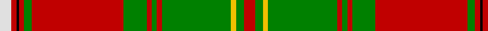

In pattern [RGYGRGRGRGRKRW](/stripes/rgygrgrgrgrkrw/).

This was sourced from weddslist.  It is a [14 stripe tartan](/stripes/stripes14/).

Original link http://www.weddslist.com/cgi-bin/tartans/pg.pl?source=sts

## Attestations

This cloth appears in 2 source records; the oldest owns this page.

- undated — Hay (weddslist, [record](http://www.weddslist.com/cgi-bin/tartans/pg.pl?source=sts))
- undated — Hay Clan Tartan Tartan Number: 1555. Earliest known date: 1842 The design comes from the Vestiarium Scoticum (1842). The authors, the Sobieski Stuart brothers, enjoyed a popular following among the Scottish gentry in the early Victorian era, and in the spirit of the times, added mystery, romance and some spurious historical documentation to the subject of tartan. Of the better known tartans, the book offers some minor variation, but in other cases it provides the only recorded version of many tartans in use today. See products available Copyright © Blair Urquhart, Comrie, 2015 (house-of-tartan, [record](http://www.house-of-tartan.scotland.net/house/TartanViewjs.asp?colr=Def&tnam=1555))

## Thread count
R/9 G6 Y4 G54 R4 G4 R4 G18 R72 G6 R4 K2 R4 LN/9

## Palette
Each colour and the base-6 reference it is a variant of.

| Colour | Shade | Base |
|---|---|---|
| G | <code style="background-color:#008000;">#008000</code> `oklch(52.0% 0.177 142.5)` <small>#008000</small> | G <code style="background-color:#006100;">#006100</code> |
| K | <code style="background-color:#000000;">#000000</code> `oklch(0.0% 0.000 0.0)` <small>#000000</small> | K <code style="background-color:#000000;">#000000</code> |
| LN | <code style="background-color:#E0E0E0;">#E0E0E0</code> `oklch(90.7% 0.000 89.9)` <small>#E0E0E0</small> | W <code style="background-color:#F7F7F7;">#F7F7F7</code> |
| R | <code style="background-color:#C00000;">#C00000</code> `oklch(50.7% 0.208 29.2)` <small>#C00000</small> | R <code style="background-color:#CC0000;">#CC0000</code> |
| Y | <code style="background-color:#F0C000;">#F0C000</code> `oklch(82.7% 0.169 90.5)` <small>#F0C000</small> | Y <code style="background-color:#F2BF00;">#F2BF00</code> |

## Nearest tartans

The nearest existing variants by ΔTartan distance, with this tartan at the top so the swatches line up against it.

ΔTartan

Tartan

Sett

—

<a href="/ttd/edit/#slug=r9g6ly4g54r4g4r4g18r72g6r4k2r4w9">Hay</a> <a class="nn-out" href="/setts/s14/r9g6ly4g54r4g4r4g18r72g6r4k2r4w9/" title="open its dictionary page">↗</a>

0.86

<a href="/ttd/edit/#slug=g2r2w1r2k1r24g12ly2g3ly2g12r2g3ly2~x2">Leask</a> <a class="nn-out" href="/setts/s14/g2r2w1r2k1r24g12ly2g3ly2g12r2g3ly2~x2/" title="open its dictionary page">↗</a>

0.88

<a href="/ttd/edit/#slug=r6dg4ly2dg36r2dg2r2dg12r48dg4r2k1r2lb6">Hay</a> <a class="nn-out" href="/setts/s14/r6dg4ly2dg36r2dg2r2dg12r48dg4r2k1r2lb6/" title="open its dictionary page">↗</a>

0.94

<a href="/ttd/edit/#slug=o15r3o3r1o35dg5w2db2dg35r1dg3r3dg15o5w2db2~x2">Keilar (2013)</a> <a class="nn-out" href="/setts/s16/o15r3o3r1o35dg5w2db2dg35r1dg3r3dg15o5w2db2~x2/" title="open its dictionary page">↗</a>

0.94

<a href="/ttd/edit/#slug=r3dg2ly1dg18r1dg1r1dg6r24dg2r1k1r1w3~x2">Hay - 1842 (Clan)</a> <a class="nn-out" href="/setts/s14/r3dg2ly1dg18r1dg1r1dg6r24dg2r1k1r1w3~x2/" title="open its dictionary page">↗</a>

0.97

<a href="/ttd/edit/#slug=t4ly1g1r30g18g3g1k3g1g3g18r30g1ly1t4g2~x2">Connemarra Irish District Tartan Tartan Number: 3897. Earliest known date: pre 1997 The Connemara tartan has been created to represent the wild yet picturesque area situated in the north west of County Galway. Strictly speaking this should be a fashion tartan but it has been placed in the same class as the House of Edgar irish tartans. See products available Copyright © Blair Urquhart, Comrie, 2015</a> <a class="nn-out" href="/setts/s16/t4ly1g1r30g18g3g1k3g1g3g18r30g1ly1t4g2~x2/" title="open its dictionary page">↗</a>

1.17

<a href="/setts/s14/r36g18r4g6k1lb2k1g2~x2/">Strang (Personal)</a>

1.23

<a href="/ttd/edit/#slug=r24w1db2r4g32r4db2w1r4db6r4w1db2r32g2r3g6~x2">Dalziel</a> <a class="nn-out" href="/setts/s17/r24w1db2r4g32r4db2w1r4db6r4w1db2r32g2r3g6~x2/" title="open its dictionary page">↗</a>

1.26

<a href="/ttd/edit/#slug=g8r1r6g3r40y2k12r6g30r3k2r1r6~x2">MacDonald of Glencoe #3</a> <a class="nn-out" href="/setts/s13/g8r1r6g3r40y2k12r6g30r3k2r1r6~x2/" title="open its dictionary page">↗</a>

1.27

<a href="/ttd/edit/#slug=g4r2w1r2k1r24g12ly2g3ly2g12r2g3ly4~x2">Leask</a> <a class="nn-out" href="/setts/s14/g4r2w1r2k1r24g12ly2g3ly2g12r2g3ly4~x2/" title="open its dictionary page">↗</a>

1.30

<a href="/ttd/edit/#slug=r6y2db2r30g2r2g4r2g2r1g20r1y2db2r4~x2">All Ireland Red</a> <a class="nn-out" href="/setts/s15/r6y2db2r30g2r2g4r2g2r1g20r1y2db2r4~x2/" title="open its dictionary page">↗</a>

## Neighbour map

Every grey dot is one of 14299 variants placed by the first two principal components of the ΔTartan feature space (44% of its variance). Red is this tartan; blue dots are its nearest — click one to open its page.

<svg viewBox="0 0 640 380" role="img" style="max-width:100%;height:auto;border:1px solid #e0e0e0;border-radius:4px;display:block" xmlns="http://www.w3.org/2000/svg"><image href="/nn/cloud.v1.png" width="640" height="380"/><a href="/setts/s14/g2r2w1r2k1r24g12ly2g3ly2g12r2g3ly2~x2/"><circle cx="291.8" cy="91.2" r="4" fill="#3465a4"><title>Leask</title></circle></a><a href="/setts/s14/r6dg4ly2dg36r2dg2r2dg12r48dg4r2k1r2lb6/"><circle cx="355.7" cy="57.4" r="4" fill="#3465a4"><title>Hay</title></circle></a><a href="/setts/s16/o15r3o3r1o35dg5w2db2dg35r1dg3r3dg15o5w2db2~x2/"><circle cx="295.9" cy="73.6" r="4" fill="#3465a4"><title>Keilar (2013)</title></circle></a><a href="/setts/s14/r3dg2ly1dg18r1dg1r1dg6r24dg2r1k1r1w3~x2/"><circle cx="335.0" cy="84.9" r="4" fill="#3465a4"><title>Hay - 1842 (Clan)</title></circle></a><a href="/setts/s16/t4ly1g1r30g18g3g1k3g1g3g18r30g1ly1t4g2~x2/"><circle cx="309.4" cy="77.7" r="4" fill="#3465a4"><title>Connemarra Irish District Tartan Tartan Number: 3897. Earliest known date: pre 1997 The Connemara tartan has been created to represent the wild yet picturesque area situated in the north west of County Galway. Strictly speaking this should be a fashion tartan but it has been placed in the same class as the House of Edgar irish tartans. See products available Copyright © Blair Urquhart, Comrie, 2015</title></circle></a><a href="/setts/s14/r36g18r4g6k1lb2k1g2~x2/"><circle cx="360.2" cy="99.5" r="4" fill="#3465a4"><title>Strang (Personal)</title></circle></a><a href="/setts/s17/r24w1db2r4g32r4db2w1r4db6r4w1db2r32g2r3g6~x2/"><circle cx="357.5" cy="73.4" r="4" fill="#3465a4"><title>Dalziel</title></circle></a><a href="/setts/s13/g8r1r6g3r40y2k12r6g30r3k2r1r6~x2/"><circle cx="330.3" cy="77.7" r="4" fill="#3465a4"><title>MacDonald of Glencoe #3</title></circle></a><a href="/setts/s14/g4r2w1r2k1r24g12ly2g3ly2g12r2g3ly4~x2/"><circle cx="300.0" cy="100.3" r="4" fill="#3465a4"><title>Leask</title></circle></a><a href="/setts/s15/r6y2db2r30g2r2g4r2g2r1g20r1y2db2r4~x2/"><circle cx="370.3" cy="78.1" r="4" fill="#3465a4"><title>All Ireland Red</title></circle></a><circle cx="339.4" cy="69.4" r="5" fill="#c00000"/></svg>

ID: /setts/s14/r9g6ly4g54r4g4r4g18r72g6r4k2r4w9/
