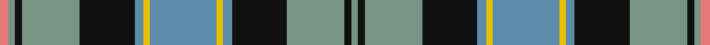

This page is one **sett** — a single exact thread-count. It belongs to the [tartan](/tartans/b30y3b4k25lg26k3lg3lr4/)
(the same proportion at any scale), whose colour order is pattern [GKGKBYBYBKGKGR](/stripes/gkgkbybybkgkgr/).

Sourced from register-of-tartans.  It is a [14 stripe tartan](/stripes/stripes14/).

Original link https://www.tartanregister.gov.uk/tartanDetails.aspx?ref=3231

## Also known as

This cloth is also recorded under:

- Ogilvie Hunting Clan/Family

## Register references

External register numbers recorded for this tartan.

- Scottish Register of Tartans: [3231](https://www.tartanregister.gov.uk/tartanDetails.aspx?ref=3231)
- Scottish Tartans Authority (ITI): 6082

## Thread count
LR/8 LG6 K6 LG52 K50 B8 Y6 B60 Y6 B8 K50 LG52 K6 LG/6

## Palette
Each colour and the base-6 reference it is a variant of.

| Colour | Shade | Base |
|---|---|---|
| B | <code style="background-color:#5C8CA8;">#5C8CA8</code> `oklch(61.7% 0.067 235.0)` <small>#5C8CA8</small> | B <code style="background-color:#2A418A;">#2A418A</code> |
| Ba | <code style="background-color:#48A4C0;">#48A4C0</code> `oklch(67.5% 0.096 221.0)` <small>#48A4C0</small> | Y <code style="background-color:#F2BF00;">#F2BF00</code> |
| K | <code style="background-color:#101010;">#101010</code> `oklch(17.3% 0.000 89.9)` <small>#101010</small> | K <code style="background-color:#000000;">#000000</code> |
| LG | <code style="background-color:#789484;">#789484</code> `oklch(64.0% 0.040 160.0)` <small>#789484</small> | G <code style="background-color:#006100;">#006100</code> |
| LP | <code style="background-color:#A8ACE8;">#A8ACE8</code> `oklch(76.3% 0.086 281.2)` <small>#A8ACE8</small> | W <code style="background-color:#F7F7F7;">#F7F7F7</code> |
| LR | <code style="background-color:#E87878;">#E87878</code> `oklch(70.0% 0.139 21.2)` <small>#E87878</small> | R <code style="background-color:#CC0000;">#CC0000</code> |
| Y | <code style="background-color:#E8C000;">#E8C000</code> `oklch(81.9% 0.168 93.7)` <small>#E8C000</small> | Y <code style="background-color:#F2BF00;">#F2BF00</code> |

## Nearest tartans

The nearest existing variants by ΔTartan distance, with this tartan at the top so the swatches line up against it.

ΔTartan

Tartan

Sett

—

<a href="/ttd/edit/#slug=t30ly3t4k25y26k3y3r4~x2">Ogilvie Hunting</a> <a class="nn-out" href="/setts/s14/t30ly3t4k25y26k3y3r4~x2/" title="open its dictionary page">↗</a>

0.66

<a href="/ttd/edit/#slug=dg8r1dg2r2dg12w1k12r1t12r2t2r1t8~x4">Boston Pipe Band, Greater</a> <a class="nn-out" href="/setts/s13/dg8r1dg2r2dg12w1k12r1t12r2t2r1t8~x4/" title="open its dictionary page">↗</a>

0.72

<a href="/ttd/edit/#slug=dg4w24dg3k3dg3k3dg24k4w4k4db24dg8r4~x2">MacInnes Dress</a> <a class="nn-out" href="/setts/s13/dg4w24dg3k3dg3k3dg24k4w4k4db24dg8r4~x2/" title="open its dictionary page">↗</a>

0.76

<a href="/ttd/edit/#slug=ly4db3ly2db2k1r1k1db7k1r1k1g10r1db3ly1db3~x2">Tartan de Longueuil</a> <a class="nn-out" href="/setts/s16/ly4db3ly2db2k1r1k1db7k1r1k1g10r1db3ly1db3~x2/" title="open its dictionary page">↗</a>

0.76

<a href="/ttd/edit/#slug=g8r1g2r2g12w1k12r1t12r2t2r1t8~x4">Boston Pipe Band, Greater (Corp)</a> <a class="nn-out" href="/setts/s13/g8r1g2r2g12w1k12r1t12r2t2r1t8~x4/" title="open its dictionary page">↗</a>

0.88

<a href="/ttd/edit/#slug=g5dt2g17ly2db5ly2r5db17g2ly4~x2">Antrim Irish County Tartan Tartan Number: 2282. Earliest known date: 1993 One of a series of Irish District tartans designed by Polly Wittering of the House of Edgar, with colours reminiscent of the Country with soft warm colours dominating. See products available Copyright © Blair Urquhart, Comrie, 2015</a> <a class="nn-out" href="/setts/s10/g5dt2g17ly2db5ly2r5db17g2ly4~x2/" title="open its dictionary page">↗</a>

0.91

<a href="/ttd/edit/#slug=lb3k1n12k1n1k2n1k6lr12k1lo1~x4">McCandlish Dress, Grey (Name)</a> <a class="nn-out" href="/setts/s11/lb3k1n12k1n1k2n1k6lr12k1lo1~x4/" title="open its dictionary page">↗</a>

0.96

<a href="/ttd/edit/#slug=dt4r1dt12w1r4w1dg4w1r4dg12dt1w2~x2">Glenfalloch</a> <a class="nn-out" href="/setts/s12/dt4r1dt12w1r4w1dg4w1r4dg12dt1w2~x2/" title="open its dictionary page">↗</a>

1.03

<a href="/ttd/edit/#slug=db8r1db2r3db12r1k12w1g12r3g2r1g8~x2">MacDonald of Clanranald 2</a> <a class="nn-out" href="/setts/s13/db8r1db2r3db12r1k12w1g12r3g2r1g8~x2/" title="open its dictionary page">↗</a>

1.03

<a href="/ttd/edit/#slug=b9k1b1k1b1k8g8ly1k1ly1g8k8b8w1~x4">Dyce</a> <a class="nn-out" href="/setts/s14/b9k1b1k1b1k8g8ly1k1ly1g8k8b8w1~x4/" title="open its dictionary page">↗</a>

1.04

<a href="/ttd/edit/#slug=db8r1db2r3db12r1k12g12r3g2r1g4w1~x2">MacDonell of Glengarry</a> <a class="nn-out" href="/setts/s13/db8r1db2r3db12r1k12g12r3g2r1g4w1~x2/" title="open its dictionary page">↗</a>

## Neighbour map

Every grey dot is one of 14299 variants placed by the first two principal components of the ΔTartan feature space (44% of its variance). Red is this tartan; blue dots are its nearest — click one to open its page.

<svg viewBox="0 0 640 380" role="img" style="max-width:100%;height:auto;border:1px solid #e0e0e0;border-radius:4px;display:block" xmlns="http://www.w3.org/2000/svg"><image href="/nn/cloud.v1.png" width="640" height="380"/><a href="/setts/s13/dg8r1dg2r2dg12w1k12r1t12r2t2r1t8~x4/"><circle cx="155.7" cy="149.9" r="4" fill="#3465a4"><title>Boston Pipe Band, Greater</title></circle></a><a href="/setts/s13/dg4w24dg3k3dg3k3dg24k4w4k4db24dg8r4~x2/"><circle cx="123.8" cy="143.2" r="4" fill="#3465a4"><title>MacInnes Dress</title></circle></a><a href="/setts/s16/ly4db3ly2db2k1r1k1db7k1r1k1g10r1db3ly1db3~x2/"><circle cx="162.1" cy="136.6" r="4" fill="#3465a4"><title>Tartan de Longueuil</title></circle></a><a href="/setts/s13/g8r1g2r2g12w1k12r1t12r2t2r1t8~x4/"><circle cx="147.0" cy="145.1" r="4" fill="#3465a4"><title>Boston Pipe Band, Greater (Corp)</title></circle></a><a href="/setts/s10/g5dt2g17ly2db5ly2r5db17g2ly4~x2/"><circle cx="156.2" cy="161.6" r="4" fill="#3465a4"><title>Antrim Irish County Tartan Tartan Number: 2282. Earliest known date: 1993 One of a series of Irish District tartans designed by Polly Wittering of the House of Edgar, with colours reminiscent of the Country with soft warm colours dominating. See products available Copyright © Blair Urquhart, Comrie, 2015</title></circle></a><a href="/setts/s11/lb3k1n12k1n1k2n1k6lr12k1lo1~x4/"><circle cx="167.5" cy="134.3" r="4" fill="#3465a4"><title>McCandlish Dress, Grey (Name)</title></circle></a><a href="/setts/s12/dt4r1dt12w1r4w1dg4w1r4dg12dt1w2~x2/"><circle cx="172.5" cy="150.3" r="4" fill="#3465a4"><title>Glenfalloch</title></circle></a><a href="/setts/s13/db8r1db2r3db12r1k12w1g12r3g2r1g8~x2/"><circle cx="132.8" cy="147.3" r="4" fill="#3465a4"><title>MacDonald of Clanranald 2</title></circle></a><a href="/setts/s14/b9k1b1k1b1k8g8ly1k1ly1g8k8b8w1~x4/"><circle cx="138.5" cy="164.6" r="4" fill="#3465a4"><title>Dyce</title></circle></a><a href="/setts/s13/db8r1db2r3db12r1k12g12r3g2r1g4w1~x2/"><circle cx="141.2" cy="143.3" r="4" fill="#3465a4"><title>MacDonell of Glengarry</title></circle></a><circle cx="152.0" cy="142.3" r="5" fill="#c00000"/></svg>

ID: /setts/s14/t30ly3t4k25y26k3y3r4~x2/
