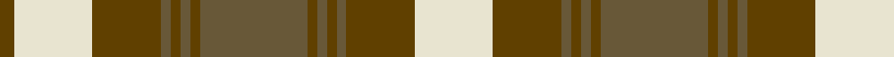

In pattern [GWGGGGGGGGGGGW](/patterns/gwgggggggggggw/).

This was sourced from register-of-tartans.  It is a [14 stripes tartan](/stripes/stripes14/).

Original link https://www.tartanregister.gov.uk/tartanDetails.aspx?ref=3826

## Register references

External register numbers recorded for this tartan.

- Scottish Register of Tartans: [3826](https://www.tartanregister.gov.uk/tartanDetails.aspx?ref=3826)
- Scottish Tartans Authority (ITI): 5319

## Thread count
Ta/6 W32 Ta28 G4 Ta4 G4 Ta4 G44 Ta4 G4 Ta4 G4 Ta28 W/32

## Palette
Each colour and its ΔE from the base-6 reference it is a variant of.

| Colour | Shade | Base | ΔE (OKLab) |
|---|---|---|---|
| DR | <code style="background-color:#441800;">#441800</code> `#441800` | B <code style="background-color:#2A418A;">#2A418A</code> | 0.23 |
| G | <code style="background-color:#685838;">#685838</code> `#685838` | G <code style="background-color:#006100;">#006100</code> | 0.13 |
| T | <code style="background-color:#603800;">#603800</code> `#603800` | G <code style="background-color:#006100;">#006100</code> | 0.16 |
| Ta | <code style="background-color:#604000;">#604000</code> `#604000` | G <code style="background-color:#006100;">#006100</code> | 0.14 |
| W | <code style="background-color:#E8E4D0;">#E8E4D0</code> `#E8E4D0` | W <code style="background-color:#F7F7F7;">#F7F7F7</code> | 0.07 |

## Nearest tartans

The nearest existing variants by ΔTartan distance.

1. [Kildonan Brown (Fashion)](/setts/s9/g22b3g3b3g3b9w28b3w6~b441800-g604000-wc0c0c0~x2/) — ΔT 1.13
1. [Lindsay Dress Red](/setts/s9/g26r3g3r3g3r11w27r3w5~g005020-rdc0000-we0e0e0~x2/) — ΔT 1.18
1. [Prince George Royal Family Tartan Tartan Number: 942. Earliest known date: pre 2003 The warmth and glow of the fertile soil, The green field and tree, The yellow and the brown of Autumn, The white of surf or a summer snow, Rust, green, yellow and white, Yes! That's our Island Tartan. See products available Copyright © Blair Urquhart, Comrie, 2015](/setts/s11/g6w4g3w4g2w7g2w2g5r15w2~g006818-rc80000-we0e0e0~x2/) — ΔT 1.20
1. [MacDougall (Lochcarron)](/setts/s19/w6r2g16r3g2r3g6w2r2w2g6r7g6r2g2r16w2r2w2~g006818-rc80000-we0e0e0~x2/) — ΔT 1.22
1. [Snaefell (District)](/setts/s8/g22ga2g2ga2g2ga14w16ga3~g685838-ga604000-we8e4d0~x2/) — ΔT 1.24
1. [Turnberry Manx Snaefell Family Tartan Tartan Number: 1749. Earliest known date: 1981 A coincidence. See products available Copyright © Blair Urquhart, Comrie, 2015](/setts/s8/y22b2y2b2y2b15w17b3~b441800-we0e0e0-ya08858~x2/) — ΔT 1.26
1. [Prince George](/setts/s11/g6w4g3w4g2w7g2w2g5r15w2~g008000-rc00000-we0e0e0~x2/) — ΔT 1.27
1. [Lindsay, dress Red](/setts/s9/g26r3g3r3g3r11w27r3w5~g008000-rc00000-we0e0e0~x2/) — ΔT 1.29
1. [Stewart of Urrard](/setts/s14/g6r2g2r18b9r3g3r3b9r3g24r2g2r4~b304080-g008000-rc00000~x2/) — ΔT 1.31
1. [MacNeish](/setts/s12/g6r3k3r24g4k10r2g4r2g24r6g2~g289c18-k101010-rc80000~x2/) — ΔT 1.32

## Neighbour map

Every grey dot is one of 15726 variants placed by the first two principal components of the ΔTartan feature space (44% of its variance). Red is this tartan; blue dots are its nearest — click one to open its page.

<svg viewBox="0 0 640 380" role="img" style="max-width:100%;height:auto;border:1px solid #e0e0e0;border-radius:4px;display:block" xmlns="http://www.w3.org/2000/svg"><image href="/nn/cloud.v1.png" width="640" height="380"/><a href="/setts/s9/g22b3g3b3g3b9w28b3w6~b441800-g604000-wc0c0c0~x2/"><circle cx="234.0" cy="182.7" r="4" fill="#3465a4"><title>Kildonan Brown (Fashion)</title></circle></a><a href="/setts/s9/g26r3g3r3g3r11w27r3w5~g005020-rdc0000-we0e0e0~x2/"><circle cx="202.4" cy="174.0" r="4" fill="#3465a4"><title>Lindsay Dress Red</title></circle></a><a href="/setts/s11/g6w4g3w4g2w7g2w2g5r15w2~g006818-rc80000-we0e0e0~x2/"><circle cx="170.1" cy="191.9" r="4" fill="#3465a4"><title>Prince George Royal Family Tartan Tartan Number: 942. Earliest known date: pre 2003 The warmth and glow of the fertile soil, The green field and tree, The yellow and the brown of Autumn, The white of surf or a summer snow, Rust, green, yellow and white, Yes! That's our Island Tartan. See products available Copyright © Blair Urquhart, Comrie, 2015</title></circle></a><a href="/setts/s19/w6r2g16r3g2r3g6w2r2w2g6r7g6r2g2r16w2r2w2~g006818-rc80000-we0e0e0~x2/"><circle cx="227.7" cy="164.7" r="4" fill="#3465a4"><title>MacDougall (Lochcarron)</title></circle></a><a href="/setts/s8/g22ga2g2ga2g2ga14w16ga3~g685838-ga604000-we8e4d0~x2/"><circle cx="246.1" cy="190.8" r="4" fill="#3465a4"><title>Snaefell (District)</title></circle></a><a href="/setts/s8/y22b2y2b2y2b15w17b3~b441800-we0e0e0-ya08858~x2/"><circle cx="220.9" cy="179.0" r="4" fill="#3465a4"><title>Turnberry Manx Snaefell Family Tartan Tartan Number: 1749. Earliest known date: 1981 A coincidence. See products available Copyright © Blair Urquhart, Comrie, 2015</title></circle></a><a href="/setts/s11/g6w4g3w4g2w7g2w2g5r15w2~g008000-rc00000-we0e0e0~x2/"><circle cx="171.5" cy="192.8" r="4" fill="#3465a4"><title>Prince George</title></circle></a><a href="/setts/s9/g26r3g3r3g3r11w27r3w5~g008000-rc00000-we0e0e0~x2/"><circle cx="208.1" cy="177.3" r="4" fill="#3465a4"><title>Lindsay, dress Red</title></circle></a><a href="/setts/s14/g6r2g2r18b9r3g3r3b9r3g24r2g2r4~b304080-g008000-rc00000~x2/"><circle cx="267.7" cy="171.2" r="4" fill="#3465a4"><title>Stewart of Urrard</title></circle></a><a href="/setts/s12/g6r3k3r24g4k10r2g4r2g24r6g2~g289c18-k101010-rc80000~x2/"><circle cx="266.7" cy="165.6" r="4" fill="#3465a4"><title>MacNeish</title></circle></a><circle cx="212.5" cy="159.4" r="5" fill="#c00000"/></svg>

ID: /setts/s14/w16g14ga2g2ga2g2ga22g2ga2g2ga2g14w16g3~g604000-ga685838-we8e4d0~x2/
