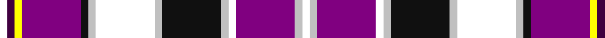

In pattern [WBYBKWWWKWWBWW](/patterns/wbybkwwwkwwbww/).

This was sourced from register-of-tartans.  It is a [14 stripes tartan](/stripes/stripes14/).

Original link https://www.tartanregister.gov.uk/tartanDetails.aspx?ref=5819

## Register references

External register numbers recorded for this tartan.

- Scottish Register of Tartans: [5819](https://www.tartanregister.gov.uk/tartanDetails.aspx?ref=5819)
- Scottish Tartans Authority (ITI): 7391
- Scottish Tartans World Register: 3215

## Thread count
W/6 DP6 Y6 P48 K6 N6 W48 N6 K48 N6 W6 P48 N6 W/6

## Palette
Each colour and its ΔE from the base-6 reference it is a variant of.

| Colour | Shade | Base | ΔE (OKLab) |
|---|---|---|---|
| DP | <code style="background-color:#400040;">#400040</code> `#400040` | B <code style="background-color:#2A418A;">#2A418A</code> | 0.19 |
| K | <code style="background-color:#101010;">#101010</code> `#101010` | K <code style="background-color:#000000;">#000000</code> | 0.17 |
| N | <code style="background-color:#C0C0C0;">#C0C0C0</code> `#C0C0C0` | W <code style="background-color:#F7F7F7;">#F7F7F7</code> | 0.17 |
| P | <code style="background-color:#800080;">#800080</code> `#800080` | B <code style="background-color:#2A418A;">#2A418A</code> | 0.17 |
| W | <code style="background-color:#FFFFFF;">#FFFFFF</code> `#FFFFFF` | W <code style="background-color:#F7F7F7;">#F7F7F7</code> | 0.02 |
| Y | <code style="background-color:#FFFF00;">#FFFF00</code> `#FFFF00` | Y <code style="background-color:#F2BF00;">#F2BF00</code> | 0.16 |

## Nearest tartans

The nearest existing variants by ΔTartan distance.

1. [Bear Baars (Personal)](/setts/s11/r2b2w2ra1w2b10w1k2r10w1r2~b00008c-k101010-rfa4b00-raff0000-wffffff~x4/) — ΔT 1.23
1. [Praetorian Imperatur (Fashion)](/setts/s14/w1k1y1b8k1ya1w8ya1k8ya1w1b8ya1w1~b5c20a0-k101010-we0e0e0-ye8c000-yaa0a0a0~x6/) — ΔT 1.24
1. [Robieson (Personal)](/setts/s13/r1y1b8r1y1r8k1w8k1y1b8ra1w1~b24608c-k101010-rc8340c-rac80000-wf8f8f8-ya0a0a0~x6/) — ΔT 1.30
1. [Lashbrooke of Barrowfield](/setts/s12/b3w3r3w24y4g6b3r2b16ba12y2b3~b202060-ba3850c8-g643424-rc80000-wfcfcfc-ye8c000~x2/) — ΔT 1.34
1. [Oliver Dress (Dance)](/setts/s16/g1r1g1r1b7r6w7k1w7r6b7r1g1r1g1w1~b1c0070-g006818-k101010-r880000-wf8f8f8~x4/) — ΔT 1.35
1. [Badminton World Federation](/setts/s13/k3r19b12k3y3g3k2w11b3w4b4k2w3~b3850c8-g649848-k101010-rdc0000-we0e0e0-ydc943c~x2/) — ΔT 1.36
1. [MacLean, dress Burgundy](/setts/s12/b12ba2k4y2k3r3k3r19w31ba2w4k2~b5480b0-ba304080-k000000-r900030-we0e0e0-yf0c000~x2/) — ΔT 1.44
1. [Skye Dress, Blue, Earl of (Dance)](/setts/s16/b4ba2bb4ba2b4w3b3ba2w4ba2b4r14w22b2w5r4~b00008c-ba3474fc-bb646464-r8c0000-we0e0e0~x2/) — ΔT 1.44
1. [MacKellar Dress, Cerise (Dance)](/setts/s11/r18w2r2b3r2w2r4k10ra2w25k3~b2888c4-k101010-rc04094-ra981c70-we0e0e0~x2/) — ΔT 1.47
1. [MacBeth Dress (Clan)](/setts/s16/w1r3k1r3g4k1w1k1w1k1b6y2b4w14b1w1~b1c0070-g006818-k101010-r880000-we0e0e0-yd09800~x4/) — ΔT 1.48

## Neighbour map

Every grey dot is one of 15726 variants placed by the first two principal components of the ΔTartan feature space (44% of its variance). Red is this tartan; blue dots are its nearest — click one to open its page.

<svg viewBox="0 0 640 380" role="img" style="max-width:100%;height:auto;border:1px solid #e0e0e0;border-radius:4px;display:block" xmlns="http://www.w3.org/2000/svg"><image href="/nn/cloud.v1.png" width="640" height="380"/><a href="/setts/s11/r2b2w2ra1w2b10w1k2r10w1r2~b00008c-k101010-rfa4b00-raff0000-wffffff~x4/"><circle cx="158.2" cy="123.6" r="4" fill="#3465a4"><title>Bear Baars (Personal)</title></circle></a><a href="/setts/s14/w1k1y1b8k1ya1w8ya1k8ya1w1b8ya1w1~b5c20a0-k101010-we0e0e0-ye8c000-yaa0a0a0~x6/"><circle cx="128.5" cy="125.9" r="4" fill="#3465a4"><title>Praetorian Imperatur (Fashion)</title></circle></a><a href="/setts/s13/r1y1b8r1y1r8k1w8k1y1b8ra1w1~b24608c-k101010-rc8340c-rac80000-wf8f8f8-ya0a0a0~x6/"><circle cx="120.9" cy="114.6" r="4" fill="#3465a4"><title>Robieson (Personal)</title></circle></a><a href="/setts/s12/b3w3r3w24y4g6b3r2b16ba12y2b3~b202060-ba3850c8-g643424-rc80000-wfcfcfc-ye8c000~x2/"><circle cx="86.3" cy="99.1" r="4" fill="#3465a4"><title>Lashbrooke of Barrowfield</title></circle></a><a href="/setts/s16/g1r1g1r1b7r6w7k1w7r6b7r1g1r1g1w1~b1c0070-g006818-k101010-r880000-wf8f8f8~x4/"><circle cx="85.4" cy="132.5" r="4" fill="#3465a4"><title>Oliver Dress (Dance)</title></circle></a><a href="/setts/s13/k3r19b12k3y3g3k2w11b3w4b4k2w3~b3850c8-g649848-k101010-rdc0000-we0e0e0-ydc943c~x2/"><circle cx="56.9" cy="110.9" r="4" fill="#3465a4"><title>Badminton World Federation</title></circle></a><a href="/setts/s12/b12ba2k4y2k3r3k3r19w31ba2w4k2~b5480b0-ba304080-k000000-r900030-we0e0e0-yf0c000~x2/"><circle cx="143.9" cy="76.1" r="4" fill="#3465a4"><title>MacLean, dress Burgundy</title></circle></a><a href="/setts/s16/b4ba2bb4ba2b4w3b3ba2w4ba2b4r14w22b2w5r4~b00008c-ba3474fc-bb646464-r8c0000-we0e0e0~x2/"><circle cx="144.3" cy="106.7" r="4" fill="#3465a4"><title>Skye Dress, Blue, Earl of (Dance)</title></circle></a><a href="/setts/s11/r18w2r2b3r2w2r4k10ra2w25k3~b2888c4-k101010-rc04094-ra981c70-we0e0e0~x2/"><circle cx="179.4" cy="108.2" r="4" fill="#3465a4"><title>MacKellar Dress, Cerise (Dance)</title></circle></a><a href="/setts/s16/w1r3k1r3g4k1w1k1w1k1b6y2b4w14b1w1~b1c0070-g006818-k101010-r880000-we0e0e0-yd09800~x4/"><circle cx="124.8" cy="74.0" r="4" fill="#3465a4"><title>MacBeth Dress (Clan)</title></circle></a><circle cx="104.4" cy="101.0" r="5" fill="#c00000"/></svg>

ID: /setts/s14/w1b1y1ba8k1wa1w8wa1k8wa1w1ba8wa1w1~b400040-ba800080-k101010-wffffff-wac0c0c0-yffff00~x6/
