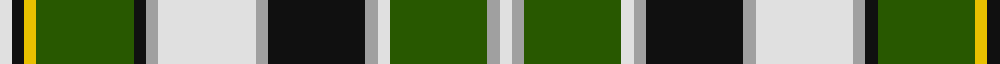

In pattern [WKYGKYWYKYWGYW](/stripes/wkygkywykywgyw/).

This was sourced from tartans-authority.  It is a [14 stripe tartan](/stripes/stripes14/).

Original link http://www.tartansauthority.com/tartan-ferret/display/7836/

## Thread count
LN/6 K6 Y6 G48 K6 N6 LN48 N6 K48 N6 LN6 G48 N6 LN/6

## Palette
Each colour and its ΔE from the base-6 reference it is a variant of.

| Colour | Shade | Base | ΔE (OKLab) |
|---|---|---|---|
| G | <code style="background-color:#285800;">#285800</code> `#285800` | G <code style="background-color:#006100;">#006100</code> | 0.03 |
| K | <code style="background-color:#101010;">#101010</code> `#101010` | K <code style="background-color:#000000;">#000000</code> | 0.17 |
| LN | <code style="background-color:#E0E0E0;">#E0E0E0</code> `#E0E0E0` | W <code style="background-color:#F7F7F7;">#F7F7F7</code> | 0.07 |
| N | <code style="background-color:#A0A0A0;">#A0A0A0</code> `#A0A0A0` | Y <code style="background-color:#F2BF00;">#F2BF00</code> | 0.21 |
| Y | <code style="background-color:#E8C000;">#E8C000</code> `#E8C000` | Y <code style="background-color:#F2BF00;">#F2BF00</code> | 0.02 |

## Nearest tartans

The nearest existing variants by ΔTartan distance.

1. [MacInnes, dress](/setts/s13/r4g8db24k4w4k4g24k3g3k3g3w24g4~x2/) — ΔT 0.51
1. [Blair, dress](/setts/s13/db1r1db8k3g8r1g1r1g8k3w10r1w1~x4/) — ΔT 0.66
1. [Lotus Elan (Corporate)](/setts/s13/k3ly4k3ly4k3g16k16w3b16k2w2k2ly2~x2/) — ΔT 0.77
1. [Dorcas, Check](/setts/s12/o4w2o2w3o18k6g3k2g2k2g14lo3~x2/) — ΔT 0.77
1. [MacInnes Dress (Dalgliesh)](/setts/s12/r4g16db24k4w4g24k3g3k3g3w24g4/) — ΔT 0.85
1. [MacInnes Dress](/setts/s13/dg4w24dg3k3dg3k3dg24k4w4k4db24dg8r4~x2/) — ΔT 0.88
1. [McCandlish Arisaid, Green (Name)](/setts/s11/lb3k1g12k1g1k2g1k6w12k1lo1~x4/) — ΔT 0.91
1. [MacCandlish Arisaid Green](/setts/s11/lb3k1g12k1g1k2g1k6lb12k1lo1~x4/) — ΔT 0.91
1. [Gayre](/setts/s15/lb20g4k4lb4g16lb4g16lb4k4r6g4lb4g3r6k4~x2/) — ΔT 1.12
1. [Antrim Irish County Tartan Tartan Number: 2282. Earliest known date: 1993 One of a series of Irish District tartans designed by Polly Wittering of the House of Edgar, with colours reminiscent of the Country with soft warm colours dominating. See products available Copyright © Blair Urquhart, Comrie, 2015](/setts/s10/g5dt2g17ly2db5ly2r5db17g2ly4~x2/) — ΔT 1.12

## Neighbour map

Every grey dot is one of 14299 variants placed by the first two principal components of the ΔTartan feature space (44% of its variance). Red is this tartan; blue dots are its nearest — click one to open its page.

<svg viewBox="0 0 640 380" role="img" style="max-width:100%;height:auto;border:1px solid #e0e0e0;border-radius:4px;display:block" xmlns="http://www.w3.org/2000/svg"><image href="/nn/cloud.v1.png" width="640" height="380"/><a href="/setts/s13/r4g8db24k4w4k4g24k3g3k3g3w24g4~x2/"><circle cx="112.4" cy="138.5" r="4" fill="#3465a4"><title>MacInnes, dress</title></circle></a><a href="/setts/s13/db1r1db8k3g8r1g1r1g8k3w10r1w1~x4/"><circle cx="106.5" cy="133.1" r="4" fill="#3465a4"><title>Blair, dress</title></circle></a><a href="/setts/s13/k3ly4k3ly4k3g16k16w3b16k2w2k2ly2~x2/"><circle cx="109.5" cy="141.8" r="4" fill="#3465a4"><title>Lotus Elan (Corporate)</title></circle></a><a href="/setts/s12/o4w2o2w3o18k6g3k2g2k2g14lo3~x2/"><circle cx="150.5" cy="143.3" r="4" fill="#3465a4"><title>Dorcas, Check</title></circle></a><a href="/setts/s12/r4g16db24k4w4g24k3g3k3g3w24g4/"><circle cx="140.9" cy="147.5" r="4" fill="#3465a4"><title>MacInnes Dress (Dalgliesh)</title></circle></a><a href="/setts/s13/dg4w24dg3k3dg3k3dg24k4w4k4db24dg8r4~x2/"><circle cx="123.8" cy="143.2" r="4" fill="#3465a4"><title>MacInnes Dress</title></circle></a><a href="/setts/s11/lb3k1g12k1g1k2g1k6w12k1lo1~x4/"><circle cx="134.3" cy="121.2" r="4" fill="#3465a4"><title>McCandlish Arisaid, Green (Name)</title></circle></a><a href="/setts/s11/lb3k1g12k1g1k2g1k6lb12k1lo1~x4/"><circle cx="143.0" cy="127.3" r="4" fill="#3465a4"><title>MacCandlish Arisaid Green</title></circle></a><a href="/setts/s15/lb20g4k4lb4g16lb4g16lb4k4r6g4lb4g3r6k4~x2/"><circle cx="118.9" cy="160.7" r="4" fill="#3465a4"><title>Gayre</title></circle></a><a href="/setts/s10/g5dt2g17ly2db5ly2r5db17g2ly4~x2/"><circle cx="156.2" cy="161.6" r="4" fill="#3465a4"><title>Antrim Irish County Tartan Tartan Number: 2282. Earliest known date: 1993 One of a series of Irish District tartans designed by Polly Wittering of the House of Edgar, with colours reminiscent of the Country with soft warm colours dominating. See products available Copyright © Blair Urquhart, Comrie, 2015</title></circle></a><circle cx="127.4" cy="130.8" r="5" fill="#c00000"/></svg>

ID: /setts/s14/w1k1ly1dg8k1lr1w8lr1k8lr1w1dg8lr1w1~x6/
