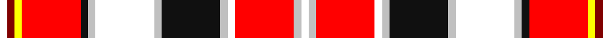

In pattern [WRYRKWWWKWWRWW](/patterns/wryrkwwwkwwrww/).

This was sourced from register-of-tartans.  It is a [14 stripes tartan](/stripes/stripes14/).

Original link https://www.tartanregister.gov.uk/tartanDetails.aspx?ref=5836

## Register references

External register numbers recorded for this tartan.

- Scottish Register of Tartans: [5836](https://www.tartanregister.gov.uk/tartanDetails.aspx?ref=5836)
- Scottish Tartans Authority (ITI): 7390
- Scottish Tartans World Register: 3135

## Thread count
W/6 DR6 Y6 R48 K6 N6 W48 N6 K48 N6 W6 R48 N6 W/6

## Palette
Each colour and its ΔE from the base-6 reference it is a variant of.

| Colour | Shade | Base | ΔE (OKLab) |
|---|---|---|---|
| DR | <code style="background-color:#800000;">#800000</code> `#800000` | R <code style="background-color:#CC0000;">#CC0000</code> | 0.17 |
| K | <code style="background-color:#101010;">#101010</code> `#101010` | K <code style="background-color:#000000;">#000000</code> | 0.17 |
| N | <code style="background-color:#C0C0C0;">#C0C0C0</code> `#C0C0C0` | W <code style="background-color:#F7F7F7;">#F7F7F7</code> | 0.17 |
| R | <code style="background-color:#FF0000;">#FF0000</code> `#FF0000` | R <code style="background-color:#CC0000;">#CC0000</code> | 0.11 |
| W | <code style="background-color:#FFFFFF;">#FFFFFF</code> `#FFFFFF` | W <code style="background-color:#F7F7F7;">#F7F7F7</code> | 0.02 |
| Y | <code style="background-color:#FFFF00;">#FFFF00</code> `#FFFF00` | Y <code style="background-color:#F2BF00;">#F2BF00</code> | 0.16 |

## Nearest tartans

The nearest existing variants by ΔTartan distance.

1. [Praetorian (Fashion)](/setts/s14/w1b1y1r8k1ya1w8ya1k8ya1w1r8ya1w1~b780078-k101010-rc80000-we0e0e0-ye8c000-yaa0a0a0~x6/) — ΔT 0.80
1. [MacKellar Dress Red](/setts/s11/r27w2r3b4r3w2r5k13ra2w26g3~b9058d8-g003820-k101010-rc80000-rae87878-we0e0e0~x2/) — ΔT 1.23
1. [MacKellar Dress Red Fashion Tartan Tartan Number: 6563. Earliest known date: 01/01/2002 The Mackellar Dress sett was originally designed by AA Bottomley of Peter MacArthur's. The colours of this version have been changed (presumably by DC Dalgliesh of Selkirk) to produce a Dancers' tartan./Threadcount and colours aren't 100% original. Generated manually./ See products available Copyright © Blair Urquhart, Comrie, 2015](/setts/s11/r23w2r3b4r3w2r5k11ra2w23k3~ba468c4-k101010-rc80000-rad05054-we0e0e0~x2/) — ΔT 1.38
1. [Gillies Red Dress](/setts/s10/y6k2r12g4r8k10w24b2w3b2~b5c8ca8-g003820-k101010-rc80000-wfcfcfc-yd8b000~x2/) — ΔT 1.42
1. [MacDougal (Dress)](/setts/s22/w2r2ra2r16k2r2w6r7g6ra2r2ra2k6r3w2r3w2r3w16r2ra2w2~g003820-k101010-rc80000-rae87878-wf8f8f8~x2/) — ΔT 1.42
1. [Crieff Red Dress (Dance)](/setts/s13/k2g2w2g3w33r2b10r3g3r26g2r4ra2~b780078-g006818-k101010-rc80000-rab43c50-wf8f8f8~x2/) — ΔT 1.44
1. [Harmon Dress](/setts/s18/k2w6y2w2y2w19b2g2b2w2r4k2r11g2r2g2r6y2~b405c80-g20483c-k101010-r8c1c38-wd8d0d0-ye8c000~x2/) — ΔT 1.45
1. [MacLean of Duart Dress #2](/setts/s12/g12w2k4ga2k3w3k3w19r30w2r4k2~g808080-ga309c18-k101010-rdc0000-we0e0e0~x2/) — ΔT 1.48
1. [Stewart - Pr Ch Ed (Royal)](/setts/s12/r14y4b6ya1b2w2b2yb12r6b2r2w1~b1c1c1c-rc80000-we0e0e0-ya4c8ac-yae8c000-ybacb884~x4/) — ΔT 1.52
1. [Aguilar Gorrondona Family (Personal)](/setts/s11/r30y30b5w5g5k5g3b3k3w3y3~b2c2c80-g006818-k101010-ra00000-wfcfcfc-ye8c000~x2/) — ΔT 1.53

## Neighbour map

Every grey dot is one of 15726 variants placed by the first two principal components of the ΔTartan feature space (44% of its variance). Red is this tartan; blue dots are its nearest — click one to open its page.

<svg viewBox="0 0 640 380" role="img" style="max-width:100%;height:auto;border:1px solid #e0e0e0;border-radius:4px;display:block" xmlns="http://www.w3.org/2000/svg"><image href="/nn/cloud.v1.png" width="640" height="380"/><a href="/setts/s14/w1b1y1r8k1ya1w8ya1k8ya1w1r8ya1w1~b780078-k101010-rc80000-we0e0e0-ye8c000-yaa0a0a0~x6/"><circle cx="118.4" cy="101.2" r="4" fill="#3465a4"><title>Praetorian (Fashion)</title></circle></a><a href="/setts/s11/r27w2r3b4r3w2r5k13ra2w26g3~b9058d8-g003820-k101010-rc80000-rae87878-we0e0e0~x2/"><circle cx="177.7" cy="89.3" r="4" fill="#3465a4"><title>MacKellar Dress Red</title></circle></a><a href="/setts/s11/r23w2r3b4r3w2r5k11ra2w23k3~ba468c4-k101010-rc80000-rad05054-we0e0e0~x2/"><circle cx="186.7" cy="114.7" r="4" fill="#3465a4"><title>MacKellar Dress Red Fashion Tartan Tartan Number: 6563. Earliest known date: 01/01/2002 The Mackellar Dress sett was originally designed by AA Bottomley of Peter MacArthur's. The colours of this version have been changed (presumably by DC Dalgliesh of Selkirk) to produce a Dancers' tartan./Threadcount and colours aren't 100% original. Generated manually./ See products available Copyright © Blair Urquhart, Comrie, 2015</title></circle></a><a href="/setts/s10/y6k2r12g4r8k10w24b2w3b2~b5c8ca8-g003820-k101010-rc80000-wfcfcfc-yd8b000~x2/"><circle cx="102.5" cy="107.4" r="4" fill="#3465a4"><title>Gillies Red Dress</title></circle></a><a href="/setts/s22/w2r2ra2r16k2r2w6r7g6ra2r2ra2k6r3w2r3w2r3w16r2ra2w2~g003820-k101010-rc80000-rae87878-wf8f8f8~x2/"><circle cx="153.2" cy="99.4" r="4" fill="#3465a4"><title>MacDougal (Dress)</title></circle></a><a href="/setts/s13/k2g2w2g3w33r2b10r3g3r26g2r4ra2~b780078-g006818-k101010-rc80000-rab43c50-wf8f8f8~x2/"><circle cx="169.8" cy="57.2" r="4" fill="#3465a4"><title>Crieff Red Dress (Dance)</title></circle></a><a href="/setts/s18/k2w6y2w2y2w19b2g2b2w2r4k2r11g2r2g2r6y2~b405c80-g20483c-k101010-r8c1c38-wd8d0d0-ye8c000~x2/"><circle cx="134.5" cy="87.8" r="4" fill="#3465a4"><title>Harmon Dress</title></circle></a><a href="/setts/s12/g12w2k4ga2k3w3k3w19r30w2r4k2~g808080-ga309c18-k101010-rdc0000-we0e0e0~x2/"><circle cx="185.2" cy="93.6" r="4" fill="#3465a4"><title>MacLean of Duart Dress #2</title></circle></a><a href="/setts/s12/r14y4b6ya1b2w2b2yb12r6b2r2w1~b1c1c1c-rc80000-we0e0e0-ya4c8ac-yae8c000-ybacb884~x4/"><circle cx="155.2" cy="104.1" r="4" fill="#3465a4"><title>Stewart - Pr Ch Ed (Royal)</title></circle></a><a href="/setts/s11/r30y30b5w5g5k5g3b3k3w3y3~b2c2c80-g006818-k101010-ra00000-wfcfcfc-ye8c000~x2/"><circle cx="117.4" cy="97.6" r="4" fill="#3465a4"><title>Aguilar Gorrondona Family (Personal)</title></circle></a><circle cx="109.7" cy="92.0" r="5" fill="#c00000"/></svg>

ID: /setts/s14/w1r1y1ra8k1wa1w8wa1k8wa1w1ra8wa1w1~k101010-r800000-raff0000-wffffff-wac0c0c0-yffff00~x6/
