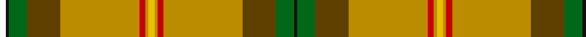

In pattern [KGGYRYYYRYGGKW](/stripes/kggyryyyryggkw/).

This was sourced from register-of-tartans.  It is a [14 stripe tartan](/stripes/stripes14/).

Original link https://www.tartanregister.gov.uk/tartanDetails.aspx?ref=3656

## Register references

External register numbers recorded for this tartan.

- Scottish Register of Tartans: [3656](https://www.tartanregister.gov.uk/tartanDetails.aspx?ref=3656)
- Scottish Tartans Authority (ITI): 1817
- Scottish Tartans World Register: 1817

## Thread count
W/4 K2 G12 Ta22 DY52 R4 DY2 Ya4 DY2 R4 DY52 Ta22 G12 K/2

## Palette
Each colour and the base-6 reference it is a variant of.

| Colour | Shade | Base |
|---|---|---|
| DY | <code style="background-color:#BC8C00;">#BC8C00</code> `oklch(66.8% 0.137 84.1)` <small>#BC8C00</small> | Y <code style="background-color:#F2BF00;">#F2BF00</code> |
| G | <code style="background-color:#006818;">#006818</code> `oklch(45.0% 0.142 145.0)` <small>#006818</small> | G <code style="background-color:#006100;">#006100</code> |
| K | <code style="background-color:#101010;">#101010</code> `oklch(17.3% 0.000 89.9)` <small>#101010</small> | K <code style="background-color:#000000;">#000000</code> |
| O | <code style="background-color:#D87C00;">#D87C00</code> `oklch(67.3% 0.155 61.8)` <small>#D87C00</small> | Y <code style="background-color:#F2BF00;">#F2BF00</code> |
| R | <code style="background-color:#C80000;">#C80000</code> `oklch(52.3% 0.215 29.2)` <small>#C80000</small> | R <code style="background-color:#CC0000;">#CC0000</code> |
| T | <code style="background-color:#4C3428;">#4C3428</code> `oklch(34.9% 0.040 47.5)` <small>#4C3428</small> | B <code style="background-color:#2A418A;">#2A418A</code> |
| Ta | <code style="background-color:#604000;">#604000</code> `oklch(39.8% 0.083 76.8)` <small>#604000</small> | G <code style="background-color:#006100;">#006100</code> |
| W | <code style="background-color:#FCFCFC;">#FCFCFC</code> `oklch(99.1% 0.000 89.9)` <small>#FCFCFC</small> | W <code style="background-color:#F7F7F7;">#F7F7F7</code> |
| Y | <code style="background-color:#E8C000;">#E8C000</code> `oklch(81.9% 0.168 93.7)` <small>#E8C000</small> | Y <code style="background-color:#F2BF00;">#F2BF00</code> |
| Ya | <code style="background-color:#E8C000;">#E8C000</code> `oklch(81.9% 0.168 93.7)` <small>#E8C000</small> | Y <code style="background-color:#F2BF00;">#F2BF00</code> |

## Nearest tartans

The nearest existing variants by ΔTartan distance, with this tartan at the top so the swatches line up against it.

ΔTartan

Tartan

Sett

—

<a href="/ttd/edit/#slug=w2k1g6dy11lo26r2lo1ly2~x2">Saskatchewan</a> <a class="nn-out" href="/setts/s14/w2k1g6dy11lo26r2lo1ly2~x2/" title="open its dictionary page">↗</a>

1.22

<a href="/ttd/edit/#slug=w2k1g6dy11lo26r2lo1ly2~x2">Saskatchewan (District)</a> <a class="nn-out" href="/setts/s8/w2k1g6dy11lo26r2lo1ly2~x2/" title="open its dictionary page">↗</a>

1.44

<a href="/ttd/edit/#slug=w2k1dg6o11lo26r2lo1ly2~x2">Saskatchewan</a> <a class="nn-out" href="/setts/s8/w2k1dg6o11lo26r2lo1ly2~x2/" title="open its dictionary page">↗</a>

1.75

<a href="/ttd/edit/#slug=y30dg5g3r1g3k1g3r1g3db1lo1~x4">California Department of Forestry (Corporate)</a> <a class="nn-out" href="/setts/s11/y30dg5g3r1g3k1g3r1g3db1lo1~x4/" title="open its dictionary page">↗</a>

1.82

<a href="/ttd/edit/#slug=ly30k1r4k1g3dg5dg4t6r2lb2~x2">Essex County (Ontario)</a> <a class="nn-out" href="/setts/s10/ly30k1r4k1g3dg5dg4t6r2lb2~x2/" title="open its dictionary page">↗</a>

1.86

<a href="/ttd/edit/#slug=ly6lo48db8lo16w4lo3g19r24lo4r9w4">Muirhead (Original)</a> <a class="nn-out" href="/setts/s11/ly6lo48db8lo16w4lo3g19r24lo4r9w4/" title="open its dictionary page">↗</a>

1.89

<a href="/ttd/edit/#slug=dy24k1lr2k1dy24o2dy2o12k4lr4w4w4ly4lo4dy4o12dy2o2~x2">Bear</a> <a class="nn-out" href="/setts/s18/dy24k1lr2k1dy24o2dy2o12k4lr4w4w4ly4lo4dy4o12dy2o2~x2/" title="open its dictionary page">↗</a>

1.89

<a href="/ttd/edit/#slug=dy24o2dy2o12k4lr4w4w4ly4lo4dy4o12dy2o2dy24k1lr2k1~x2">Bear (Corporate)</a> <a class="nn-out" href="/setts/s18/dy24o2dy2o12k4lr4w4w4ly4lo4dy4o12dy2o2dy24k1lr2k1~x2/" title="open its dictionary page">↗</a>

1.96

<a href="/ttd/edit/#slug=lo34g10lo5r2k8b2w3b2k8r2lo5g10lo28k3~x2">Lambert Hunting (Personal)</a> <a class="nn-out" href="/setts/s14/lo34g10lo5r2k8b2w3b2k8r2lo5g10lo28k3~x2/" title="open its dictionary page">↗</a>

1.96

<a href="/ttd/edit/#slug=w2k1g6dy11ly26r2ly1ly2~x2">Saskatchewan District Tartan Tartan Number: 1817. Earliest known date: 1959 The colours chosen are the same as those for the flag. Red for the Blood of Christ, blue for the Heavenly Father, yellow for Fire of the Holy Spirit when tongues of fire symbolized his presence at Penticost. See products available Copyright © Blair Urquhart, Comrie, 2015</a> <a class="nn-out" href="/setts/s8/w2k1g6dy11ly26r2ly1ly2~x2/" title="open its dictionary page">↗</a>

2.04

<a href="/ttd/edit/#slug=lo18r3g30b4k2w2k2b4r37ly1r3ly1r3~x2">Sri Lanka</a> <a class="nn-out" href="/setts/s13/lo18r3g30b4k2w2k2b4r37ly1r3ly1r3~x2/" title="open its dictionary page">↗</a>

## Neighbour map

Every grey dot is one of 14299 variants placed by the first two principal components of the ΔTartan feature space (44% of its variance). Red is this tartan; blue dots are its nearest — click one to open its page.

<svg viewBox="0 0 640 380" role="img" style="max-width:100%;height:auto;border:1px solid #e0e0e0;border-radius:4px;display:block" xmlns="http://www.w3.org/2000/svg"><image href="/nn/cloud.v1.png" width="640" height="380"/><a href="/setts/s8/w2k1g6dy11lo26r2lo1ly2~x2/"><circle cx="289.2" cy="87.2" r="4" fill="#3465a4"><title>Saskatchewan (District)</title></circle></a><a href="/setts/s8/w2k1dg6o11lo26r2lo1ly2~x2/"><circle cx="291.5" cy="83.5" r="4" fill="#3465a4"><title>Saskatchewan</title></circle></a><a href="/setts/s11/y30dg5g3r1g3k1g3r1g3db1lo1~x4/"><circle cx="372.5" cy="76.3" r="4" fill="#3465a4"><title>California Department of Forestry (Corporate)</title></circle></a><a href="/setts/s10/ly30k1r4k1g3dg5dg4t6r2lb2~x2/"><circle cx="236.2" cy="37.8" r="4" fill="#3465a4"><title>Essex County (Ontario)</title></circle></a><a href="/setts/s11/ly6lo48db8lo16w4lo3g19r24lo4r9w4/"><circle cx="248.6" cy="124.4" r="4" fill="#3465a4"><title>Muirhead (Original)</title></circle></a><a href="/setts/s18/dy24k1lr2k1dy24o2dy2o12k4lr4w4w4ly4lo4dy4o12dy2o2~x2/"><circle cx="212.1" cy="42.7" r="4" fill="#3465a4"><title>Bear</title></circle></a><a href="/setts/s18/dy24o2dy2o12k4lr4w4w4ly4lo4dy4o12dy2o2dy24k1lr2k1~x2/"><circle cx="212.1" cy="42.7" r="4" fill="#3465a4"><title>Bear (Corporate)</title></circle></a><a href="/setts/s14/lo34g10lo5r2k8b2w3b2k8r2lo5g10lo28k3~x2/"><circle cx="291.1" cy="103.2" r="4" fill="#3465a4"><title>Lambert Hunting (Personal)</title></circle></a><a href="/setts/s8/w2k1g6dy11ly26r2ly1ly2~x2/"><circle cx="255.5" cy="68.1" r="4" fill="#3465a4"><title>Saskatchewan District Tartan Tartan Number: 1817. Earliest known date: 1959 The colours chosen are the same as those for the flag. Red for the Blood of Christ, blue for the Heavenly Father, yellow for Fire of the Holy Spirit when tongues of fire symbolized his presence at Penticost. See products available Copyright © Blair Urquhart, Comrie, 2015</title></circle></a><a href="/setts/s13/lo18r3g30b4k2w2k2b4r37ly1r3ly1r3~x2/"><circle cx="238.0" cy="41.3" r="4" fill="#3465a4"><title>Sri Lanka</title></circle></a><circle cx="300.4" cy="73.2" r="5" fill="#c00000"/></svg>

ID: /setts/s14/w2k1g6dy11lo26r2lo1ly2~x2/
