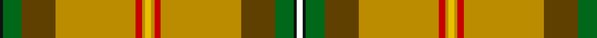

In pattern [KGGYRYYYRYGGKW](/patterns/kggyryyyryggkw/).

This was sourced from register-of-tartans.  It is a [14 stripes tartan](/stripes/stripes14/).

Original link https://www.tartanregister.gov.uk/tartanDetails.aspx?ref=3656

## Thread count
K/2 G12 Ta22 DY52 R4 DY2 Ya4 DY2 R4 DY52 Ta22 G12 K2 W/4

## Palette
Each colour and its ΔE from the base-6 reference it is a variant of.

| Colour | Shade | Base | ΔE (OKLab) |
|---|---|---|---|
| DY | <code style="background-color:#BC8C00;">#BC8C00</code> `#BC8C00` | Y <code style="background-color:#F2BF00;">#F2BF00</code> | 0.16 |
| G | <code style="background-color:#006818;">#006818</code> `#006818` | G <code style="background-color:#006100;">#006100</code> | 0.02 |
| K | <code style="background-color:#101010;">#101010</code> `#101010` | K <code style="background-color:#000000;">#000000</code> | 0.17 |
| O | <code style="background-color:#D87C00;">#D87C00</code> `#D87C00` | Y <code style="background-color:#F2BF00;">#F2BF00</code> | 0.17 |
| R | <code style="background-color:#C80000;">#C80000</code> `#C80000` | R <code style="background-color:#CC0000;">#CC0000</code> | 0.01 |
| T | <code style="background-color:#4C3428;">#4C3428</code> `#4C3428` | B <code style="background-color:#2A418A;">#2A418A</code> | 0.17 |
| Ta | <code style="background-color:#604000;">#604000</code> `#604000` | G <code style="background-color:#006100;">#006100</code> | 0.14 |
| W | <code style="background-color:#FCFCFC;">#FCFCFC</code> `#FCFCFC` | W <code style="background-color:#F7F7F7;">#F7F7F7</code> | 0.01 |
| Y | <code style="background-color:#E8C000;">#E8C000</code> `#E8C000` | Y <code style="background-color:#F2BF00;">#F2BF00</code> | 0.02 |
| Ya | <code style="background-color:#E8C000;">#E8C000</code> `#E8C000` | Y <code style="background-color:#F2BF00;">#F2BF00</code> | 0.02 |

## Nearest tartans

The nearest existing variants by ΔTartan distance.

1. [Saskatchewan (District)](/setts/s8/w2k1g6ga11y26r2y1ya2x2~g006818-ga604000-k101010-rc80000-wfcfcfc-ybc8c00-yae8c000/) — ΔT 1.22
1. [Saskatchewan](/setts/s8/w2k1g6r11y26ra2y1ya2x2~g004010-k000000-r806050-rac00000-we0e0e0-yd08010-yaf0c000/) — ΔT 1.44
1. [California Department of Forestry (Corporate)](/setts/s11/g30ga5gb3r1gb3k1gb3r1gb3b1y1x4~b1c0070-g8c7038-ga003820-gb289c18-k101010-rc80000-yd09800/) — ΔT 1.75
1. [Essex County (Ontario)](/setts/s10/y30k1r4k1g3ga5gb4b6r2w2x2~b788cb4-g007c00-ga005800-gb003000-k000000-r8c0000-wc8c8c8-yc89800/) — ΔT 1.82
1. [Muirhead (Original)](/setts/s11/y6ya48b8ya16w4ya3g19r24ya4r9w4~b2c2c80-g006818-rc80000-we0e0e0-ye8c000-yaa08858/) — ΔT 1.86
1. [Bear](/setts/s18/g24k1y2k1g24r2g2r12k4y4w4wa4ya4yb4g4r12g2r2x2~g603800-k101010-ra07c58-wfcfcfc-waf0e8d0-yb0b0b0-yaf0c800-ybd07c00/) — ΔT 1.89
1. [Bear (Corporate)](/setts/s18/g24r2g2r12k4y4w4wa4ya4yb4g4r12g2r2g24k1y2k1x2~g603800-k101010-ra07c58-wfcfcfc-waf0e8d0-yb0b0b0-yaf0c800-ybd07c00/) — ΔT 1.89
1. [Lambert Hunting (Personal)](/setts/s14/y34g10y5r2k8b2w3b2k8r2y5g10y28k3x2~b1474b4-g006818-k101010-rc8002c-wfcfcfc-ya08858/) — ΔT 1.96
1. [Saskatchewan District Tartan Tartan Number: 1817. Earliest known date: 1959 The colours chosen are the same as those for the flag. Red for the Blood of Christ, blue for the Heavenly Father, yellow for Fire of the Holy Spirit when tongues of fire symbolized his presence at Penticost. See products available Copyright © Blair Urquhart, Comrie, 2015](/setts/s8/w2k1g6ga11y26r2y1y2x2~g006818-ga604000-k101010-rc80000-we0e0e0-ye8c000/) — ΔT 1.96
1. [Sri Lanka](/setts/s13/y18r3g30b4k2w2k2b4r37ya1r3ya1r3x2~b1474b4-g006818-k101010-rc80000-we0e0e0-yd87c00-yae8c000/) — ΔT 2.04

## Neighbour map

Every grey dot is one of 15726 variants placed by the first two principal components of the ΔTartan feature space (44% of its variance). Red is this tartan; blue dots are its nearest — click one to open its page.

<svg viewBox="0 0 640 380" role="img" style="max-width:100%;height:auto;border:1px solid #e0e0e0;border-radius:4px;display:block" xmlns="http://www.w3.org/2000/svg"><image href="/nn/cloud.v1.png" width="640" height="380"/><a href="/setts/s8/w2k1g6ga11y26r2y1ya2x2~g006818-ga604000-k101010-rc80000-wfcfcfc-ybc8c00-yae8c000/"><circle cx="288.5" cy="84.7" r="4" fill="#3465a4"><title>Saskatchewan (District)</title></circle></a><a href="/setts/s8/w2k1g6r11y26ra2y1ya2x2~g004010-k000000-r806050-rac00000-we0e0e0-yd08010-yaf0c000/"><circle cx="291.3" cy="81.5" r="4" fill="#3465a4"><title>Saskatchewan</title></circle></a><a href="/setts/s11/g30ga5gb3r1gb3k1gb3r1gb3b1y1x4~b1c0070-g8c7038-ga003820-gb289c18-k101010-rc80000-yd09800/"><circle cx="371.4" cy="68.9" r="4" fill="#3465a4"><title>California Department of Forestry (Corporate)</title></circle></a><a href="/setts/s10/y30k1r4k1g3ga5gb4b6r2w2x2~b788cb4-g007c00-ga005800-gb003000-k000000-r8c0000-wc8c8c8-yc89800/"><circle cx="234.8" cy="36.2" r="4" fill="#3465a4"><title>Essex County (Ontario)</title></circle></a><a href="/setts/s11/y6ya48b8ya16w4ya3g19r24ya4r9w4~b2c2c80-g006818-rc80000-we0e0e0-ye8c000-yaa08858/"><circle cx="248.0" cy="121.1" r="4" fill="#3465a4"><title>Muirhead (Original)</title></circle></a><a href="/setts/s18/g24k1y2k1g24r2g2r12k4y4w4wa4ya4yb4g4r12g2r2x2~g603800-k101010-ra07c58-wfcfcfc-waf0e8d0-yb0b0b0-yaf0c800-ybd07c00/"><circle cx="210.8" cy="39.7" r="4" fill="#3465a4"><title>Bear</title></circle></a><a href="/setts/s18/g24r2g2r12k4y4w4wa4ya4yb4g4r12g2r2g24k1y2k1x2~g603800-k101010-ra07c58-wfcfcfc-waf0e8d0-yb0b0b0-yaf0c800-ybd07c00/"><circle cx="210.8" cy="39.7" r="4" fill="#3465a4"><title>Bear (Corporate)</title></circle></a><a href="/setts/s14/y34g10y5r2k8b2w3b2k8r2y5g10y28k3x2~b1474b4-g006818-k101010-rc8002c-wfcfcfc-ya08858/"><circle cx="289.5" cy="102.5" r="4" fill="#3465a4"><title>Lambert Hunting (Personal)</title></circle></a><a href="/setts/s8/w2k1g6ga11y26r2y1y2x2~g006818-ga604000-k101010-rc80000-we0e0e0-ye8c000/"><circle cx="254.6" cy="69.1" r="4" fill="#3465a4"><title>Saskatchewan District Tartan Tartan Number: 1817. Earliest known date: 1959 The colours chosen are the same as those for the flag. Red for the Blood of Christ, blue for the Heavenly Father, yellow for Fire of the Holy Spirit when tongues of fire symbolized his presence at Penticost. See products available Copyright © Blair Urquhart, Comrie, 2015</title></circle></a><a href="/setts/s13/y18r3g30b4k2w2k2b4r37ya1r3ya1r3x2~b1474b4-g006818-k101010-rc80000-we0e0e0-yd87c00-yae8c000/"><circle cx="237.2" cy="38.3" r="4" fill="#3465a4"><title>Sri Lanka</title></circle></a><circle cx="299.9" cy="69.3" r="5" fill="#c00000"/></svg>

ID: /setts/s14/w2k1g6ga11y26r2y1ya2y1r2y26ga11g6k1x2~g006818-ga604000-k101010-rc80000-wfcfcfc-ybc8c00-yae8c000/
