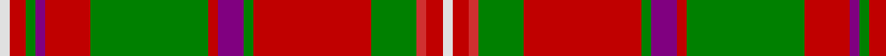

In pattern [WRGBRGRBGRGRRW](/patterns/wrgbrgrbgrgrrw/).

This was sourced from weddslist.  It is a [14 stripes tartan](/stripes/stripes14/).

Original link http://www.weddslist.com/cgi-bin/tartans/pg.pl?source=sts

## Thread count
LN/6 Ra10 G6 P6 Ra28 G72 Ra6 P16 G6 Ra72 G28 R6 Ra10 LN/6

## Palette
Each colour and its ΔE from the base-6 reference it is a variant of.

| Colour | Shade | Base | ΔE (OKLab) |
|---|---|---|---|
| G | <code style="background-color:#008000;">#008000</code> `#008000` | G <code style="background-color:#006100;">#006100</code> | 0.10 |
| LN | <code style="background-color:#E0E0E0;">#E0E0E0</code> `#E0E0E0` | W <code style="background-color:#F7F7F7;">#F7F7F7</code> | 0.07 |
| P | <code style="background-color:#800080;">#800080</code> `#800080` | B <code style="background-color:#2A418A;">#2A418A</code> | 0.17 |
| R | <code style="background-color:#D03030;">#D03030</code> `#D03030` | R <code style="background-color:#CC0000;">#CC0000</code> | 0.04 |
| Ra | <code style="background-color:#C00000;">#C00000</code> `#C00000` | R <code style="background-color:#CC0000;">#CC0000</code> | 0.03 |

## Nearest tartans

The nearest existing variants by ΔTartan distance.

1. [Hay](/setts/s14/r6g4y2g17r2g2r2g8r26g6r4k2r4w6x2~g285800-k101010-rc80000-we0e0e0-yd8b000/) — ΔT 0.62
1. [MacKinnon 2](/setts/s14/r1ra2g1k1ra5g11ra1k2g1ra11g4r1ra2w1x2~g008000-k000000-rd03030-rac00000-we0e0e0/) — ΔT 0.69
1. [Stewart of Appin 3](/setts/s16/r3k2b2r2g19r3g2r2ba6r2g2r21k2b2r2g2x2~b5480b0-ba304080-g008000-k000000-rc00000/) — ΔT 0.79
1. [MacKinnon #9](/setts/s14/r1ra2g1k1ra5g11ra1k2g1ra11g4r1ra2w1x2~g005020-k101010-rc82828-radc0000-we0e0e0/) — ΔT 0.81
1. [MacKinnon #11](/setts/s14/w3r5g3b3r14g36r3b8g3r36g14ra3r5w3x2~b5a008c-g005020-rdc0000-rac82828-we0e0e0/) — ΔT 0.82
1. [MacKinnon 1](/setts/s12/r3ra4g3b3ra11g30ra3b7g3r2ra4w2x2~b800080-g008000-rd03030-rac00000-we0e0e0/) — ΔT 0.84
1. [MacKinnon 5](/setts/s14/b2r3g2ba2r6g16r2ba4g2r16g8b2r4w2x2~b800080-ba304080-g008000-rc00000-we0e0e0/) — ΔT 0.90
1. [MacDonald of Staffa 4](/setts/s14/r2ra4g2b2ra6g14ra2b2g2ra12g7r2ra5w1x2~b304080-g008000-r800000-rac00000-we0e0e0/) — ΔT 0.91
1. [MacGuire (Personal)](/setts/s14/w3k2g18r2b8r18g2r2g2r2b2r18g18k2x2~b2c2c80-g285800-k101010-rc80000-we0e0e0/) — ΔT 0.93
1. [MacKinnon 6](/setts/s14/b2r3g2ba2r6g16r2ba4g2r16g8b2r4w2x2~b5480b0-ba304080-g008000-rc00000-we0e0e0/) — ΔT 0.98

## Neighbour map

Every grey dot is one of 15726 variants placed by the first two principal components of the ΔTartan feature space (44% of its variance). Red is this tartan; blue dots are its nearest — click one to open its page.

<svg viewBox="0 0 640 380" role="img" style="max-width:100%;height:auto;border:1px solid #e0e0e0;border-radius:4px;display:block" xmlns="http://www.w3.org/2000/svg"><image href="/nn/cloud.v1.png" width="640" height="380"/><a href="/setts/s14/r6g4y2g17r2g2r2g8r26g6r4k2r4w6x2~g285800-k101010-rc80000-we0e0e0-yd8b000/"><circle cx="272.3" cy="128.0" r="4" fill="#3465a4"><title>Hay</title></circle></a><a href="/setts/s14/r1ra2g1k1ra5g11ra1k2g1ra11g4r1ra2w1x2~g008000-k000000-rd03030-rac00000-we0e0e0/"><circle cx="248.2" cy="125.9" r="4" fill="#3465a4"><title>MacKinnon 2</title></circle></a><a href="/setts/s16/r3k2b2r2g19r3g2r2ba6r2g2r21k2b2r2g2x2~b5480b0-ba304080-g008000-k000000-rc00000/"><circle cx="245.3" cy="112.9" r="4" fill="#3465a4"><title>Stewart of Appin 3</title></circle></a><a href="/setts/s14/r1ra2g1k1ra5g11ra1k2g1ra11g4r1ra2w1x2~g005020-k101010-rc82828-radc0000-we0e0e0/"><circle cx="261.7" cy="128.1" r="4" fill="#3465a4"><title>MacKinnon #9</title></circle></a><a href="/setts/s14/w3r5g3b3r14g36r3b8g3r36g14ra3r5w3x2~b5a008c-g005020-rdc0000-rac82828-we0e0e0/"><circle cx="252.7" cy="119.9" r="4" fill="#3465a4"><title>MacKinnon #11</title></circle></a><a href="/setts/s12/r3ra4g3b3ra11g30ra3b7g3r2ra4w2x2~b800080-g008000-rd03030-rac00000-we0e0e0/"><circle cx="264.7" cy="119.6" r="4" fill="#3465a4"><title>MacKinnon 1</title></circle></a><a href="/setts/s14/b2r3g2ba2r6g16r2ba4g2r16g8b2r4w2x2~b800080-ba304080-g008000-rc00000-we0e0e0/"><circle cx="216.8" cy="152.0" r="4" fill="#3465a4"><title>MacKinnon 5</title></circle></a><a href="/setts/s14/r2ra4g2b2ra6g14ra2b2g2ra12g7r2ra5w1x2~b304080-g008000-r800000-rac00000-we0e0e0/"><circle cx="256.3" cy="142.7" r="4" fill="#3465a4"><title>MacDonald of Staffa 4</title></circle></a><a href="/setts/s14/w3k2g18r2b8r18g2r2g2r2b2r18g18k2x2~b2c2c80-g285800-k101010-rc80000-we0e0e0/"><circle cx="224.4" cy="145.7" r="4" fill="#3465a4"><title>MacGuire (Personal)</title></circle></a><a href="/setts/s14/b2r3g2ba2r6g16r2ba4g2r16g8b2r4w2x2~b5480b0-ba304080-g008000-rc00000-we0e0e0/"><circle cx="217.5" cy="153.5" r="4" fill="#3465a4"><title>MacKinnon 6</title></circle></a><circle cx="257.4" cy="123.3" r="5" fill="#c00000"/></svg>

ID: /setts/s14/w3r5g3b3r14g36r3b8g3r36g14ra3r5w3x2~b800080-g008000-rc00000-rad03030-we0e0e0/
