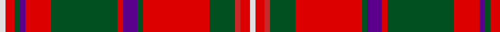

In pattern [WRGBRGRBGRGRRW](/patterns/wrgbrgrbgrgrrw/).

This was sourced from register-of-tartans.  It is a [14 stripes tartan](/stripes/stripes14/).

Original link https://www.tartanregister.gov.uk/tartanDetails.aspx?ref=2544

## Register references

External register numbers recorded for this tartan.

- Scottish Register of Tartans: [2544](https://www.tartanregister.gov.uk/tartanDetails.aspx?ref=2544)
- Scottish Tartans World Register: 1841

## Thread count
LN/6 R10 G6 P6 R28 G72 R6 P16 G6 R72 G28 Ra6 R10 LN/6

## Palette
Each colour and its ΔE from the base-6 reference it is a variant of.

| Colour | Shade | Base | ΔE (OKLab) |
|---|---|---|---|
| G | <code style="background-color:#005020;">#005020</code> `#005020` | G <code style="background-color:#006100;">#006100</code> | 0.07 |
| LN | <code style="background-color:#E0E0E0;">#E0E0E0</code> `#E0E0E0` | W <code style="background-color:#F7F7F7;">#F7F7F7</code> | 0.07 |
| P | <code style="background-color:#5A008C;">#5A008C</code> `#5A008C` | B <code style="background-color:#2A418A;">#2A418A</code> | 0.13 |
| R | <code style="background-color:#DC0000;">#DC0000</code> `#DC0000` | R <code style="background-color:#CC0000;">#CC0000</code> | 0.03 |
| Ra | <code style="background-color:#C82828;">#C82828</code> `#C82828` | R <code style="background-color:#CC0000;">#CC0000</code> | 0.03 |

## Nearest tartans

The nearest existing variants by ΔTartan distance.

1. [MacKinnon #9](/setts/s14/r1ra2g1k1ra5g11ra1k2g1ra11g4r1ra2w1~g005020-k101010-rc82828-radc0000-we0e0e0~x2/) — ΔT 0.46
1. [Stuart/Stewart of Appin #3](/setts/s16/r3k2b2r2g19r3g2r2ba6r2g2r21k2b2r2g2~b3c82af-ba2c4084-g005020-k101010-rdc0000~x2/) — ΔT 0.65
1. [Hay](/setts/s14/r6g4y2g17r2g2r2g8r26g6r4k2r4w6~g285800-k101010-rc80000-we0e0e0-yd8b000~x2/) — ΔT 0.81
1. [MacKinnon 3](/setts/s14/w3r5g3b3r14g36r3b8g3r36g14ra3r5w3~b800080-g008000-rc00000-rad03030-we0e0e0~x2/) — ΔT 0.82
1. [Stewart of Appin 3](/setts/s16/r3k2b2r2g19r3g2r2ba6r2g2r21k2b2r2g2~b5480b0-ba304080-g008000-k000000-rc00000~x2/) — ΔT 0.88
1. [Cameron of Locheil](/setts/s13/k3r4b2r20b20r2g2r6g10r6w2r3k2~b304080-g008000-k000000-rc00000-we0e0e0~x2/) — ΔT 0.89
1. [MacKinnon #8](/setts/s14/b2r3g2ba2r6g16r2ba4g2r16g8b2r4w2~b5a008c-ba2c4084-g005020-rdc0000-we0e0e0~x2/) — ΔT 0.90
1. [MacGuire (Personal)](/setts/s14/w3k2g18r2b8r18g2r2g2r2b2r18g18k2~b2c2c80-g285800-k101010-rc80000-we0e0e0~x2/) — ΔT 0.90
1. [Seton](/setts/s18/r2g1r10k2r1b2r2g6w1g3w1g6r2b2r1k2r10g1~b780078-g006818-k101010-rc80000-wfcfcfc~x8/) — ΔT 0.94
1. [MacKinnon 2](/setts/s14/r1ra2g1k1ra5g11ra1k2g1ra11g4r1ra2w1~g008000-k000000-rd03030-rac00000-we0e0e0~x2/) — ΔT 0.94

## Neighbour map

Every grey dot is one of 15726 variants placed by the first two principal components of the ΔTartan feature space (44% of its variance). Red is this tartan; blue dots are its nearest — click one to open its page.

<svg viewBox="0 0 640 380" role="img" style="max-width:100%;height:auto;border:1px solid #e0e0e0;border-radius:4px;display:block" xmlns="http://www.w3.org/2000/svg"><image href="/nn/cloud.v1.png" width="640" height="380"/><a href="/setts/s14/r1ra2g1k1ra5g11ra1k2g1ra11g4r1ra2w1~g005020-k101010-rc82828-radc0000-we0e0e0~x2/"><circle cx="261.7" cy="128.1" r="4" fill="#3465a4"><title>MacKinnon #9</title></circle></a><a href="/setts/s16/r3k2b2r2g19r3g2r2ba6r2g2r21k2b2r2g2~b3c82af-ba2c4084-g005020-k101010-rdc0000~x2/"><circle cx="255.7" cy="114.2" r="4" fill="#3465a4"><title>Stuart/Stewart of Appin #3</title></circle></a><a href="/setts/s14/r6g4y2g17r2g2r2g8r26g6r4k2r4w6~g285800-k101010-rc80000-we0e0e0-yd8b000~x2/"><circle cx="272.3" cy="128.0" r="4" fill="#3465a4"><title>Hay</title></circle></a><a href="/setts/s14/w3r5g3b3r14g36r3b8g3r36g14ra3r5w3~b800080-g008000-rc00000-rad03030-we0e0e0~x2/"><circle cx="257.4" cy="123.3" r="4" fill="#3465a4"><title>MacKinnon 3</title></circle></a><a href="/setts/s16/r3k2b2r2g19r3g2r2ba6r2g2r21k2b2r2g2~b5480b0-ba304080-g008000-k000000-rc00000~x2/"><circle cx="245.3" cy="112.9" r="4" fill="#3465a4"><title>Stewart of Appin 3</title></circle></a><a href="/setts/s13/k3r4b2r20b20r2g2r6g10r6w2r3k2~b304080-g008000-k000000-rc00000-we0e0e0~x2/"><circle cx="238.5" cy="138.4" r="4" fill="#3465a4"><title>Cameron of Locheil</title></circle></a><a href="/setts/s14/b2r3g2ba2r6g16r2ba4g2r16g8b2r4w2~b5a008c-ba2c4084-g005020-rdc0000-we0e0e0~x2/"><circle cx="214.4" cy="149.4" r="4" fill="#3465a4"><title>MacKinnon #8</title></circle></a><a href="/setts/s14/w3k2g18r2b8r18g2r2g2r2b2r18g18k2~b2c2c80-g285800-k101010-rc80000-we0e0e0~x2/"><circle cx="224.4" cy="145.7" r="4" fill="#3465a4"><title>MacGuire (Personal)</title></circle></a><a href="/setts/s18/r2g1r10k2r1b2r2g6w1g3w1g6r2b2r1k2r10g1~b780078-g006818-k101010-rc80000-wfcfcfc~x8/"><circle cx="243.1" cy="128.8" r="4" fill="#3465a4"><title>Seton</title></circle></a><a href="/setts/s14/r1ra2g1k1ra5g11ra1k2g1ra11g4r1ra2w1~g008000-k000000-rd03030-rac00000-we0e0e0~x2/"><circle cx="248.2" cy="125.9" r="4" fill="#3465a4"><title>MacKinnon 2</title></circle></a><circle cx="252.7" cy="119.9" r="5" fill="#c00000"/></svg>

ID: /setts/s14/w3r5g3b3r14g36r3b8g3r36g14ra3r5w3~b5a008c-g005020-rdc0000-rac82828-we0e0e0~x2/
