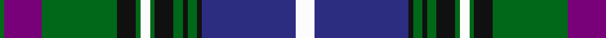

In pattern [GBGKGWGKGKGKBW](/patterns/gbgkgwgkgkgkbw/).

This was sourced from register-of-tartans.  It is a [14 stripes tartan](/stripes/stripes14/).

Original link https://www.tartanregister.gov.uk/tartanDetails.aspx?ref=4822

## Register references

External register numbers recorded for this tartan.

- Scottish Register of Tartans: [4822](https://www.tartanregister.gov.uk/tartanDetails.aspx?ref=4822)
- Scottish Tartans Authority (ITI): 2625
- Scottish Tartans World Register: 2625

## Thread count
G/2 P16 G32 K8 G2 W4 G2 K8 G4 K2 G4 K2 DB40 W/8

## Palette
Each colour and its ΔE from the base-6 reference it is a variant of.

| Colour | Shade | Base | ΔE (OKLab) |
|---|---|---|---|
| DB | <code style="background-color:#2C2C80;">#2C2C80</code> `#2C2C80` | B <code style="background-color:#2A418A;">#2A418A</code> | 0.06 |
| G | <code style="background-color:#006818;">#006818</code> `#006818` | G <code style="background-color:#006100;">#006100</code> | 0.02 |
| K | <code style="background-color:#101010;">#101010</code> `#101010` | K <code style="background-color:#000000;">#000000</code> | 0.17 |
| LG | <code style="background-color:#789484;">#789484</code> `#789484` | G <code style="background-color:#006100;">#006100</code> | 0.24 |
| LR | <code style="background-color:#EC34C4;">#EC34C4</code> `#EC34C4` | R <code style="background-color:#CC0000;">#CC0000</code> | 0.24 |
| P | <code style="background-color:#780078;">#780078</code> `#780078` | B <code style="background-color:#2A418A;">#2A418A</code> | 0.17 |
| W | <code style="background-color:#FCFCFC;">#FCFCFC</code> `#FCFCFC` | W <code style="background-color:#F7F7F7;">#F7F7F7</code> | 0.01 |

## Nearest tartans

The nearest existing variants by ΔTartan distance.

1. [Cochrane Hunting](/setts/s15/g46r6g6r2g8r2g6r2g6b36r2ba47r6ba24y6~b480800-ba000048-g408060-ra00000-yfccc00/) — ΔT 0.79
1. [Couper of Gogar (Clan)](/setts/s18/r2w4b2g24b4g2b4k10w4b2w4g8b1k2b22w4b2r2~b2c2c80-g006818-k101010-rc80000-wc49cd8~x2/) — ΔT 0.81
1. [Scottish Islamic (Corporate)](/setts/s18/g2y2g2y2g2y2g18k1g2k5b2k1b19w2b2w2b2w2~b1c0070-g00643c-k101010-wfcfcfc-ybc8c00~x2/) — ΔT 0.82
1. [Couper of Gogar](/setts/s18/b2w4r2g24b4g2b4k10w4b2w4g8b1k1b22w4b2r2~b2c2c80-g006818-k101010-rc80000-wc49cd8~x2/) — ΔT 0.83
1. [Couper / Cooper](/setts/s18/b2w4r2g24b4g2b4k10w4b2w4g8b1k1b22w4b2r2~b304080-g008000-k000000-rc00000-wc0a0e0~x2/) — ΔT 0.85
1. [Scottish Islamic](/setts/s18/g2y2g2y2g2y2g18k1g2k5b2k1b19w2b2w2b2w2~b031567-g064b15-k101010-wffffff-yeeb422~x2/) — ΔT 0.96
1. [Willox](/setts/s13/g6w12b3wa1b6w4wa1w4b6wa1k27g5wa2~b483d8b-g5c6428-k101010-wa8ace8-wafcfcfc~x2/) — ΔT 0.96
1. [Rangers Dress (Sports)](/setts/s11/r2b6y2b2k9g30k9b5y4b2r2~b1c0070-g688c98-k101010-r880000-yb8b8b8~x2/) — ΔT 1.01
1. [Hope Vere Family Tartan Tartan Number: 759. Earliest known date: c.1815 Hopetoun House, South Queensferry, home of the Marquesses of Linlithgow, was built by Robert Adam. The Highland Society of London collected specimens of tartan sealed with the signature of the Clan Chief or Head of the family, from 1815 onwards. See products available Copyright © Blair Urquhart, Comrie, 2015](/setts/s16/g19k1ga3k1g3k9b20k1y1k7y1k1b21k12g2ga1~b2c2c80-g289c18-ga006818-k101010-ye8c000~x2/) — ΔT 1.03
1. [Baron of Greencastle Htg (Personal)](/setts/s13/b4y2g24y2k12b3k2b2k2b14r1b1r3~b2c2c80-g006818-k101010-r880000-ye8c000~x2/) — ΔT 1.04

## Neighbour map

Every grey dot is one of 15726 variants placed by the first two principal components of the ΔTartan feature space (44% of its variance). Red is this tartan; blue dots are its nearest — click one to open its page.

<svg viewBox="0 0 640 380" role="img" style="max-width:100%;height:auto;border:1px solid #e0e0e0;border-radius:4px;display:block" xmlns="http://www.w3.org/2000/svg"><image href="/nn/cloud.v1.png" width="640" height="380"/><a href="/setts/s15/g46r6g6r2g8r2g6r2g6b36r2ba47r6ba24y6~b480800-ba000048-g408060-ra00000-yfccc00/"><circle cx="194.3" cy="101.6" r="4" fill="#3465a4"><title>Cochrane Hunting</title></circle></a><a href="/setts/s18/r2w4b2g24b4g2b4k10w4b2w4g8b1k2b22w4b2r2~b2c2c80-g006818-k101010-rc80000-wc49cd8~x2/"><circle cx="191.4" cy="93.9" r="4" fill="#3465a4"><title>Couper of Gogar (Clan)</title></circle></a><a href="/setts/s18/g2y2g2y2g2y2g18k1g2k5b2k1b19w2b2w2b2w2~b1c0070-g00643c-k101010-wfcfcfc-ybc8c00~x2/"><circle cx="182.5" cy="85.6" r="4" fill="#3465a4"><title>Scottish Islamic (Corporate)</title></circle></a><a href="/setts/s18/b2w4r2g24b4g2b4k10w4b2w4g8b1k1b22w4b2r2~b2c2c80-g006818-k101010-rc80000-wc49cd8~x2/"><circle cx="195.0" cy="93.0" r="4" fill="#3465a4"><title>Couper of Gogar</title></circle></a><a href="/setts/s18/b2w4r2g24b4g2b4k10w4b2w4g8b1k1b22w4b2r2~b304080-g008000-k000000-rc00000-wc0a0e0~x2/"><circle cx="176.3" cy="86.4" r="4" fill="#3465a4"><title>Couper / Cooper</title></circle></a><a href="/setts/s18/g2y2g2y2g2y2g18k1g2k5b2k1b19w2b2w2b2w2~b031567-g064b15-k101010-wffffff-yeeb422~x2/"><circle cx="178.4" cy="85.7" r="4" fill="#3465a4"><title>Scottish Islamic</title></circle></a><a href="/setts/s13/g6w12b3wa1b6w4wa1w4b6wa1k27g5wa2~b483d8b-g5c6428-k101010-wa8ace8-wafcfcfc~x2/"><circle cx="159.6" cy="88.5" r="4" fill="#3465a4"><title>Willox</title></circle></a><a href="/setts/s11/r2b6y2b2k9g30k9b5y4b2r2~b1c0070-g688c98-k101010-r880000-yb8b8b8~x2/"><circle cx="193.9" cy="123.1" r="4" fill="#3465a4"><title>Rangers Dress (Sports)</title></circle></a><a href="/setts/s16/g19k1ga3k1g3k9b20k1y1k7y1k1b21k12g2ga1~b2c2c80-g289c18-ga006818-k101010-ye8c000~x2/"><circle cx="209.4" cy="109.6" r="4" fill="#3465a4"><title>Hope Vere Family Tartan Tartan Number: 759. Earliest known date: c.1815 Hopetoun House, South Queensferry, home of the Marquesses of Linlithgow, was built by Robert Adam. The Highland Society of London collected specimens of tartan sealed with the signature of the Clan Chief or Head of the family, from 1815 onwards. See products available Copyright © Blair Urquhart, Comrie, 2015</title></circle></a><a href="/setts/s13/b4y2g24y2k12b3k2b2k2b14r1b1r3~b2c2c80-g006818-k101010-r880000-ye8c000~x2/"><circle cx="203.5" cy="111.4" r="4" fill="#3465a4"><title>Baron of Greencastle Htg (Personal)</title></circle></a><circle cx="165.9" cy="101.3" r="5" fill="#c00000"/></svg>

ID: /setts/s14/w4b20k1g2k1g2k4g1w2g1k4g16ba8g1~b2c2c80-ba780078-g006818-k101010-wfcfcfc~x2/
