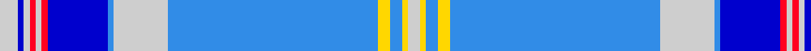

In pattern [WBWRWRBBWBYBYW](/patterns/wbwrwrbbwbybyw/).

This was sourced from house-of-tartan.  It is a [14 stripes tartan](/stripes/stripes14/).

Original link http://www.house-of-tartan.scotland.net/house/TartanViewjs.asp?colr=Def&tnam=10741

## Thread count
N/6 B2 N2 R2 N2 R2 B20 Ba2 N18 Ba70 Y4 Ba4 Y2 N/4

## Palette
Each colour and its ΔE from the base-6 reference it is a variant of.

| Colour | Shade | Base | ΔE (OKLab) |
|---|---|---|---|
| B | <code style="background-color:#0000CD;">#0000CD</code> `#0000CD` | B <code style="background-color:#2C4084;">#2C4084</code> | 0.15 |
| Ba | <code style="background-color:#318CE7;">#318CE7</code> `#318CE7` | B <code style="background-color:#2C4084;">#2C4084</code> | 0.24 |
| N | <code style="background-color:#CECECE;">#CECECE</code> `#CECECE` | W <code style="background-color:#F4F4F0;">#F4F4F0</code> | 0.11 |
| R | <code style="background-color:#FF0020;">#FF0020</code> `#FF0020` | R <code style="background-color:#C80000;">#C80000</code> | 0.11 |
| Y | <code style="background-color:#FFD700;">#FFD700</code> `#FFD700` | Y <code style="background-color:#E8C000;">#E8C000</code> | 0.07 |

## Nearest tartans

The nearest existing variants by ΔTartan distance.

1. [De Clercq, Christian Family (Belgium)](/setts/s14/w6b2w2r2w2r2b20ba2w18ba70y4ba4y2w4-b0000cd-ba318ce7-rff0000-wcecece-yffd700/) — ΔT 0.01
1. [De Clercq, Christian (Belgium)](/setts/s13/w6b2w2r2w2b20r2w18ba70y4ba4y2w4-b2c2c80-ba1474b4-rc80000-wc0c0c0-ybc8c00/) — ΔT 1.18
1. [Spirit of India](/setts/s13/b64w4ba2w4b8ba2g16w16r16ba2b32ba2w8-b3399ff-ba071239-g3a6629-rff5721-wffffff/) — ΔT 1.39
1. [StammBar](/setts/s12/w8b16w8y16w4y4w8b84r2ya4r2b4-b1870a4-ra00000-wfcfcfc-y48a4c0-yafccc00/) — ΔT 1.69
1. [Dallas](/setts/s17/b150ba4b20ba12w4ba12b20w4g18ga12w4ga12g20w4b12ba8w4-b2474e8-ba5c5c5c-g006818-ga789484-we0e0e0/) — ΔT 1.70
1. [Edinburgh '86](/setts/s11/b6w2b2w2b4w6b28ba4b4ba45r4-b2c4084-ba0596fa-rdc0000-we0e0e0/) — ΔT 1.70
1. [Bennet Dress](/setts/s11/y128b36w4b6y4b6ba28bb16k4bb8y4-b000060-ba306084-bb3070fc-k000000-w94acfc-yacacac/) — ΔT 1.76
1. [Summerwood](/setts/s12/b76w3r4w3g4w3ga8b20wa20b3wa8w10-b2e4b95-g09401f-ga024f21-rdc0000-wffffff-wa66e7e9/) — ΔT 1.87
1. [Dunn (Scotland) (Name)](/setts/s12/b90y12b6y12b6w6ba10w6ba10w40b4w6-b1474b4-ba202060-we0e0e0-ye8c000/) — ΔT 1.93
1. [Commonwealth Games 1986 (Corp)](/setts/s11/b6w2b2w2b4w6b30ba4b4ba44r4-b2c2c80-ba2888c4-rc80000-wfcfcfc/) — ΔT 1.96

## Neighbour map

Every grey dot is one of 15726 variants placed by the first two principal components of the ΔTartan feature space (44% of its variance). Red is this tartan; blue dots are its nearest — click one to open its page.

<svg viewBox="0 0 640 380" role="img" style="max-width:100%;height:auto;border:1px solid #e0e0e0;border-radius:4px;display:block" xmlns="http://www.w3.org/2000/svg"><image href="/nn/cloud.v1.png" width="640" height="380"/><a href="/setts/s14/w6b2w2r2w2r2b20ba2w18ba70y4ba4y2w4-b0000cd-ba318ce7-rff0000-wcecece-yffd700/"><circle cx="322.6" cy="57.7" r="4" fill="#3465a4"><title>De Clercq, Christian Family (Belgium)</title></circle></a><a href="/setts/s13/w6b2w2r2w2b20r2w18ba70y4ba4y2w4-b2c2c80-ba1474b4-rc80000-wc0c0c0-ybc8c00/"><circle cx="339.8" cy="72.9" r="4" fill="#3465a4"><title>De Clercq, Christian (Belgium)</title></circle></a><a href="/setts/s13/b64w4ba2w4b8ba2g16w16r16ba2b32ba2w8-b3399ff-ba071239-g3a6629-rff5721-wffffff/"><circle cx="308.5" cy="78.4" r="4" fill="#3465a4"><title>Spirit of India</title></circle></a><a href="/setts/s12/w8b16w8y16w4y4w8b84r2ya4r2b4-b1870a4-ra00000-wfcfcfc-y48a4c0-yafccc00/"><circle cx="398.2" cy="67.4" r="4" fill="#3465a4"><title>StammBar</title></circle></a><a href="/setts/s17/b150ba4b20ba12w4ba12b20w4g18ga12w4ga12g20w4b12ba8w4-b2474e8-ba5c5c5c-g006818-ga789484-we0e0e0/"><circle cx="408.6" cy="70.3" r="4" fill="#3465a4"><title>Dallas</title></circle></a><a href="/setts/s11/b6w2b2w2b4w6b28ba4b4ba45r4-b2c4084-ba0596fa-rdc0000-we0e0e0/"><circle cx="299.8" cy="124.1" r="4" fill="#3465a4"><title>Edinburgh '86</title></circle></a><a href="/setts/s11/y128b36w4b6y4b6ba28bb16k4bb8y4-b000060-ba306084-bb3070fc-k000000-w94acfc-yacacac/"><circle cx="292.8" cy="55.8" r="4" fill="#3465a4"><title>Bennet Dress</title></circle></a><a href="/setts/s12/b76w3r4w3g4w3ga8b20wa20b3wa8w10-b2e4b95-g09401f-ga024f21-rdc0000-wffffff-wa66e7e9/"><circle cx="306.4" cy="68.3" r="4" fill="#3465a4"><title>Summerwood</title></circle></a><a href="/setts/s12/b90y12b6y12b6w6ba10w6ba10w40b4w6-b1474b4-ba202060-we0e0e0-ye8c000/"><circle cx="282.1" cy="103.4" r="4" fill="#3465a4"><title>Dunn (Scotland) (Name)</title></circle></a><a href="/setts/s11/b6w2b2w2b4w6b30ba4b4ba44r4-b2c2c80-ba2888c4-rc80000-wfcfcfc/"><circle cx="287.6" cy="121.9" r="4" fill="#3465a4"><title>Commonwealth Games 1986 (Corp)</title></circle></a><circle cx="322.8" cy="57.8" r="5" fill="#c00000"/></svg>

ID: /setts/s14/w6b2w2r2w2r2b20ba2w18ba70y4ba4y2w4-b0000cd-ba318ce7-rff0020-wcecece-yffd700/
