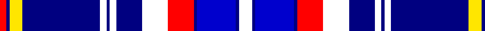

In pattern [RBYBWBWBWRBBBW](/patterns/rbybwbwbwrbbbw/).

This was sourced from register-of-tartans.  It is a [14 stripes tartan](/stripes/stripes14/).

Original link https://www.tartanregister.gov.uk/tartanDetails.aspx?ref=10589

## Attestations

This cloth appears in 2 source records; the oldest owns this page.

- 23/03/2012 — Submariners (register-of-tartans, [record](https://www.tartanregister.gov.uk/tartanDetails.aspx?ref=10589))
- undated — Submariners Corporate Tartan Tartan Number: 10589. Earliest known date: 23/03/2012 Commissioned by Steven Johnson of Lisburn, NI. The colours are taken from the Royal Navy ensigns with the gold and red of the dolphin symbol worn by submariners. See products available Copyright © Blair Urquhart, Comrie, 2015 (house-of-tartan, [record](http://www.house-of-tartan.scotland.net/house/TartanViewjs.asp?colr=Def&tnam=10589))

## Thread count
R/4 DB2 Y8 DB48 W4 DB2 W4 DB16 W16 R16 DB2 B24 DB2 W/8

## Palette
Each colour and its ΔE from the base-6 reference it is a variant of.

| Colour | Shade | Base | ΔE (OKLab) |
|---|---|---|---|
| B | <code style="background-color:#0000CD;">#0000CD</code> `#0000CD` | B <code style="background-color:#2A418A;">#2A418A</code> | 0.14 |
| DB | <code style="background-color:#000080;">#000080</code> `#000080` | B <code style="background-color:#2A418A;">#2A418A</code> | 0.14 |
| R | <code style="background-color:#FF0000;">#FF0000</code> `#FF0000` | R <code style="background-color:#CC0000;">#CC0000</code> | 0.11 |
| W | <code style="background-color:#FFFFFF;">#FFFFFF</code> `#FFFFFF` | W <code style="background-color:#F7F7F7;">#F7F7F7</code> | 0.02 |
| Y | <code style="background-color:#FFE600;">#FFE600</code> `#FFE600` | Y <code style="background-color:#F2BF00;">#F2BF00</code> | 0.10 |

## Nearest tartans

The nearest existing variants by ΔTartan distance.

1. [Ar Lenn Vor](/setts/s11/b15y30w30k20w20k15w10y4b94w4r10-b0000ff-k101010-re87878-wffffff-yfccc00/) — ΔT 1.14
1. [Mead of Poetry, The](/setts/s12/w12b4ba12b4ba50b4r2b4y6bb10w12b8-b666666-ba131362-bb0000cd-rff0000-wffffff-yffe600/) — ΔT 1.15
1. [Illinois, St Andrews Society](/setts/s13/b8r6ba46b32w10ba6r4ba6w10ba22b4r2b8-b000050-ba8080d0-rc00000-we0e0e0/) — ΔT 1.26
1. [Payeur, François (Personal)](/setts/s12/w12r4w48b24ba6b4ba4b4ba24y2ba2y6-b000080-ba0000cd-r9e0508-wffffff-yffd700/) — ΔT 1.31
1. [Sinclair Dress (Dance)](/setts/s12/b8r4b62k20g8w42g4w42g8k20b62r4-b38409c-g006818-k101010-rc80000-we0e0e0/) — ΔT 1.37
1. [Submariners (Unofficial)](/setts/s14/w8b2ba24b2r16w16b16w4b2w4b48y8b2r4-b003c64-ba2c2c80-rc80000-wfcfcfc-yfccc00/) — ΔT 1.39
1. [Rikaco Morning Dew 1 (Fashion)](/setts/s10/b8w4b2ba48b20w2bb4w10bb6r4-b202060-ba2888c4-bb1c0070-rc80000-we0e0e0/) — ΔT 1.39
1. [Highlands Country Club](/setts/s12/b60w44wa8w4wa4g16wa4w4wa8w44b60g20-b1c0070-g006818-wa8ace8-wac0c0c0/) — ΔT 1.47
1. [Baudoux et amis picards](/setts/s11/y8b14y8b52g6k2g6w18r4w8r4-b271b86-g3b522f-k120a01-rf4758c-wf7f1e8-yd3cc20/) — ΔT 1.47
1. [MacKellar Royal Blue Dress Tartan Tartan Number: 8181. Earliest known date: Threadcount and colours aren't 100% original. Generated manually. See products available Copyright © Blair Urquhart, Comrie, 2015](/setts/s11/b46w4b6ba8b6w4b10k22bb4w46k6-b2c2c80-ba2888c4-bb8c008c-k101010-we0e0e0/) — ΔT 1.49

## Neighbour map

Every grey dot is one of 15726 variants placed by the first two principal components of the ΔTartan feature space (44% of its variance). Red is this tartan; blue dots are its nearest — click one to open its page.

<svg viewBox="0 0 640 380" role="img" style="max-width:100%;height:auto;border:1px solid #e0e0e0;border-radius:4px;display:block" xmlns="http://www.w3.org/2000/svg"><image href="/nn/cloud.v1.png" width="640" height="380"/><a href="/setts/s11/b15y30w30k20w20k15w10y4b94w4r10-b0000ff-k101010-re87878-wffffff-yfccc00/"><circle cx="170.6" cy="95.2" r="4" fill="#3465a4"><title>Ar Lenn Vor</title></circle></a><a href="/setts/s12/w12b4ba12b4ba50b4r2b4y6bb10w12b8-b666666-ba131362-bb0000cd-rff0000-wffffff-yffe600/"><circle cx="199.8" cy="75.6" r="4" fill="#3465a4"><title>Mead of Poetry, The</title></circle></a><a href="/setts/s13/b8r6ba46b32w10ba6r4ba6w10ba22b4r2b8-b000050-ba8080d0-rc00000-we0e0e0/"><circle cx="251.0" cy="120.6" r="4" fill="#3465a4"><title>Illinois, St Andrews Society</title></circle></a><a href="/setts/s12/w12r4w48b24ba6b4ba4b4ba24y2ba2y6-b000080-ba0000cd-r9e0508-wffffff-yffd700/"><circle cx="178.0" cy="82.9" r="4" fill="#3465a4"><title>Payeur, François (Personal)</title></circle></a><a href="/setts/s12/b8r4b62k20g8w42g4w42g8k20b62r4-b38409c-g006818-k101010-rc80000-we0e0e0/"><circle cx="189.2" cy="125.7" r="4" fill="#3465a4"><title>Sinclair Dress (Dance)</title></circle></a><a href="/setts/s14/w8b2ba24b2r16w16b16w4b2w4b48y8b2r4-b003c64-ba2c2c80-rc80000-wfcfcfc-yfccc00/"><circle cx="201.7" cy="87.3" r="4" fill="#3465a4"><title>Submariners (Unofficial)</title></circle></a><a href="/setts/s10/b8w4b2ba48b20w2bb4w10bb6r4-b202060-ba2888c4-bb1c0070-rc80000-we0e0e0/"><circle cx="227.8" cy="105.3" r="4" fill="#3465a4"><title>Rikaco Morning Dew 1 (Fashion)</title></circle></a><a href="/setts/s12/b60w44wa8w4wa4g16wa4w4wa8w44b60g20-b1c0070-g006818-wa8ace8-wac0c0c0/"><circle cx="204.3" cy="144.8" r="4" fill="#3465a4"><title>Highlands Country Club</title></circle></a><a href="/setts/s11/y8b14y8b52g6k2g6w18r4w8r4-b271b86-g3b522f-k120a01-rf4758c-wf7f1e8-yd3cc20/"><circle cx="214.9" cy="75.7" r="4" fill="#3465a4"><title>Baudoux et amis picards</title></circle></a><a href="/setts/s11/b46w4b6ba8b6w4b10k22bb4w46k6-b2c2c80-ba2888c4-bb8c008c-k101010-we0e0e0/"><circle cx="168.6" cy="127.3" r="4" fill="#3465a4"><title>MacKellar Royal Blue Dress Tartan Tartan Number: 8181. Earliest known date: Threadcount and colours aren't 100% original. Generated manually. See products available Copyright © Blair Urquhart, Comrie, 2015</title></circle></a><circle cx="190.5" cy="85.0" r="5" fill="#c00000"/></svg>

ID: /setts/s14/w8b2ba24b2r16w16b16w4b2w4b48y8b2r4-b000080-ba0000cd-rff0000-wffffff-yffe600/
