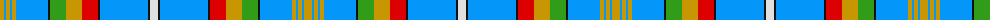

In pattern [WKBKRYGKBYBYBY](/patterns/wkbkrygkbybyby/).

This was sourced from register-of-tartans.  It is a [14 stripes tartan](/stripes/stripes14/).

Original link https://www.tartanregister.gov.uk/tartanDetails.aspx?ref=5977

## Thread count
DY/8 B2 DY4 B2 DY4 B32 K2 G16 DY16 R16 K2 B48 K2 LN/8

## Palette
Each colour and its ΔE from the base-6 reference it is a variant of.

| Colour | Shade | Base | ΔE (OKLab) |
|---|---|---|---|
| B | <code style="background-color:#0596FA;">#0596FA</code> `#0596FA` | B <code style="background-color:#2C4084;">#2C4084</code> | 0.28 |
| DY | <code style="background-color:#C89600;">#C89600</code> `#C89600` | Y <code style="background-color:#E8C000;">#E8C000</code> | 0.12 |
| G | <code style="background-color:#309C18;">#309C18</code> `#309C18` | G <code style="background-color:#006400;">#006400</code> | 0.18 |
| K | <code style="background-color:#101010;">#101010</code> `#101010` | K <code style="background-color:#000000;">#000000</code> | 0.17 |
| LN | <code style="background-color:#E0E0E0;">#E0E0E0</code> `#E0E0E0` | W <code style="background-color:#F4F4F0;">#F4F4F0</code> | 0.06 |
| R | <code style="background-color:#DC0000;">#DC0000</code> `#DC0000` | R <code style="background-color:#C80000;">#C80000</code> | 0.04 |

ID: /setts/s14/w8k2b48k2r16y16g16k2b32y4b2y4b2y8-b0596fa-g309c18-k101010-rdc0000-we0e0e0-yc89600/
