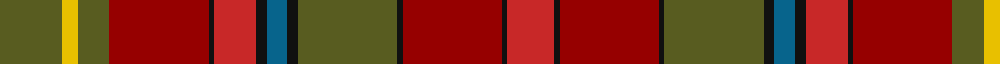

In pattern [GYGRKRKBKGKRKR](/stripes/gygrkrkbkgkrkr/).

This was sourced from register-of-tartans.  It is a [14 stripe tartan](/stripes/stripes14/).

Original link https://www.tartanregister.gov.uk/tartanDetails.aspx?ref=5845

## Register references

External register numbers recorded for this tartan.

- Scottish Register of Tartans: [5845](https://www.tartanregister.gov.uk/tartanDetails.aspx?ref=5845)
- Scottish Tartans World Register: 3125

## Thread count
G/24 Y6 G12 DR38 K2 R16 K4 B8 K4 G38 K2 DR38 K2 R/18

## Palette
Each colour and its ΔE from the base-6 reference it is a variant of.

| Colour | Shade | Base | ΔE (OKLab) |
|---|---|---|---|
| B | <code style="background-color:#07648C;">#07648C</code> `#07648C` | B <code style="background-color:#2A418A;">#2A418A</code> | 0.10 |
| DR | <code style="background-color:#960000;">#960000</code> `#960000` | R <code style="background-color:#CC0000;">#CC0000</code> | 0.12 |
| G | <code style="background-color:#585C20;">#585C20</code> `#585C20` | G <code style="background-color:#006100;">#006100</code> | 0.09 |
| K | <code style="background-color:#101010;">#101010</code> `#101010` | K <code style="background-color:#000000;">#000000</code> | 0.17 |
| R | <code style="background-color:#C82828;">#C82828</code> `#C82828` | R <code style="background-color:#CC0000;">#CC0000</code> | 0.03 |
| Y | <code style="background-color:#E8C000;">#E8C000</code> `#E8C000` | Y <code style="background-color:#F2BF00;">#F2BF00</code> | 0.02 |

## Nearest tartans

The nearest existing variants by ΔTartan distance.

1. [Ryutokukan High School (Corporate)](/setts/s12/o3n20r1n4r2n2r4n2r5g2r20w3~x2/) — ΔT 1.20
1. [McCall (Name)](/setts/s15/r8k5r8g27r8w2r3g3r3w2r8o27r8o3r3~x2/) — ΔT 1.36
1. [Powys (District)](/setts/s12/dg24r7dg7r7dg7r22r7r4b4r4r40b14/) — ΔT 1.52
1. [Caithness](/setts/s15/o28r3dr2y2dr2r3y8o2dr8o5dr3w2dr2o3dr1~x2/) — ΔT 1.55
1. [Prince Edward Island District Tartan Tartan Number: 918. Earliest known date: 1964 The warmth and glow of the fertile soil, The green field and tree, The yellow and the brown of Autumn, The white of surf or a summer snow, Rust, green, yellow and white, Yes! That's our Island Tartan. See products available Copyright © Blair Urquhart, Comrie, 2015](/setts/s15/g16dy1g2dy1g2dy12m12dy1ly2dy1m12dy12g12dy1w2~x2/) — ΔT 1.58
1. [MacDougall 2](/setts/s17/r30p3r3g12r12g12r8r3r8p12r5g3r5g25r4r6t1~x2/) — ΔT 1.59
1. [MacColl, hunting](/setts/s18/r6r3r6db22r7r2w1r2db2r2w1r2r7y22r7y2r2r2~x2/) — ΔT 1.61
1. [MacDougall #3](/setts/s17/r30dp3r3dg12r12dg12r8r3r8dp12r5dg3r5dg25r4r6t1~x2/) — ΔT 1.61
1. [Caithness District Tartan Tartan Number: 2466. Earliest known date: (Feb, 2001) Designed by Trudi Mann of Wick and incorporating colours of Caithness, including the unique blue grey Caithness flagstone. See products available Copyright © Blair Urquhart, Comrie, 2015](/setts/s15/dy28r3do2o2do2r3o8lo2do8lo5do3w2do2lo3do1~x2/) — ΔT 1.63
1. [Flodden](/setts/s12/w2lo1r3y20r1lo1r3lo2o14ly2r2ly2~x2/) — ΔT 1.64

## Neighbour map

Every grey dot is one of 14299 variants placed by the first two principal components of the ΔTartan feature space (44% of its variance). Red is this tartan; blue dots are its nearest — click one to open its page.

<svg viewBox="0 0 640 380" role="img" style="max-width:100%;height:auto;border:1px solid #e0e0e0;border-radius:4px;display:block" xmlns="http://www.w3.org/2000/svg"><image href="/nn/cloud.v1.png" width="640" height="380"/><a href="/setts/s12/o3n20r1n4r2n2r4n2r5g2r20w3~x2/"><circle cx="254.1" cy="111.9" r="4" fill="#3465a4"><title>Ryutokukan High School (Corporate)</title></circle></a><a href="/setts/s15/r8k5r8g27r8w2r3g3r3w2r8o27r8o3r3~x2/"><circle cx="247.6" cy="144.9" r="4" fill="#3465a4"><title>McCall (Name)</title></circle></a><a href="/setts/s12/dg24r7dg7r7dg7r22r7r4b4r4r40b14/"><circle cx="235.0" cy="171.3" r="4" fill="#3465a4"><title>Powys (District)</title></circle></a><a href="/setts/s15/o28r3dr2y2dr2r3y8o2dr8o5dr3w2dr2o3dr1~x2/"><circle cx="252.3" cy="90.5" r="4" fill="#3465a4"><title>Caithness</title></circle></a><a href="/setts/s15/g16dy1g2dy1g2dy12m12dy1ly2dy1m12dy12g12dy1w2~x2/"><circle cx="233.2" cy="150.7" r="4" fill="#3465a4"><title>Prince Edward Island District Tartan Tartan Number: 918. Earliest known date: 1964 The warmth and glow of the fertile soil, The green field and tree, The yellow and the brown of Autumn, The white of surf or a summer snow, Rust, green, yellow and white, Yes! That's our Island Tartan. See products available Copyright © Blair Urquhart, Comrie, 2015</title></circle></a><a href="/setts/s17/r30p3r3g12r12g12r8r3r8p12r5g3r5g25r4r6t1~x2/"><circle cx="224.1" cy="109.5" r="4" fill="#3465a4"><title>MacDougall 2</title></circle></a><a href="/setts/s18/r6r3r6db22r7r2w1r2db2r2w1r2r7y22r7y2r2r2~x2/"><circle cx="259.6" cy="105.8" r="4" fill="#3465a4"><title>MacColl, hunting</title></circle></a><a href="/setts/s17/r30dp3r3dg12r12dg12r8r3r8dp12r5dg3r5dg25r4r6t1~x2/"><circle cx="224.4" cy="109.8" r="4" fill="#3465a4"><title>MacDougall #3</title></circle></a><a href="/setts/s15/dy28r3do2o2do2r3o8lo2do8lo5do3w2do2lo3do1~x2/"><circle cx="235.9" cy="82.9" r="4" fill="#3465a4"><title>Caithness District Tartan Tartan Number: 2466. Earliest known date: (Feb, 2001) Designed by Trudi Mann of Wick and incorporating colours of Caithness, including the unique blue grey Caithness flagstone. See products available Copyright © Blair Urquhart, Comrie, 2015</title></circle></a><a href="/setts/s12/w2lo1r3y20r1lo1r3lo2o14ly2r2ly2~x2/"><circle cx="254.4" cy="112.6" r="4" fill="#3465a4"><title>Flodden</title></circle></a><circle cx="227.0" cy="133.2" r="5" fill="#c00000"/></svg>

ID: /setts/s14/y12ly3y6r19k1r8k2n4k2y19k1r19k1r9~x2/
