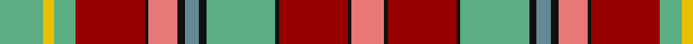

In pattern [RKRKYKGKRKRYYY](/patterns/rkrkykgkrkryyy/).

This was sourced from register-of-tartans.  It is a [14 stripes tartan](/stripes/stripes14/).

Original link https://www.tartanregister.gov.uk/tartanDetails.aspx?ref=4950

## Attestations

This cloth appears in 3 source records; the oldest owns this page.

- 01/01/2005 — Golden Broom (register-of-tartans, [record](https://www.tartanregister.gov.uk/tartanDetails.aspx?ref=4950))
- 2005 — Golden Broom (Corporate) (tartans-authority, [record](http://www.tartansauthority.com/tartan-ferret/display/7072/))
- undated — Golden Broom (Corporate) Corporate Tartan Tartan Number: 7072. Earliest known date: 2005 Designed by pupils of P6 & P7 in Mulbuie Primary School at Muir of Order (northwest of Inverness) during a project on the Jacobites. Mulbuie is the Gaelic for Golden Broom - thus the name of the tartan which has also been chosen as the official design for the 2007 Highland Year of Culture. Burgundy is the school colour, gold is for the golden broom and the greens and browns represent the area's agriculture. Woven sample. See products available Copyright © Blair Urquhart, Comrie, 2015 (house-of-tartan, [record](http://www.house-of-tartan.scotland.net/house/TartanViewjs.asp?colr=Def&tnam=7072))

## Thread count
LG/24 Y6 LG12 DR38 K2 LR16 K4 B8 K4 LG38 K2 DR38 K2 LR/18

## Palette
Each colour and its ΔE from the base-6 reference it is a variant of.

| Colour | Shade | Base | ΔE (OKLab) |
|---|---|---|---|
| B | <code style="background-color:#648894;">#648894</code> `#648894` | G <code style="background-color:#006400;">#006400</code> | 0.22 |
| DR | <code style="background-color:#980000;">#980000</code> `#980000` | R <code style="background-color:#C80000;">#C80000</code> | 0.10 |
| K | <code style="background-color:#101010;">#101010</code> `#101010` | K <code style="background-color:#000000;">#000000</code> | 0.17 |
| LG | <code style="background-color:#5CAC84;">#5CAC84</code> `#5CAC84` | Y <code style="background-color:#E8C000;">#E8C000</code> | 0.21 |
| LR | <code style="background-color:#E87878;">#E87878</code> `#E87878` | R <code style="background-color:#C80000;">#C80000</code> | 0.19 |
| LRa | <code style="background-color:#E08070;">#E08070</code> `#E08070` | Y <code style="background-color:#E8C000;">#E8C000</code> | 0.20 |
| R | <code style="background-color:#C80000;">#C80000</code> `#C80000` | R <code style="background-color:#C80000;">#C80000</code> | 0.00 |
| Y | <code style="background-color:#E8C000;">#E8C000</code> `#E8C000` | Y <code style="background-color:#E8C000;">#E8C000</code> | 0.00 |

## Nearest tartans

The nearest existing variants by ΔTartan distance.

1. [Unnamed No 1 Tartan Tartan Number: 1340. Earliest known date: 1870 This sett is taken from the records of Messrs Bolingbroke and Jones of Norwich, who were weavers around 1870. Some of the tartans have been adopted or modified in recent times as the copyright of the designs is now in the public domain. See products available Copyright © Blair Urquhart, Comrie, 2015](/setts/s12/r16b14k16y4k2w4k2g38k2r16b6r16-b5c8ca8-g006818-k101010-rc80000-we0e0e0-ye8c000/) — ΔT 0.91
1. [Unidentified No 1](/setts/s12/r16b14k16y4k2w4k2g38k2r16b6r16-b3c82af-g005020-k101010-rdc0000-we0e0e0-ye8c000/) — ΔT 1.01
1. [Devon 2000](/setts/s14/b48g8ga4g16ga4g8b24g6r44y6ba16g6r44y12-b304080-ba8080d0-g008000-ga003000-rc00000-yf0c000/) — ΔT 1.02
1. [Pernel (Personal)](/setts/s17/k16w2r4g32r16g16r22y4g4ya2g4w4r20y4r4k2w8-g006818-k101010-rc80000-we0e0e0-ye8c000-yad87c00/) — ΔT 1.06
1. [Unnamed C20th - National Archives](/setts/s11/b16k2r44y2r12k6g20w2k6b40w2-b5c8ca8-g003820-k101010-rc80000-wfcfcfc-yfccc00/) — ΔT 1.08
1. [Stewart - Pr Ch Ed (Royal)](/setts/s12/r56y16b24ya4b8w8b8yb48r24b8r8w4-b1c1c1c-rc80000-we0e0e0-ya4c8ac-yae8c000-ybacb884/) — ΔT 1.11
1. [Maclean of Duart (Wilsons) (Clan)](/setts/s11/b16k12y4k4w6k4g32r50b6r8k3-b5c8ca8-g285800-k101010-rc80000-we0e0e0-ye8c000/) — ΔT 1.14
1. [City of Edinburgh (2001) (District)](/setts/s16/r36b2ra36k2g36w2b36r2ra36g2r36k6w8k6w8k6-b2888c4-g006818-k101010-rc80000-ra888888-wf8f8f8/) — ΔT 1.16
1. [Westwood (Fashion?)](/setts/s10/r30y60k2w12k2y4g32b8r12w2-b5c8ca8-g003820-k101010-rc80000-we0e0e0-ya08858/) — ΔT 1.17
1. [Innes (D C Stewart)](/setts/s16/k4g24r4k4r4k4r32y4r6b12r6k2g16k2r6w4-b2c2c80-g006818-k101010-rc80000-wfcfcfc-ye8c000/) — ΔT 1.18

## Neighbour map

Every grey dot is one of 15726 variants placed by the first two principal components of the ΔTartan feature space (44% of its variance). Red is this tartan; blue dots are its nearest — click one to open its page.

<svg viewBox="0 0 640 380" role="img" style="max-width:100%;height:auto;border:1px solid #e0e0e0;border-radius:4px;display:block" xmlns="http://www.w3.org/2000/svg"><image href="/nn/cloud.v1.png" width="640" height="380"/><a href="/setts/s12/r16b14k16y4k2w4k2g38k2r16b6r16-b5c8ca8-g006818-k101010-rc80000-we0e0e0-ye8c000/"><circle cx="144.5" cy="109.1" r="4" fill="#3465a4"><title>Unnamed No 1 Tartan Tartan Number: 1340. Earliest known date: 1870 This sett is taken from the records of Messrs Bolingbroke and Jones of Norwich, who were weavers around 1870. Some of the tartans have been adopted or modified in recent times as the copyright of the designs is now in the public domain. See products available Copyright © Blair Urquhart, Comrie, 2015</title></circle></a><a href="/setts/s12/r16b14k16y4k2w4k2g38k2r16b6r16-b3c82af-g005020-k101010-rdc0000-we0e0e0-ye8c000/"><circle cx="141.7" cy="107.0" r="4" fill="#3465a4"><title>Unidentified No 1</title></circle></a><a href="/setts/s14/b48g8ga4g16ga4g8b24g6r44y6ba16g6r44y12-b304080-ba8080d0-g008000-ga003000-rc00000-yf0c000/"><circle cx="137.1" cy="121.7" r="4" fill="#3465a4"><title>Devon 2000</title></circle></a><a href="/setts/s17/k16w2r4g32r16g16r22y4g4ya2g4w4r20y4r4k2w8-g006818-k101010-rc80000-we0e0e0-ye8c000-yad87c00/"><circle cx="161.9" cy="95.3" r="4" fill="#3465a4"><title>Pernel (Personal)</title></circle></a><a href="/setts/s11/b16k2r44y2r12k6g20w2k6b40w2-b5c8ca8-g003820-k101010-rc80000-wfcfcfc-yfccc00/"><circle cx="187.7" cy="94.6" r="4" fill="#3465a4"><title>Unnamed C20th - National Archives</title></circle></a><a href="/setts/s12/r56y16b24ya4b8w8b8yb48r24b8r8w4-b1c1c1c-rc80000-we0e0e0-ya4c8ac-yae8c000-ybacb884/"><circle cx="153.7" cy="104.2" r="4" fill="#3465a4"><title>Stewart - Pr Ch Ed (Royal)</title></circle></a><a href="/setts/s11/b16k12y4k4w6k4g32r50b6r8k3-b5c8ca8-g285800-k101010-rc80000-we0e0e0-ye8c000/"><circle cx="174.9" cy="101.0" r="4" fill="#3465a4"><title>Maclean of Duart (Wilsons) (Clan)</title></circle></a><a href="/setts/s16/r36b2ra36k2g36w2b36r2ra36g2r36k6w8k6w8k6-b2888c4-g006818-k101010-rc80000-ra888888-wf8f8f8/"><circle cx="104.9" cy="91.5" r="4" fill="#3465a4"><title>City of Edinburgh (2001) (District)</title></circle></a><a href="/setts/s10/r30y60k2w12k2y4g32b8r12w2-b5c8ca8-g003820-k101010-rc80000-we0e0e0-ya08858/"><circle cx="204.8" cy="85.6" r="4" fill="#3465a4"><title>Westwood (Fashion?)</title></circle></a><a href="/setts/s16/k4g24r4k4r4k4r32y4r6b12r6k2g16k2r6w4-b2c2c80-g006818-k101010-rc80000-wfcfcfc-ye8c000/"><circle cx="186.8" cy="94.6" r="4" fill="#3465a4"><title>Innes (D C Stewart)</title></circle></a><circle cx="163.1" cy="100.9" r="5" fill="#c00000"/></svg>

ID: /setts/s14/y24ya6y12r38k2ra16k4g8k4y38k2r38k2ra18-g648894-k101010-r980000-rae87878-y5cac84-yae8c000/
