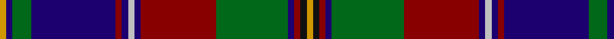

In pattern [YBGBRBWBRGBRKY](/patterns/ybgbrbwbrgbrky/).

This was sourced from register-of-tartans.  It is a [14 stripes tartan](/stripes/stripes14/).

Original link https://www.tartanregister.gov.uk/tartanDetails.aspx?ref=3243

## Thread count
DY/4 DB4 G12 DB54 DR4 DB4 N4 DB4 DR48 G46 DB4 DR4 K4 DY/4

## Palette
Each colour and its ΔE from the base-6 reference it is a variant of.

| Colour | Shade | Base | ΔE (OKLab) |
|---|---|---|---|
| DB | <code style="background-color:#1C0070;">#1C0070</code> `#1C0070` | B <code style="background-color:#2A418A;">#2A418A</code> | 0.14 |
| DR | <code style="background-color:#880000;">#880000</code> `#880000` | R <code style="background-color:#CC0000;">#CC0000</code> | 0.15 |
| DY | <code style="background-color:#D09800;">#D09800</code> `#D09800` | Y <code style="background-color:#F2BF00;">#F2BF00</code> | 0.12 |
| G | <code style="background-color:#006818;">#006818</code> `#006818` | G <code style="background-color:#006100;">#006100</code> | 0.02 |
| K | <code style="background-color:#101010;">#101010</code> `#101010` | K <code style="background-color:#000000;">#000000</code> | 0.17 |
| N | <code style="background-color:#C0C0C0;">#C0C0C0</code> `#C0C0C0` | W <code style="background-color:#F7F7F7;">#F7F7F7</code> | 0.17 |
| R | <code style="background-color:#C80000;">#C80000</code> `#C80000` | R <code style="background-color:#CC0000;">#CC0000</code> | 0.01 |
| W | <code style="background-color:#FCFCFC;">#FCFCFC</code> `#FCFCFC` | W <code style="background-color:#F7F7F7;">#F7F7F7</code> | 0.01 |

## Nearest tartans

The nearest existing variants by ΔTartan distance.

1. [Olympic Corporate Tartan Tartan Number: 1923. Earliest known date: pre 2003 Olympic symbol on every red block See products available Copyright © Blair Urquhart, Comrie, 2015](/setts/s13/b2g6b27r2k2w2b2r24g23b2r2k2y2~b2c2c80-g006818-k101010-rc80000-we0e0e0-ye8c000~x2/) — ΔT 0.70
1. [Olympic](/setts/s13/r24b2w2k2r2b27g6b2y2k2r2b2g23~b202060-g285800-k101010-rc80000-wfcfcfc-yd8b000~x2/) — ΔT 0.75
1. [Cats Winter (Fashion)](/setts/s12/r8g2k2y2k2ya2k2g18b2g2b29k3~b2c2c80-g006818-k101010-rc80000-ybc8c00-yae8c000~x2/) — ΔT 0.83
1. [Quebec, Plaid du (District)](/setts/s13/k25g5k2y2ka2r2k2g20r20ka2w2ka2r2~g003820-k00002c-ka101010-rb40000-we0e0e0-yc4a000~x2/) — ΔT 0.84
1. [Quebec Plaid Du.. Corporate Tartan Tartan Number: 1949. Earliest known date: 1965 The Scottish Tartans Society received a sample from A.C.Lumsden which is slightly different. (The black and the dark blue are almost indistinguishable). The colours of the tartan are taken from the Provincial Coat of Arms. The tartan is not registered with Lord Lyon. See products available Copyright © Blair Urquhart, Comrie, 2015](/setts/s12/b25g5b2y2k2r3g20r20b2w2k2r2~b202060-g006818-k101010-rc80000-we0e0e0-ye8c000~x2/) — ΔT 0.87
1. [Quebec, Plaid du](/setts/s12/k25g5k2y2ka2r3g20r20k2w2ka2r2~g003820-k00002c-ka101010-rb40000-we0e0e0-yc4a000~x2/) — ΔT 0.91
1. [Olympic](/setts/s13/b2g6b27r2k2w2b2r24g23b2r2k2y2~b304080-g008000-k000000-rc00000-we0e0e0-yf0c000~x2/) — ΔT 1.05
1. [Loch Lomond & the Trossachs (Fashion](/setts/s10/w2r5k2y3k4b28r4g14k4w2~b2c2c80-g285800-k101010-rc80000-we0e0e0-ybc8c00~x2/) — ΔT 1.06
1. [Linn (Personal)](/setts/s15/w3b3r1b3r1b15r1b2g15y1g2k20y1k2y2~b1c0070-g006818-k101010-rc80000-we0e0e0-ybc8c00~x2/) — ΔT 1.11
1. [MacDonald of Clanranald #5](/setts/s14/b20r2b2r5b30r2k32w2g30r5g4r2g4w2~b2c4084-g005020-k101010-rdc0000-we0e0e0/) — ΔT 1.12

## Neighbour map

Every grey dot is one of 15726 variants placed by the first two principal components of the ΔTartan feature space (44% of its variance). Red is this tartan; blue dots are its nearest — click one to open its page.

<svg viewBox="0 0 640 380" role="img" style="max-width:100%;height:auto;border:1px solid #e0e0e0;border-radius:4px;display:block" xmlns="http://www.w3.org/2000/svg"><image href="/nn/cloud.v1.png" width="640" height="380"/><a href="/setts/s13/b2g6b27r2k2w2b2r24g23b2r2k2y2~b2c2c80-g006818-k101010-rc80000-we0e0e0-ye8c000~x2/"><circle cx="171.5" cy="100.3" r="4" fill="#3465a4"><title>Olympic Corporate Tartan Tartan Number: 1923. Earliest known date: pre 2003 Olympic symbol on every red block See products available Copyright © Blair Urquhart, Comrie, 2015</title></circle></a><a href="/setts/s13/r24b2w2k2r2b27g6b2y2k2r2b2g23~b202060-g285800-k101010-rc80000-wfcfcfc-yd8b000~x2/"><circle cx="173.9" cy="101.2" r="4" fill="#3465a4"><title>Olympic</title></circle></a><a href="/setts/s12/r8g2k2y2k2ya2k2g18b2g2b29k3~b2c2c80-g006818-k101010-rc80000-ybc8c00-yae8c000~x2/"><circle cx="211.7" cy="107.2" r="4" fill="#3465a4"><title>Cats Winter (Fashion)</title></circle></a><a href="/setts/s13/k25g5k2y2ka2r2k2g20r20ka2w2ka2r2~g003820-k00002c-ka101010-rb40000-we0e0e0-yc4a000~x2/"><circle cx="158.1" cy="110.2" r="4" fill="#3465a4"><title>Quebec, Plaid du (District)</title></circle></a><a href="/setts/s12/b25g5b2y2k2r3g20r20b2w2k2r2~b202060-g006818-k101010-rc80000-we0e0e0-ye8c000~x2/"><circle cx="158.7" cy="110.7" r="4" fill="#3465a4"><title>Quebec Plaid Du.. Corporate Tartan Tartan Number: 1949. Earliest known date: 1965 The Scottish Tartans Society received a sample from A.C.Lumsden which is slightly different. (The black and the dark blue are almost indistinguishable). The colours of the tartan are taken from the Provincial Coat of Arms. The tartan is not registered with Lord Lyon. See products available Copyright © Blair Urquhart, Comrie, 2015</title></circle></a><a href="/setts/s12/k25g5k2y2ka2r3g20r20k2w2ka2r2~g003820-k00002c-ka101010-rb40000-we0e0e0-yc4a000~x2/"><circle cx="160.2" cy="116.2" r="4" fill="#3465a4"><title>Quebec, Plaid du</title></circle></a><a href="/setts/s13/b2g6b27r2k2w2b2r24g23b2r2k2y2~b304080-g008000-k000000-rc00000-we0e0e0-yf0c000~x2/"><circle cx="164.1" cy="97.9" r="4" fill="#3465a4"><title>Olympic</title></circle></a><a href="/setts/s10/w2r5k2y3k4b28r4g14k4w2~b2c2c80-g285800-k101010-rc80000-we0e0e0-ybc8c00~x2/"><circle cx="177.8" cy="117.3" r="4" fill="#3465a4"><title>Loch Lomond &amp; the Trossachs (Fashion</title></circle></a><a href="/setts/s15/w3b3r1b3r1b15r1b2g15y1g2k20y1k2y2~b1c0070-g006818-k101010-rc80000-we0e0e0-ybc8c00~x2/"><circle cx="155.4" cy="85.8" r="4" fill="#3465a4"><title>Linn (Personal)</title></circle></a><a href="/setts/s14/b20r2b2r5b30r2k32w2g30r5g4r2g4w2~b2c4084-g005020-k101010-rdc0000-we0e0e0/"><circle cx="200.3" cy="125.9" r="4" fill="#3465a4"><title>MacDonald of Clanranald #5</title></circle></a><circle cx="180.7" cy="101.9" r="5" fill="#c00000"/></svg>

ID: /setts/s14/y2b2g6b27r2b2w2b2r24g23b2r2k2y2~b1c0070-g006818-k101010-r880000-wc0c0c0-yd09800~x2/
