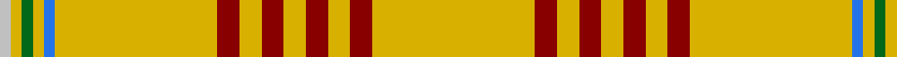

In pattern [WYGYBYRYRYRYRY](/patterns/wygybyryryryry/).

This was sourced from register-of-tartans.  It is a [14 stripes tartan](/stripes/stripes14/).

Original link https://www.tartanregister.gov.uk/tartanDetails.aspx?ref=593

## Attestations

This cloth appears in 2 source records; the oldest owns this page.

- 01/01/1992 — Catalan (92 Olympics) (register-of-tartans, [record](https://www.tartanregister.gov.uk/tartanDetails.aspx?ref=593))
- 1992 — Catalan (92 Olympics) (District) (tartans-authority, [record](http://www.tartansauthority.com/tartan-ferret/display/2071/))

## Thread count
N/3 Y3 G3 Y3 B3 Y44 DR6 Y6 DR6 Y6 DR6 Y6 DR6 Y/44

## Palette
Each colour and its ΔE from the base-6 reference it is a variant of.

| Colour | Shade | Base | ΔE (OKLab) |
|---|---|---|---|
| B | <code style="background-color:#2474E8;">#2474E8</code> `#2474E8` | B <code style="background-color:#2A418A;">#2A418A</code> | 0.19 |
| DR | <code style="background-color:#880000;">#880000</code> `#880000` | R <code style="background-color:#CC0000;">#CC0000</code> | 0.15 |
| G | <code style="background-color:#006818;">#006818</code> `#006818` | G <code style="background-color:#006100;">#006100</code> | 0.02 |
| N | <code style="background-color:#C0C0C0;">#C0C0C0</code> `#C0C0C0` | W <code style="background-color:#F7F7F7;">#F7F7F7</code> | 0.17 |
| Y | <code style="background-color:#D8B000;">#D8B000</code> `#D8B000` | Y <code style="background-color:#F2BF00;">#F2BF00</code> | 0.06 |

## Nearest tartans

The nearest existing variants by ΔTartan distance.

1. [Catalan District Tartan Tartan Number: 2071. Earliest known date: 1991 The 10th century Compte de Barcelona, Guifre Pilos, with his dying breath brushed his four bloodstained fingers down his shield leaving four vertical stripes creating the heraldic device of Catalunya. Later the stripes were turned sideways for the Bandera. (flag). The tartan also incorporates white for the snow, green for the flora and blue for the Mediterranean Sea. It was first seen at the Barcelona Olympic Games, 1992. See products available Copyright © Blair Urquhart, Comrie, 2015](/setts/s14/b3y3g3y62r9y9r9y9r9y9r9y62w3y3-b2c2c80-g006818-rc80000-we0e0e0-ye8c000/) — ΔT 0.83
1. [Catalan](/setts/s14/b3y3g3y62r9y9r9y9r9y9r9y62w3y3-b304080-g008000-rc00000-we0e0e0-yf0c000/) — ΔT 0.90
1. [Virginia Quadricentennial (District)](/setts/s13/y80ya6y20ya12y40k6y4k6y20r8y4r16y4-k101010-r901c38-yc4bc68-yaa08858/) — ΔT 1.48
1. [Dundonald (Name)](/setts/s16/y50b6y6b4y8b4y6b6y16y20r32b2y32b6y16b4-b2c2c80-rc80000-ye8c000/) — ΔT 2.07
1. [Bro-Dreger](/setts/s7/w6k10y6r6y64k4y6-k101010-r880000-we0e0e0-yb0840c/) — ΔT 2.17
1. [Virginia Quadricentennial](/setts/s13/w40r3w10r6w20k3w2k3w10ra4w2ra8w2-k101010-rbe7832-ra960032-wfafa96/) — ΔT 2.22
1. [Houston Family Tartan Tartan Number: 2290. Earliest known date: 1994 Nothing See products available Copyright © Blair Urquhart, Comrie, 2015](/setts/s12/g4y2ya4y2g4y2ya4y64ga4y24ya4y4-g006818-ga604000-ye8c000-yaa08858/) — ΔT 2.25
1. [Houston #2 (Personal)](/setts/s12/y64b4y24g4y2ga4y2g4y2ga4y2g4-b441800-g604000-ga006818-ybc8c00/) — ΔT 2.44
1. [Gary (Personal)](/setts/s12/b8r4y16w8y48w32y48w8y8y8w4y8-b6c0070-rc80000-wfcfcfc-yd87c00/) — ΔT 2.44
1. [Port Moresby City Pipes and Drums](/setts/s5/g4w6k10y66r4-g309c18-k101010-rdc0000-we0e0e0-ye8c000/) — ΔT 2.49

## Neighbour map

Every grey dot is one of 15726 variants placed by the first two principal components of the ΔTartan feature space (44% of its variance). Red is this tartan; blue dots are its nearest — click one to open its page.

<svg viewBox="0 0 640 380" role="img" style="max-width:100%;height:auto;border:1px solid #e0e0e0;border-radius:4px;display:block" xmlns="http://www.w3.org/2000/svg"><image href="/nn/cloud.v1.png" width="640" height="380"/><a href="/setts/s14/b3y3g3y62r9y9r9y9r9y9r9y62w3y3-b2c2c80-g006818-rc80000-we0e0e0-ye8c000/"><circle cx="494.9" cy="92.6" r="4" fill="#3465a4"><title>Catalan District Tartan Tartan Number: 2071. Earliest known date: 1991 The 10th century Compte de Barcelona, Guifre Pilos, with his dying breath brushed his four bloodstained fingers down his shield leaving four vertical stripes creating the heraldic device of Catalunya. Later the stripes were turned sideways for the Bandera. (flag). The tartan also incorporates white for the snow, green for the flora and blue for the Mediterranean Sea. It was first seen at the Barcelona Olympic Games, 1992. See products available Copyright © Blair Urquhart, Comrie, 2015</title></circle></a><a href="/setts/s14/b3y3g3y62r9y9r9y9r9y9r9y62w3y3-b304080-g008000-rc00000-we0e0e0-yf0c000/"><circle cx="494.8" cy="91.3" r="4" fill="#3465a4"><title>Catalan</title></circle></a><a href="/setts/s13/y80ya6y20ya12y40k6y4k6y20r8y4r16y4-k101010-r901c38-yc4bc68-yaa08858/"><circle cx="468.3" cy="123.8" r="4" fill="#3465a4"><title>Virginia Quadricentennial (District)</title></circle></a><a href="/setts/s16/y50b6y6b4y8b4y6b6y16y20r32b2y32b6y16b4-b2c2c80-rc80000-ye8c000/"><circle cx="398.4" cy="105.3" r="4" fill="#3465a4"><title>Dundonald (Name)</title></circle></a><a href="/setts/s7/w6k10y6r6y64k4y6-k101010-r880000-we0e0e0-yb0840c/"><circle cx="470.1" cy="145.9" r="4" fill="#3465a4"><title>Bro-Dreger</title></circle></a><a href="/setts/s13/w40r3w10r6w20k3w2k3w10ra4w2ra8w2-k101010-rbe7832-ra960032-wfafa96/"><circle cx="428.9" cy="101.8" r="4" fill="#3465a4"><title>Virginia Quadricentennial</title></circle></a><a href="/setts/s12/g4y2ya4y2g4y2ya4y64ga4y24ya4y4-g006818-ga604000-ye8c000-yaa08858/"><circle cx="585.5" cy="101.1" r="4" fill="#3465a4"><title>Houston Family Tartan Tartan Number: 2290. Earliest known date: 1994 Nothing See products available Copyright © Blair Urquhart, Comrie, 2015</title></circle></a><a href="/setts/s12/y64b4y24g4y2ga4y2g4y2ga4y2g4-b441800-g604000-ga006818-ybc8c00/"><circle cx="604.1" cy="111.6" r="4" fill="#3465a4"><title>Houston #2 (Personal)</title></circle></a><a href="/setts/s12/b8r4y16w8y48w32y48w8y8y8w4y8-b6c0070-rc80000-wfcfcfc-yd87c00/"><circle cx="344.3" cy="133.4" r="4" fill="#3465a4"><title>Gary (Personal)</title></circle></a><a href="/setts/s5/g4w6k10y66r4-g309c18-k101010-rdc0000-we0e0e0-ye8c000/"><circle cx="423.3" cy="132.2" r="4" fill="#3465a4"><title>Port Moresby City Pipes and Drums</title></circle></a><circle cx="468.8" cy="107.3" r="5" fill="#c00000"/></svg>

ID: /setts/s14/y44r6y6r6y6r6y6r6y44b3y3g3y3w3-b2474e8-g006818-r880000-wc0c0c0-yd8b000/
