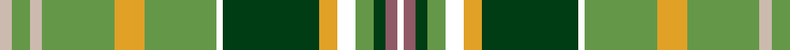

In pattern [WRGGWYGWGYGYGY](/patterns/wrggwygwgygygy/).

This was sourced from register-of-tartans.  It is a [14 stripes tartan](/stripes/stripes14/).

Original link https://www.tartanregister.gov.uk/tartanDetails.aspx?ref=11625

## Thread count
N/4 LG6 N4 LG24 Y10 LG24 W2 DG32 Y6 W6 LG6 DG4 LT4 W/2

## Palette
Each colour and its ΔE from the base-6 reference it is a variant of.

| Colour | Shade | Base | ΔE (OKLab) |
|---|---|---|---|
| DG | <code style="background-color:#003C14;">#003C14</code> `#003C14` | G <code style="background-color:#006400;">#006400</code> | 0.14 |
| LG | <code style="background-color:#649848;">#649848</code> `#649848` | G <code style="background-color:#006400;">#006400</code> | 0.19 |
| LT | <code style="background-color:#905966;">#905966</code> `#905966` | R <code style="background-color:#C80000;">#C80000</code> | 0.15 |
| N | <code style="background-color:#CCBAAF;">#CCBAAF</code> `#CCBAAF` | Y <code style="background-color:#E8C000;">#E8C000</code> | 0.15 |
| W | <code style="background-color:#FFFFFF;">#FFFFFF</code> `#FFFFFF` | W <code style="background-color:#F4F4F0;">#F4F4F0</code> | 0.03 |
| Y | <code style="background-color:#E0A126;">#E0A126</code> `#E0A126` | Y <code style="background-color:#E8C000;">#E8C000</code> | 0.08 |

ID: /setts/s14/y4g6y4g24ya10g24w2ga32ya6w6g6ga4r4w2-g649848-ga003c14-r905966-wffffff-yccbaaf-yae0a126/
