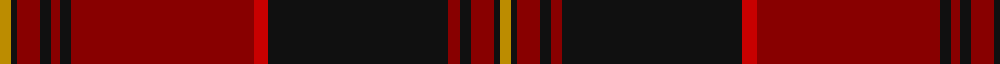

In pattern [YKRKRKRRKRKRKY](/patterns/ykrkrkrrkrkrky/).

This was sourced from register-of-tartans.  It is a [14 stripes tartan](/stripes/stripes14/).

Original link https://www.tartanregister.gov.uk/tartanDetails.aspx?ref=1335

## Attestations

This cloth appears in 3 source records; the oldest owns this page.

- 01/12/2006 — German Heritage (register-of-tartans, [record](https://www.tartanregister.gov.uk/tartanDetails.aspx?ref=1335))
- December 2006 — German Heritage (Fashion) (tartans-authority, [record](http://www.tartansauthority.com/tartan-ferret/display/7016/))
- undated — German Heritage (Fashion) American Fashion Tartan Tartan Number: 7016. Earliest known date: December 2006 Designed by William C. (Rocky) Roeger III of usakilts.com to honor anyone with German heritage. Itr is a private fashion tartan designed for ANYONE to wear, regardless of clan affiliation or nationality. The Colours were chosen to reflect those of the German flag. Woven sample. See products available Copyright © Blair Urquhart, Comrie, 2015 (house-of-tartan, [record](http://www.house-of-tartan.scotland.net/house/TartanViewjs.asp?colr=Def&tnam=7016))

## Thread count
DY/4 K2 DR8 K4 DR3 K4 DR64 R5 K63 DR4 K4 DR8 K2 DY/4

## Palette
Each colour and its ΔE from the base-6 reference it is a variant of.

| Colour | Shade | Base | ΔE (OKLab) |
|---|---|---|---|
| DR | <code style="background-color:#880000;">#880000</code> `#880000` | R <code style="background-color:#CC0000;">#CC0000</code> | 0.15 |
| DY | <code style="background-color:#BC8C00;">#BC8C00</code> `#BC8C00` | Y <code style="background-color:#F2BF00;">#F2BF00</code> | 0.16 |
| K | <code style="background-color:#101010;">#101010</code> `#101010` | K <code style="background-color:#000000;">#000000</code> | 0.17 |
| R | <code style="background-color:#C80000;">#C80000</code> `#C80000` | R <code style="background-color:#CC0000;">#CC0000</code> | 0.01 |

## Nearest tartans

The nearest existing variants by ΔTartan distance.

1. [Old Aberdeen Diamond Jubilee](/setts/s14/r3ra2k7r3k3r52ra4k52r3k3r3k7ra2r3-k101010-r8b0000-raff0000/) — ΔT 0.93
1. [Old Aberdeen Diamond Jubilee (Fash)](/setts/s14/r3ra2k7r3k3r52ra4k52r3k3r3k7ra2r3-k101010-r880000-rac80000/) — ΔT 1.02
1. [Firefighters' Memorial](/setts/s13/r4k4r65k8r6k35y2k2g7k35ra3k2ra4-g408060-k101010-r880000-rac80000-ybc8c00/) — ΔT 1.03
1. [Grant](/setts/s15/r12b4r4g48r4g4r4b16r4ba2r64b4r4b2r12-b000052-ba4367ae-g11450d-raa0000/) — ΔT 1.08
1. [Grant](/setts/s15/r6b2r2g24r2g2r2b8r2ba1r32b2r2b1r6-b000052-ba4367ae-g11450d-raa0000/) — ΔT 1.08
1. [Gudbrandsdalen Mannsdrakt District Tartan Tartan Number: 2081. Earliest known date: 18th Century Sample is an off cut of hard tartan woven in plain weave - from fabric used to make a true copy of the original jacket in the possession of Bjornsgaard Farm, Dovre, Norway. Part of the collection of Norwegian district tartans presented to the Scottish Tartans Society by Erik Paulsen in 1992. Scottish-Norwegian connections are explored in a research report available from the Society. See products available Copyright © Blair Urquhart, Comrie, 2015](/setts/s16/g88r4k10g8r4k2g4r20g4k2r4g8k10r4w2r88-g003820-k101010-rc80000-we0e0e0/) — ΔT 1.23
1. [Stewart of Appin](/setts/s16/r6b4ba2r4g48r8g4r4b16r4g4r48b4ba2r4g4-b000052-ba4367ae-g11450d-raa0000/) — ΔT 1.23
1. [Stewart of Appin](/setts/s16/r3b2ba1r2g24r4g2r2b8r2g2r24b2ba1r2g2-b000052-ba4367ae-g11450d-raa0000/) — ΔT 1.23
1. [MacGillivray](/setts/s13/r8b2ba2r64b4r4ba24r4g32r8b2r8ba4-b4367ae-ba000052-g11450d-raa0000/) — ΔT 1.27
1. [MacAlister of Skye (Clan?)](/setts/s9/r8k10y2r52w2k60y2k2y8-k101010-r880000-wc0c0c0-yd09800/) — ΔT 1.34

## Neighbour map

Every grey dot is one of 15726 variants placed by the first two principal components of the ΔTartan feature space (44% of its variance). Red is this tartan; blue dots are its nearest — click one to open its page.

<svg viewBox="0 0 640 380" role="img" style="max-width:100%;height:auto;border:1px solid #e0e0e0;border-radius:4px;display:block" xmlns="http://www.w3.org/2000/svg"><image href="/nn/cloud.v1.png" width="640" height="380"/><a href="/setts/s14/r3ra2k7r3k3r52ra4k52r3k3r3k7ra2r3-k101010-r8b0000-raff0000/"><circle cx="411.4" cy="122.3" r="4" fill="#3465a4"><title>Old Aberdeen Diamond Jubilee</title></circle></a><a href="/setts/s14/r3ra2k7r3k3r52ra4k52r3k3r3k7ra2r3-k101010-r880000-rac80000/"><circle cx="425.7" cy="129.7" r="4" fill="#3465a4"><title>Old Aberdeen Diamond Jubilee (Fash)</title></circle></a><a href="/setts/s13/r4k4r65k8r6k35y2k2g7k35ra3k2ra4-g408060-k101010-r880000-rac80000-ybc8c00/"><circle cx="364.1" cy="101.0" r="4" fill="#3465a4"><title>Firefighters' Memorial</title></circle></a><a href="/setts/s15/r12b4r4g48r4g4r4b16r4ba2r64b4r4b2r12-b000052-ba4367ae-g11450d-raa0000/"><circle cx="401.1" cy="98.4" r="4" fill="#3465a4"><title>Grant</title></circle></a><a href="/setts/s15/r6b2r2g24r2g2r2b8r2ba1r32b2r2b1r6-b000052-ba4367ae-g11450d-raa0000/"><circle cx="401.1" cy="98.4" r="4" fill="#3465a4"><title>Grant</title></circle></a><a href="/setts/s16/g88r4k10g8r4k2g4r20g4k2r4g8k10r4w2r88-g003820-k101010-rc80000-we0e0e0/"><circle cx="370.0" cy="67.1" r="4" fill="#3465a4"><title>Gudbrandsdalen Mannsdrakt District Tartan Tartan Number: 2081. Earliest known date: 18th Century Sample is an off cut of hard tartan woven in plain weave - from fabric used to make a true copy of the original jacket in the possession of Bjornsgaard Farm, Dovre, Norway. Part of the collection of Norwegian district tartans presented to the Scottish Tartans Society by Erik Paulsen in 1992. Scottish-Norwegian connections are explored in a research report available from the Society. See products available Copyright © Blair Urquhart, Comrie, 2015</title></circle></a><a href="/setts/s16/r6b4ba2r4g48r8g4r4b16r4g4r48b4ba2r4g4-b000052-ba4367ae-g11450d-raa0000/"><circle cx="330.5" cy="107.6" r="4" fill="#3465a4"><title>Stewart of Appin</title></circle></a><a href="/setts/s16/r3b2ba1r2g24r4g2r2b8r2g2r24b2ba1r2g2-b000052-ba4367ae-g11450d-raa0000/"><circle cx="330.5" cy="107.6" r="4" fill="#3465a4"><title>Stewart of Appin</title></circle></a><a href="/setts/s13/r8b2ba2r64b4r4ba24r4g32r8b2r8ba4-b4367ae-ba000052-g11450d-raa0000/"><circle cx="388.4" cy="103.9" r="4" fill="#3465a4"><title>MacGillivray</title></circle></a><a href="/setts/s9/r8k10y2r52w2k60y2k2y8-k101010-r880000-wc0c0c0-yd09800/"><circle cx="362.1" cy="125.5" r="4" fill="#3465a4"><title>MacAlister of Skye (Clan?)</title></circle></a><circle cx="395.7" cy="99.6" r="5" fill="#c00000"/></svg>

ID: /setts/s14/y4k2r8k4r4k63ra5r64k4r3k4r8k2y4-k101010-r880000-rac80000-ybc8c00/
