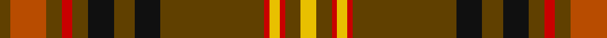

In pattern [GRGRGKGKGRYRGY](/patterns/grgrgkgkgryrgy/).

This was sourced from register-of-tartans.  It is a [14 stripes tartan](/stripes/stripes14/).

Original link https://www.tartanregister.gov.uk/tartanDetails.aspx?ref=187

## Attestations

This cloth appears in 2 source records; the oldest owns this page.

- 01/09/2002 — Balnagowan (Harrods) (register-of-tartans, [record](https://www.tartanregister.gov.uk/tartanDetails.aspx?ref=187))
- May 2003 — Balnagown (Corporate) (tartans-authority, [record](http://www.tartansauthority.com/tartan-ferret/display/5824/))

## Thread count
T/4 DO14 T6 R4 T6 K10 T8 K10 T40 R2 Y4 R2 T6 Y/6

## Palette
Each colour and its ΔE from the base-6 reference it is a variant of.

| Colour | Shade | Base | ΔE (OKLab) |
|---|---|---|---|
| DO | <code style="background-color:#B84C00;">#B84C00</code> `#B84C00` | R <code style="background-color:#CC0000;">#CC0000</code> | 0.08 |
| K | <code style="background-color:#101010;">#101010</code> `#101010` | K <code style="background-color:#000000;">#000000</code> | 0.17 |
| R | <code style="background-color:#C80000;">#C80000</code> `#C80000` | R <code style="background-color:#CC0000;">#CC0000</code> | 0.01 |
| T | <code style="background-color:#604000;">#604000</code> `#604000` | G <code style="background-color:#006100;">#006100</code> | 0.14 |
| Y | <code style="background-color:#E8C000;">#E8C000</code> `#E8C000` | Y <code style="background-color:#F2BF00;">#F2BF00</code> | 0.02 |

## Nearest tartans

The nearest existing variants by ΔTartan distance.

1. [Ainslie #2](/setts/s15/r24k8r8k16r8k8r24g72r8y4r8k8r40w4r8-g006818-k101010-r880000-wfcfcfc-yd09800/) — ΔT 0.65
1. [MacQuarrie 1](/setts/s14/r8b4r100ba52r20g88ra8r20ra8g88r102ba4r8b4-b5480b0-ba304080-g008000-rc00000-rad03030/) — ΔT 1.01
1. [MacClure Clan/Family Tartan Tartan Number: 3330. Earliest known date: pre 2002 Designed by Phil Smith for all MacClures. (note by Phil Smith Sept 2004) and originally woven by D C Dalgliesh. MacClures and MacLures are a sept of MacLeod. See products available Copyright © Blair Urquhart, Comrie, 2015](/setts/s12/k8y4r8g24r8b16r8k8r60g8r8k4-b1c0070-g006818-k101010-r800000-yb8b8b8/) — ΔT 1.18
1. [MacDonald of Glencoe](/setts/s13/g6r2ra4g4ra32w2b8ra6g26ra2b2r2ra6-b2c2c80-g285800-re87878-ra880000-w98c8e8/) — ΔT 1.20
1. [Leach (1995)](/setts/s9/r96w4k12w4g56r32k12b12w8-b6c0070-g006818-k101010-r880000-wc0c0c0/) — ΔT 1.20
1. [MacMaster Clan/Family Tartan Tartan Number: 3493. Earliest known date: 1986 Designed by Phil Smith in 1986 for all of the names MacMaster, MacMasters etc. See MacMasters Canada. See products available Copyright © Blair Urquhart, Comrie, 2015](/setts/s12/k4r56g4r4g24w8g24r4g4r56k4wa4-g006818-k101010-r880000-wc0c0c0-waa8ace8/) — ΔT 1.20
1. [MacQuarrie #2](/setts/s14/r8b4r100ba52r20g88ra8r20ra8g88r102ba4r8b4-b3c82af-ba2c4084-g005020-rdc0000-rac82828/) — ΔT 1.26
1. [MacCall Family Tartan Tartan Number: 2238. Earliest known date: 2000 Originally designed for a wedding in the McCall family in Aberdeen, and permission was given for anyone of the name to wear it. It was designed by John C McCall & M McCall who are related to Nancy McCall the former owner of McCall's of Aberdeen (01224 405300). MacCall Chieftain is a Peter J.D. MacCall of Birkenshaw who is believed to be elderly and living with a daughter in Lockerbie (October 2002). See products available Copyright © Blair Urquhart, Comrie, 2015](/setts/s15/r12k8r16g32r12w4r4g4r4w4r12g36b12g4b2-b6c0070-g006818-k101010-r880000-wc0c0c0/) — ΔT 1.29
1. [MacDonald of Lochmaddy](/setts/s17/r26w2b4r4g28r4w2b4r4ba8r4b4w2r32g2r4g6-b5480b0-ba304080-g008000-rc00000-we0e0e0/) — ΔT 1.30
1. [Glen Nevis #2 (Personal)](/setts/s12/g56y4g4y4g8k12g12k12b12ba4b36y4-b4c3428-ba441800-g8c7038-k101010-ydc943c/) — ΔT 1.30

## Neighbour map

Every grey dot is one of 15726 variants placed by the first two principal components of the ΔTartan feature space (44% of its variance). Red is this tartan; blue dots are its nearest — click one to open its page.

<svg viewBox="0 0 640 380" role="img" style="max-width:100%;height:auto;border:1px solid #e0e0e0;border-radius:4px;display:block" xmlns="http://www.w3.org/2000/svg"><image href="/nn/cloud.v1.png" width="640" height="380"/><a href="/setts/s15/r24k8r8k16r8k8r24g72r8y4r8k8r40w4r8-g006818-k101010-r880000-wfcfcfc-yd09800/"><circle cx="300.1" cy="124.0" r="4" fill="#3465a4"><title>Ainslie #2</title></circle></a><a href="/setts/s14/r8b4r100ba52r20g88ra8r20ra8g88r102ba4r8b4-b5480b0-ba304080-g008000-rc00000-rad03030/"><circle cx="310.4" cy="108.8" r="4" fill="#3465a4"><title>MacQuarrie 1</title></circle></a><a href="/setts/s12/k8y4r8g24r8b16r8k8r60g8r8k4-b1c0070-g006818-k101010-r800000-yb8b8b8/"><circle cx="325.3" cy="142.0" r="4" fill="#3465a4"><title>MacClure Clan/Family Tartan Tartan Number: 3330. Earliest known date: pre 2002 Designed by Phil Smith for all MacClures. (note by Phil Smith Sept 2004) and originally woven by D C Dalgliesh. MacClures and MacLures are a sept of MacLeod. See products available Copyright © Blair Urquhart, Comrie, 2015</title></circle></a><a href="/setts/s13/g6r2ra4g4ra32w2b8ra6g26ra2b2r2ra6-b2c2c80-g285800-re87878-ra880000-w98c8e8/"><circle cx="317.6" cy="134.2" r="4" fill="#3465a4"><title>MacDonald of Glencoe</title></circle></a><a href="/setts/s9/r96w4k12w4g56r32k12b12w8-b6c0070-g006818-k101010-r880000-wc0c0c0/"><circle cx="328.3" cy="127.6" r="4" fill="#3465a4"><title>Leach (1995)</title></circle></a><a href="/setts/s12/k4r56g4r4g24w8g24r4g4r56k4wa4-g006818-k101010-r880000-wc0c0c0-waa8ace8/"><circle cx="373.0" cy="137.6" r="4" fill="#3465a4"><title>MacMaster Clan/Family Tartan Tartan Number: 3493. Earliest known date: 1986 Designed by Phil Smith in 1986 for all of the names MacMaster, MacMasters etc. See MacMasters Canada. See products available Copyright © Blair Urquhart, Comrie, 2015</title></circle></a><a href="/setts/s14/r8b4r100ba52r20g88ra8r20ra8g88r102ba4r8b4-b3c82af-ba2c4084-g005020-rdc0000-rac82828/"><circle cx="307.4" cy="104.5" r="4" fill="#3465a4"><title>MacQuarrie #2</title></circle></a><a href="/setts/s15/r12k8r16g32r12w4r4g4r4w4r12g36b12g4b2-b6c0070-g006818-k101010-r880000-wc0c0c0/"><circle cx="257.1" cy="137.6" r="4" fill="#3465a4"><title>MacCall Family Tartan Tartan Number: 2238. Earliest known date: 2000 Originally designed for a wedding in the McCall family in Aberdeen, and permission was given for anyone of the name to wear it. It was designed by John C McCall &amp; M McCall who are related to Nancy McCall the former owner of McCall's of Aberdeen (01224 405300). MacCall Chieftain is a Peter J.D. MacCall of Birkenshaw who is believed to be elderly and living with a daughter in Lockerbie (October 2002). See products available Copyright © Blair Urquhart, Comrie, 2015</title></circle></a><a href="/setts/s17/r26w2b4r4g28r4w2b4r4ba8r4b4w2r32g2r4g6-b5480b0-ba304080-g008000-rc00000-we0e0e0/"><circle cx="308.3" cy="102.5" r="4" fill="#3465a4"><title>MacDonald of Lochmaddy</title></circle></a><a href="/setts/s12/g56y4g4y4g8k12g12k12b12ba4b36y4-b4c3428-ba441800-g8c7038-k101010-ydc943c/"><circle cx="272.0" cy="142.8" r="4" fill="#3465a4"><title>Glen Nevis #2 (Personal)</title></circle></a><circle cx="323.9" cy="122.3" r="5" fill="#c00000"/></svg>

ID: /setts/s14/y6g6r2y4r2g40k10g8k10g6r4g6ra14g4-g604000-k101010-rc80000-rab84c00-ye8c000/
