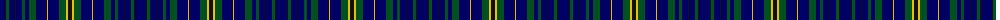

In pattern [BKGBKBGBGBYBGYK](/patterns/bkgbkbgbgbybgyk/).

This was sourced from register-of-tartans.  It is a [15 stripes tartan](/stripes/stripes15/).

Original link https://www.tartanregister.gov.uk/tartanDetails.aspx?ref=258

## Thread count
DB/11 K1 G3 DB6 K1 DB6 G3 DB4 G7 DB11 Y1 DB11 G7 Y2 K/4

## Palette
Each colour and its ΔE from the base-6 reference it is a variant of.

| Colour | Shade | Base | ΔE (OKLab) |
|---|---|---|---|
| DB | <code style="background-color:#000064;">#000064</code> `#000064` | B <code style="background-color:#2C4084;">#2C4084</code> | 0.17 |
| G | <code style="background-color:#005020;">#005020</code> `#005020` | G <code style="background-color:#006400;">#006400</code> | 0.08 |
| K | <code style="background-color:#101010;">#101010</code> `#101010` | K <code style="background-color:#000000;">#000000</code> | 0.17 |
| Y | <code style="background-color:#E8C000;">#E8C000</code> `#E8C000` | Y <code style="background-color:#E8C000;">#E8C000</code> | 0.00 |

ID: /setts/s15/b11k1g3b6k1b6g3b4g7b11y1b11g7y2k4-b000064-g005020-k101010-ye8c000/
