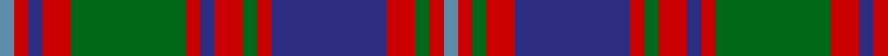

In pattern [BRBRGRBRGRBRGRB](/patterns/brbrgrbrgrbrgrb/).

This was sourced from house-of-tartan.  It is a [15 stripes tartan](/stripes/stripes15/).

Original link http://www.house-of-tartan.scotland.net/house/TartanViewjs.asp?colr=Def&tnam=402

## Thread count
B/4 R4 DB4 R8 G32 R4 DB4 R8 G4 R4 DB32 R8 G4 R4 B/4

## Palette
Each colour and its ΔE from the base-6 reference it is a variant of.

| Colour | Shade | Base | ΔE (OKLab) |
|---|---|---|---|
| B | <code style="background-color:#5C8CA8;">#5C8CA8</code> `#5C8CA8` | B <code style="background-color:#2A418A;">#2A418A</code> | 0.23 |
| DB | <code style="background-color:#2C2C80;">#2C2C80</code> `#2C2C80` | B <code style="background-color:#2A418A;">#2A418A</code> | 0.06 |
| G | <code style="background-color:#006818;">#006818</code> `#006818` | G <code style="background-color:#006100;">#006100</code> | 0.02 |
| R | <code style="background-color:#C80000;">#C80000</code> `#C80000` | R <code style="background-color:#CC0000;">#CC0000</code> | 0.01 |

## Nearest tartans

The nearest existing variants by ΔTartan distance.

1. [Roxburgh Red](/setts/s10/b3g26b3r3b20r3b3r26g5w3x2~b2c2c80-g006818-rc80000-wfcfcfc/) — ΔT 1.04
1. [Roxburgh, Red](/setts/s10/b3g26b3r3b20r3b3r26g5w3x2~b304080-g003000-rc00000-we0e0e0/) — ΔT 1.05
1. [Bonnie Brae School](/setts/s11/r6b3ra3r24b20g24ra3g3ra3g3ra6~b000060-g004800-r880000-rab07430/) — ΔT 1.09
1. [Roxburgh Red District Tartan Tartan Number: 140. Earliest known date: 1875 Roxburgh is in the heart of the Borders region of Scotland. The pattern was taken from a silk in Patterson's sample book (c.1875) now stored in the Scottish Tartan Society's archives. The tartan may have been in production before 1850, and is now woven commercially for the first time in perhaps a century and a half. See products available Copyright © Blair Urquhart, Comrie, 2015](/setts/s10/b3g26b3r3b20r3b3r26g5w3x2~b2c2c80-g003820-rc80000-we0e0e0/) — ΔT 1.13
1. [MacIntyre of Whitehouse (Clan?)](/setts/s15/b1r2ba2r4g16r2ba2r4g2r2ba16r4g2r2b1x2~b2888c4-ba2c2c80-g00841c-rc80000/) — ΔT 1.15
1. [Glen Orchy](/setts/s15/b2r3ba3r5g14r3ba2r5g2r3ba14r5g3r3b2x2~b5480b0-ba304080-g008000-rc00000/) — ΔT 1.17
1. [Glen Orchy #1](/setts/s15/b2r3ba3r5g14r3ba2r5g2r3ba14r5g3r3b2x2~b3c82af-ba2c4084-g005020-rdc0000/) — ΔT 1.18
1. [Caithelyn (Personal)](/setts/s14/b20k2w2k2b2k10g3k2g20k2g3k10b8k2x2~b780078-g006818-k101010-we0e0e0/) — ΔT 1.18
1. [Bonnie Brae (School)](/setts/s11/r6b3ra3r24b20g24ra3g3ra3g3ra6~b000060-g004800-r70000c-rab07430/) — ΔT 1.19
1. [MacIntyre, and Glenorchy](/setts/s15/b1r2ba2r4g16r2ba1r4g1r2ba16r4g2r2b1x2~b5480b0-ba304080-g008000-rc00000/) — ΔT 1.21

## Neighbour map

Every grey dot is one of 15726 variants placed by the first two principal components of the ΔTartan feature space (44% of its variance). Red is this tartan; blue dots are its nearest — click one to open its page.

<svg viewBox="0 0 640 380" role="img" style="max-width:100%;height:auto;border:1px solid #e0e0e0;border-radius:4px;display:block" xmlns="http://www.w3.org/2000/svg"><image href="/nn/cloud.v1.png" width="640" height="380"/><a href="/setts/s10/b3g26b3r3b20r3b3r26g5w3x2~b2c2c80-g006818-rc80000-wfcfcfc/"><circle cx="190.5" cy="172.9" r="4" fill="#3465a4"><title>Roxburgh Red</title></circle></a><a href="/setts/s10/b3g26b3r3b20r3b3r26g5w3x2~b304080-g003000-rc00000-we0e0e0/"><circle cx="200.3" cy="178.1" r="4" fill="#3465a4"><title>Roxburgh, Red</title></circle></a><a href="/setts/s11/r6b3ra3r24b20g24ra3g3ra3g3ra6~b000060-g004800-r880000-rab07430/"><circle cx="170.3" cy="185.6" r="4" fill="#3465a4"><title>Bonnie Brae School</title></circle></a><a href="/setts/s10/b3g26b3r3b20r3b3r26g5w3x2~b2c2c80-g003820-rc80000-we0e0e0/"><circle cx="199.5" cy="177.0" r="4" fill="#3465a4"><title>Roxburgh Red District Tartan Tartan Number: 140. Earliest known date: 1875 Roxburgh is in the heart of the Borders region of Scotland. The pattern was taken from a silk in Patterson's sample book (c.1875) now stored in the Scottish Tartan Society's archives. The tartan may have been in production before 1850, and is now woven commercially for the first time in perhaps a century and a half. See products available Copyright © Blair Urquhart, Comrie, 2015</title></circle></a><a href="/setts/s15/b1r2ba2r4g16r2ba2r4g2r2ba16r4g2r2b1x2~b2888c4-ba2c2c80-g00841c-rc80000/"><circle cx="210.0" cy="127.1" r="4" fill="#3465a4"><title>MacIntyre of Whitehouse (Clan?)</title></circle></a><a href="/setts/s15/b2r3ba3r5g14r3ba2r5g2r3ba14r5g3r3b2x2~b5480b0-ba304080-g008000-rc00000/"><circle cx="193.4" cy="182.2" r="4" fill="#3465a4"><title>Glen Orchy</title></circle></a><a href="/setts/s15/b2r3ba3r5g14r3ba2r5g2r3ba14r5g3r3b2x2~b3c82af-ba2c4084-g005020-rdc0000/"><circle cx="191.9" cy="179.9" r="4" fill="#3465a4"><title>Glen Orchy #1</title></circle></a><a href="/setts/s14/b20k2w2k2b2k10g3k2g20k2g3k10b8k2x2~b780078-g006818-k101010-we0e0e0/"><circle cx="196.3" cy="164.0" r="4" fill="#3465a4"><title>Caithelyn (Personal)</title></circle></a><a href="/setts/s11/r6b3ra3r24b20g24ra3g3ra3g3ra6~b000060-g004800-r70000c-rab07430/"><circle cx="174.0" cy="188.8" r="4" fill="#3465a4"><title>Bonnie Brae (School)</title></circle></a><a href="/setts/s15/b1r2ba2r4g16r2ba1r4g1r2ba16r4g2r2b1x2~b5480b0-ba304080-g008000-rc00000/"><circle cx="229.9" cy="129.1" r="4" fill="#3465a4"><title>MacIntyre, and Glenorchy</title></circle></a><circle cx="183.2" cy="158.8" r="5" fill="#c00000"/></svg>

ID: /setts/s15/b1r1ba1r2g8r1ba1r2g1r1ba8r2g1r1b1x4~b5c8ca8-ba2c2c80-g006818-rc80000/
