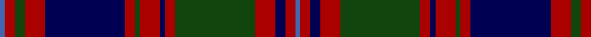

**Bands:** [BRGRBRGRBRGRBRB](/stripes/brgrbrgrbrgrbrb/) · **Stripes:** [B R DG R DB R DG R DB R DG R DB R B](/stripes/stripes15/) B R DG R DB R DG R DB R DG R DB R B

This was sourced from weddslist.  It is a [15 band tartan](/bands/bands15/).

Original link http://www.weddslist.com/cgi-bin/tartans/pg.pl?source=tinsel

## Register references

External register numbers recorded for this tartan.

- Scottish Register of Tartans: [1166](https://www.tartanregister.gov.uk/tartanDetails.aspx?ref=1166)
- Scottish Register of Tartans: [1510](https://www.tartanregister.gov.uk/tartanDetails.aspx?ref=1510)
- Scottish Register of Tartans: [1758](https://www.tartanregister.gov.uk/tartanDetails.aspx?ref=1758)
- Scottish Register of Tartans: [2307](https://www.tartanregister.gov.uk/tartanDetails.aspx?ref=2307)
- Scottish Register of Tartans: [2349](https://www.tartanregister.gov.uk/tartanDetails.aspx?ref=2349)
- Scottish Register of Tartans: [2540](https://www.tartanregister.gov.uk/tartanDetails.aspx?ref=2540)
- Scottish Register of Tartans: [2582](https://www.tartanregister.gov.uk/tartanDetails.aspx?ref=2582)
- Scottish Register of Tartans: [2585](https://www.tartanregister.gov.uk/tartanDetails.aspx?ref=2585)
- Scottish Register of Tartans: [2625](https://www.tartanregister.gov.uk/tartanDetails.aspx?ref=2625)
- Scottish Register of Tartans: [2730](https://www.tartanregister.gov.uk/tartanDetails.aspx?ref=2730)
- Scottish Register of Tartans: [2862](https://www.tartanregister.gov.uk/tartanDetails.aspx?ref=2862)
- Scottish Register of Tartans: [3072](https://www.tartanregister.gov.uk/tartanDetails.aspx?ref=3072)
- Scottish Register of Tartans: [3555](https://www.tartanregister.gov.uk/tartanDetails.aspx?ref=3555)
- Scottish Register of Tartans: [4925](https://www.tartanregister.gov.uk/tartanDetails.aspx?ref=4925)
- Scottish Register of Tartans: [696](https://www.tartanregister.gov.uk/tartanDetails.aspx?ref=696)
- Scottish Register of Tartans: [697](https://www.tartanregister.gov.uk/tartanDetails.aspx?ref=697)
- Scottish Register of Tartans: [982](https://www.tartanregister.gov.uk/tartanDetails.aspx?ref=982)
- Scottish Tartans Authority (ITI): 1277
- Scottish Tartans Authority (ITI): 1429
- Scottish Tartans Authority (ITI): 218
- Scottish Tartans Authority (ITI): 977
- Scottish Tartans World Register: 1042
- Scottish Tartans World Register: 127
- Scottish Tartans World Register: 1277
- Scottish Tartans World Register: 1399
- Scottish Tartans World Register: 1429
- Scottish Tartans World Register: 1593
- Scottish Tartans World Register: 218
- Scottish Tartans World Register: 2218
- Scottish Tartans World Register: 3061
- Scottish Tartans World Register: 441
- Scottish Tartans World Register: 737
- Scottish Tartans World Register: 858
- Scottish Tartans World Register: 864
- Scottish Tartans World Register: 873
- Scottish Tartans World Register: 897
- Scottish Tartans World Register: 977
- Scottish Tartans World Register: 978

## Variants

Other setts woven to the same stripe pattern.

- [MacIntyre](/setts/s15/b1r2dg2r4db16r2dg1r4db1r2dg16r4db2r2b1/)

## Thread count
B/2 DR4 DG4 DR8 DB32 DR4 DG2 DR8 DB2 DR4 DG32 DR8 DB4 DR4 B/2

## Palette
Each colour and its ΔE from the base-6 reference it is a variant of.

| Colour | Shade | Base | ΔE (OKLab) |
|---|---|---|---|
| B | <code style="background-color:#4367AE;">#4367AE</code> `#4367AE` | B <code style="background-color:#2A418A;">#2A418A</code> | 0.12 |
| DB | <code style="background-color:#000052;">#000052</code> `#000052` | B <code style="background-color:#2A418A;">#2A418A</code> | 0.20 |
| DG | <code style="background-color:#11450D;">#11450D</code> `#11450D` | G <code style="background-color:#006100;">#006100</code> | 0.09 |
| DR | <code style="background-color:#AA0000;">#AA0000</code> `#AA0000` | R <code style="background-color:#CC0000;">#CC0000</code> | 0.07 |

## Nearest tartans

The nearest existing variants by ΔTartan distance.

1. [MacIntyre](/setts/s15/b1r2dg2r4db16r2dg1r4db1r2dg16r4db2r2b1/) — ΔT 0.00
1. [MacIntyre](/setts/s15/lb1r2dg2r4db16r2dg1r4db1r2dg16r4db2r2lb1~x2/) — ΔT 0.88
1. [Kettles, Ryan & Alan (Personal)](/setts/s16/g13k2g2k2g2k12dp16k1g2k1dp16k12g12k1ly2dp1~x2/) — ΔT 0.96
1. [Caithelyn (Personal)](/setts/s14/dp20k2w2k2dp2k10g3k2g20k2g3k10dp8k2~x2/) — ΔT 0.99
1. [MacIntyre of Whitehouse (Clan?)](/setts/s15/t1r2db2r4g16r2db2r4g2r2db16r4g2r2t1~x2/) — ΔT 1.19
1. [MacDonald](/setts/s12/db17r2db2r5db29r2k31g29r5g2r2g17~x2/) — ΔT 1.21
1. [Griffiths of Llangynin (Personal)](/setts/s18/db40k8r4k4r8k4r4k8dg40k8r4k4r8k4r4k8db40ly3~x2/) — ΔT 1.22
1. [MacDonald #5](/setts/s12/dg12r2dg2r5dg27k29r2db26r5db2r2db12~x2/) — ΔT 1.23
1. [Urbino](/setts/s18/dg3dp2dg2dp2dg2dp20k20dg22k1o3~x4/) — ΔT 1.25
1. [MacDonald of Clanranald #5](/setts/s14/db20r2db2r5db30r2k32w2dg30r5dg4r2dg4w2/) — ΔT 1.27

## Neighbour map

Every grey dot is one of 14299 variants placed by the first two principal components of the ΔTartan feature space (44% of its variance). Red is this tartan; blue dots are its nearest — click one to open its page.

<svg viewBox="0 0 640 380" role="img" style="max-width:100%;height:auto;border:1px solid #e0e0e0;border-radius:4px;display:block" xmlns="http://www.w3.org/2000/svg"><image href="/nn/cloud.v1.png" width="640" height="380"/><a href="/setts/s15/b1r2dg2r4db16r2dg1r4db1r2dg16r4db2r2b1/"><circle cx="232.8" cy="138.3" r="4" fill="#3465a4"><title>MacIntyre</title></circle></a><a href="/setts/s15/lb1r2dg2r4db16r2dg1r4db1r2dg16r4db2r2lb1~x2/"><circle cx="208.7" cy="123.3" r="4" fill="#3465a4"><title>MacIntyre</title></circle></a><a href="/setts/s16/g13k2g2k2g2k12dp16k1g2k1dp16k12g12k1ly2dp1~x2/"><circle cx="227.1" cy="160.9" r="4" fill="#3465a4"><title>Kettles, Ryan &amp; Alan (Personal)</title></circle></a><a href="/setts/s14/dp20k2w2k2dp2k10g3k2g20k2g3k10dp8k2~x2/"><circle cx="199.2" cy="166.7" r="4" fill="#3465a4"><title>Caithelyn (Personal)</title></circle></a><a href="/setts/s15/t1r2db2r4g16r2db2r4g2r2db16r4g2r2t1~x2/"><circle cx="212.4" cy="129.3" r="4" fill="#3465a4"><title>MacIntyre of Whitehouse (Clan?)</title></circle></a><a href="/setts/s12/db17r2db2r5db29r2k31g29r5g2r2g17~x2/"><circle cx="210.3" cy="170.0" r="4" fill="#3465a4"><title>MacDonald</title></circle></a><a href="/setts/s18/db40k8r4k4r8k4r4k8dg40k8r4k4r8k4r4k8db40ly3~x2/"><circle cx="212.6" cy="129.7" r="4" fill="#3465a4"><title>Griffiths of Llangynin (Personal)</title></circle></a><a href="/setts/s12/dg12r2dg2r5dg27k29r2db26r5db2r2db12~x2/"><circle cx="213.2" cy="175.4" r="4" fill="#3465a4"><title>MacDonald #5</title></circle></a><a href="/setts/s18/dg3dp2dg2dp2dg2dp20k20dg22k1o3~x4/"><circle cx="228.8" cy="122.2" r="4" fill="#3465a4"><title>Urbino</title></circle></a><a href="/setts/s14/db20r2db2r5db30r2k32w2dg30r5dg4r2dg4w2/"><circle cx="203.5" cy="131.4" r="4" fill="#3465a4"><title>MacDonald of Clanranald #5</title></circle></a><circle cx="232.8" cy="138.3" r="5" fill="#c00000"/></svg>

ID: /setts/s15/b1r2dg2r4db16r2dg1r4db1r2dg16r4db2r2b1~x2/
