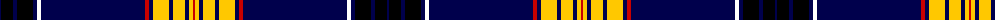

In pattern [BKBKBKBRBYBYBYR](/patterns/bkbkbkbrbybybyr/).

This was sourced from weddslist.  It is a [15 stripes tartan](/stripes/stripes15/).

Original link http://www.weddslist.com/cgi-bin/tartans/pg.pl?source=misc

## Thread count
DB/2 K12 DB4 K16 DB4 W4 DB104 R4 DB4 Y16 DB4 Y12 DB4 Y4 R/2

## Palette
Each colour and its ΔE from the base-6 reference it is a variant of.

| Colour | Shade | Base | ΔE (OKLab) |
|---|---|---|---|
| DB | <code style="background-color:#00004C;">#00004C</code> `#00004C` | B <code style="background-color:#2C4084;">#2C4084</code> | 0.21 |
| K | <code style="background-color:#000000;">#000000</code> `#000000` | K <code style="background-color:#000000;">#000000</code> | 0.00 |
| R | <code style="background-color:#C80000;">#C80000</code> `#C80000` | R <code style="background-color:#C80000;">#C80000</code> | 0.00 |
| Y | <code style="background-color:#FFC800;">#FFC800</code> `#FFC800` | Y <code style="background-color:#E8C000;">#E8C000</code> | 0.04 |

## Nearest tartans

The nearest existing variants by ΔTartan distance.

1. [Racing Stewart](/setts/s10/b108w6k10w3k3w3k3g12r12w4-b000050-g008000-k000000-rc00000-we0e0e0/) — ΔT 1.10
1. [Racing Stewart Corporate Tartan Tartan Number: 2306. Earliest known date: 1990 The tartan that appears on the Jackie Stewart formula one racing car. See products available Copyright © Blair Urquhart, Comrie, 2015](/setts/s10/b108w6k10w3k3w3k3g12r12w4-b202060-g006818-k101010-rc80000-we0e0e0/) — ΔT 1.53
1. [Parr](/setts/s10/b124r2b4r2b8k28g8w4g12k8-b304080-g008000-k000000-rc00000-we0e0e0/) — ΔT 1.57
1. [Marsa Scout Group](/setts/s11/g8k2y4k2g16k88r4k2b16k2r8-b1414b4-g006c00-k101010-rff0000-yffff0a/) — ΔT 1.58
1. [J.C.M. Customs](/setts/s19/k6w2wa2r10wa2w2k2b2r2k2wa2w2k2b8k2wa2w8k80r6-b2c2c80-k101010-rc80000-wfcfcfc-wac0c0c0/) — ΔT 1.58
1. [Khalsa](/setts/s22/b10w2b10w2b10w2b10w2b10w2r10ba2y10ba2r10y2k72w2ba6w2k144w2-b003c64-ba0000cd-k101010-re86000-wffffff-yfccc00/) — ΔT 1.61
1. [Estonian National Tartan (District)](/setts/s10/k106b6k4w2k4b6k10b64y2r6-b1870a4-k101010-rc80000-wf8f8f8-ye8c000/) — ΔT 1.63
1. [Park](/setts/s10/b124r2b4r2b8k28g8k4g12k8-b304080-g008000-k000000-rc00000/) — ΔT 1.65
1. [JCM Customs](/setts/s19/k6w2wa2r10wa2w2k2b2r2k2w2wa2k2b8k2wa2w8k80r6-b141e46-k101010-rc80000-wffffff-waf8f4d0/) — ΔT 1.68
1. [Seacliff Academy](/setts/s10/k92w2ka6wa8ka6b6ka4b22ka2wa4-b2c2c80-k00002c-ka101010-wfcfcfc-wa98c8e8/) — ΔT 1.71

## Neighbour map

Every grey dot is one of 15726 variants placed by the first two principal components of the ΔTartan feature space (44% of its variance). Red is this tartan; blue dots are its nearest — click one to open its page.

<svg viewBox="0 0 640 380" role="img" style="max-width:100%;height:auto;border:1px solid #e0e0e0;border-radius:4px;display:block" xmlns="http://www.w3.org/2000/svg"><image href="/nn/cloud.v1.png" width="640" height="380"/><a href="/setts/s10/b108w6k10w3k3w3k3g12r12w4-b000050-g008000-k000000-rc00000-we0e0e0/"><circle cx="394.0" cy="74.9" r="4" fill="#3465a4"><title>Racing Stewart</title></circle></a><a href="/setts/s10/b108w6k10w3k3w3k3g12r12w4-b202060-g006818-k101010-rc80000-we0e0e0/"><circle cx="412.3" cy="75.7" r="4" fill="#3465a4"><title>Racing Stewart Corporate Tartan Tartan Number: 2306. Earliest known date: 1990 The tartan that appears on the Jackie Stewart formula one racing car. See products available Copyright © Blair Urquhart, Comrie, 2015</title></circle></a><a href="/setts/s10/b124r2b4r2b8k28g8w4g12k8-b304080-g008000-k000000-rc00000-we0e0e0/"><circle cx="446.1" cy="75.0" r="4" fill="#3465a4"><title>Parr</title></circle></a><a href="/setts/s11/g8k2y4k2g16k88r4k2b16k2r8-b1414b4-g006c00-k101010-rff0000-yffff0a/"><circle cx="394.6" cy="71.4" r="4" fill="#3465a4"><title>Marsa Scout Group</title></circle></a><a href="/setts/s19/k6w2wa2r10wa2w2k2b2r2k2wa2w2k2b8k2wa2w8k80r6-b2c2c80-k101010-rc80000-wfcfcfc-wac0c0c0/"><circle cx="392.7" cy="21.6" r="4" fill="#3465a4"><title>J.C.M. Customs</title></circle></a><a href="/setts/s22/b10w2b10w2b10w2b10w2b10w2r10ba2y10ba2r10y2k72w2ba6w2k144w2-b003c64-ba0000cd-k101010-re86000-wffffff-yfccc00/"><circle cx="397.1" cy="14.0" r="4" fill="#3465a4"><title>Khalsa</title></circle></a><a href="/setts/s10/k106b6k4w2k4b6k10b64y2r6-b1870a4-k101010-rc80000-wf8f8f8-ye8c000/"><circle cx="404.2" cy="82.8" r="4" fill="#3465a4"><title>Estonian National Tartan (District)</title></circle></a><a href="/setts/s10/b124r2b4r2b8k28g8k4g12k8-b304080-g008000-k000000-rc00000/"><circle cx="452.6" cy="78.4" r="4" fill="#3465a4"><title>Park</title></circle></a><a href="/setts/s19/k6w2wa2r10wa2w2k2b2r2k2w2wa2k2b8k2wa2w8k80r6-b141e46-k101010-rc80000-wffffff-waf8f4d0/"><circle cx="389.5" cy="20.3" r="4" fill="#3465a4"><title>JCM Customs</title></circle></a><a href="/setts/s10/k92w2ka6wa8ka6b6ka4b22ka2wa4-b2c2c80-k00002c-ka101010-wfcfcfc-wa98c8e8/"><circle cx="391.5" cy="85.4" r="4" fill="#3465a4"><title>Seacliff Academy</title></circle></a><circle cx="387.1" cy="42.6" r="5" fill="#c00000"/></svg>

ID: /setts/s15/b2k12b4k16b4k4b104r4b4y16b4y12b4y4r2-b00004c-k000000-rc80000-yffc800/
