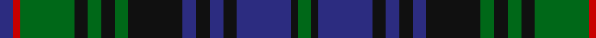

In pattern [BRGKGKGKBKBKBKG](/patterns/brgkgkgkbkbkbkg/).

This was sourced from register-of-tartans.  It is a [15 stripes tartan](/stripes/stripes15/).

Original link https://www.tartanregister.gov.uk/tartanDetails.aspx?ref=2221

## Attestations

This cloth appears in 2 source records; the oldest owns this page.

- 01/01/1871 — Lorne, Louise of (register-of-tartans, [record](https://www.tartanregister.gov.uk/tartanDetails.aspx?ref=2221))
- undated — Louise Commemorative Tartan Tartan Number: 7. Earliest known date: 1871 Brought out for the wedding of the Marquis of Lorne to Her Royal Highness the Princess Louise in 1871. Published in 'Campbell Tartan' by Alastair Campbell of Airds, yr, in 1985, where he quotes, "brought out by Mr M'Kissock, of Girvan" and approved by the Marquis of Lorne. There is a companion to this sett in which the red stripe is replaced with black. They are collectively known as Lorne and Louise tartans. See products available Copyright © Blair Urquhart, Comrie, 2015 (house-of-tartan, [record](http://www.house-of-tartan.scotland.net/house/TartanViewjs.asp?colr=Def&tnam=7))

## Thread count
DB/4 R2 G16 K4 G4 K4 G4 K16 DB4 K4 DB4 K4 DB16 K2 G/4

## Palette
Each colour and its ΔE from the base-6 reference it is a variant of.

| Colour | Shade | Base | ΔE (OKLab) |
|---|---|---|---|
| DB | <code style="background-color:#2C2C80;">#2C2C80</code> `#2C2C80` | B <code style="background-color:#2A418A;">#2A418A</code> | 0.06 |
| G | <code style="background-color:#006818;">#006818</code> `#006818` | G <code style="background-color:#006100;">#006100</code> | 0.02 |
| K | <code style="background-color:#101010;">#101010</code> `#101010` | K <code style="background-color:#000000;">#000000</code> | 0.17 |
| R | <code style="background-color:#C80000;">#C80000</code> `#C80000` | R <code style="background-color:#CC0000;">#CC0000</code> | 0.01 |

## Nearest tartans

The nearest existing variants by ΔTartan distance.

1. [Urquhart Clan Tartan Tartan Number: 774. Earliest known date: 1831 Recorded in the scales given by James Logan in his book 'The Scottish Gael' (1831) and also given by Thomas Smibert in his 'Clans of the Highlands of Scotland' (1850). It has a foundation similar to the Black Watch but with pairs of black lines appearing in the green bands, not the blue. See products available Copyright © Blair Urquhart, Comrie, 2015](/setts/s13/g8k1g1k1g1k8b8r1b8k8g8k1g1x2~b2c2c80-g006818-k101010-rc80000/) — ΔT 0.39
1. [Urquhart (Logan)](/setts/s13/g8k1g1k1g1k8b8r1b8k8g8k1g1x2~b2c2c80-g006818-k101010-r880000/) — ΔT 0.40
1. [Safeway](/setts/s15/b19k3b3k3b3k20g19k2r5k2g19k20b19k3b3x2~b2c2c80-g006818-k101010-rc80000/) — ΔT 0.40
1. [Forbes #2](/setts/s15/b17k3b3k3b3k16g15k2w3k2g15k16b16k3b3x2~b2c4084-g005020-k101010-we0e0e0/) — ΔT 0.44
1. [Stephenson Hunting](/setts/s13/b9k9g9k1w1k2w1k1g9k9b9k1g2x4~b2c4084-g005020-k101010-we0e0e0/) — ΔT 0.45
1. [Westgate (Corporate)](/setts/s13/b23k3b3k3b3k17g22y4g22k17b22k3b3x2~b2c2c80-g006818-k101010-ye8c000/) — ΔT 0.54
1. [MacKinlay Clan Tartan Tartan Number: 218. Earliest known date: 1906 The MacKinlay tartan could be described in tartan parlance as Black Watch with red. It is similar to the early military setts produced by Wilson's of Bannockburn for the MacKenzies, the MacLeods and the Gordons, but there is no mention in Wilson's comprehensive pattern books of a MacKinlay tartan. There are, however, grounds for comparison with the Farquharson, as MacKinlays are named in that clan. To further confuse the issue the sett is identical to Logan's 'Murray of Athol'. The first publication to include the sett (as MacKinlay) was Whyte's 'The Tartans of the Clans and Septs of Scotland' published by W. and A.K. Johnston in 1906. See products available Copyright © Blair Urquhart, Comrie, 2015](/setts/s15/b6k2b2k2b2k6g8k1r2k1g8k6b8k2b2x2~b2c2c80-g006818-k101010-rc80000/) — ΔT 0.55
1. [MacKinlay (2/4 black stripes)](/setts/s15/b12k4b4k4b4k12g16k2r3k2g16k12b16k4b4~b1c0070-g006818-k101010-r880000/) — ΔT 0.64
1. [Dewar's Highlander](/setts/s13/g56k6g7k6g7k35b45y6b45k35g45k6g6~b202060-g006818-k101010-ybc8c00/) — ΔT 0.67
1. [Gordon Regimental Tartan Tartan Number: 214. Earliest known date: 1793 Source references: Cockburn Collection No 10. Logan. Smibert No: 46. Smith No 35. Grant No: 17. Bain. The Setts No: 64. Wilson advertised a range of different quality Gordon tartans in the same colours. e.g. Sergt's Plaids 56 8 8 8 8 58 54 10 54 58 54 8 8. Forsythe, it is said, produced samples with one, two and three yellow stripes. The Duke chose the single stripe. See products available Copyright © Blair Urquhart, Comrie, 2015](/setts/s13/b6k1b1k1b1k6g6y1g6k6b6k1b1x4~b2c2c80-g006818-k101010-ye8c000/) — ΔT 0.67

## Neighbour map

Every grey dot is one of 15726 variants placed by the first two principal components of the ΔTartan feature space (44% of its variance). Red is this tartan; blue dots are its nearest — click one to open its page.

<svg viewBox="0 0 640 380" role="img" style="max-width:100%;height:auto;border:1px solid #e0e0e0;border-radius:4px;display:block" xmlns="http://www.w3.org/2000/svg"><image href="/nn/cloud.v1.png" width="640" height="380"/><a href="/setts/s13/g8k1g1k1g1k8b8r1b8k8g8k1g1x2~b2c2c80-g006818-k101010-rc80000/"><circle cx="198.3" cy="206.1" r="4" fill="#3465a4"><title>Urquhart Clan Tartan Tartan Number: 774. Earliest known date: 1831 Recorded in the scales given by James Logan in his book 'The Scottish Gael' (1831) and also given by Thomas Smibert in his 'Clans of the Highlands of Scotland' (1850). It has a foundation similar to the Black Watch but with pairs of black lines appearing in the green bands, not the blue. See products available Copyright © Blair Urquhart, Comrie, 2015</title></circle></a><a href="/setts/s13/g8k1g1k1g1k8b8r1b8k8g8k1g1x2~b2c2c80-g006818-k101010-r880000/"><circle cx="201.3" cy="207.6" r="4" fill="#3465a4"><title>Urquhart (Logan)</title></circle></a><a href="/setts/s15/b19k3b3k3b3k20g19k2r5k2g19k20b19k3b3x2~b2c2c80-g006818-k101010-rc80000/"><circle cx="212.3" cy="190.0" r="4" fill="#3465a4"><title>Safeway</title></circle></a><a href="/setts/s15/b17k3b3k3b3k16g15k2w3k2g15k16b16k3b3x2~b2c4084-g005020-k101010-we0e0e0/"><circle cx="213.2" cy="203.2" r="4" fill="#3465a4"><title>Forbes #2</title></circle></a><a href="/setts/s13/b9k9g9k1w1k2w1k1g9k9b9k1g2x4~b2c4084-g005020-k101010-we0e0e0/"><circle cx="205.3" cy="205.5" r="4" fill="#3465a4"><title>Stephenson Hunting</title></circle></a><a href="/setts/s13/b23k3b3k3b3k17g22y4g22k17b22k3b3x2~b2c2c80-g006818-k101010-ye8c000/"><circle cx="190.1" cy="205.8" r="4" fill="#3465a4"><title>Westgate (Corporate)</title></circle></a><a href="/setts/s15/b6k2b2k2b2k6g8k1r2k1g8k6b8k2b2x2~b2c2c80-g006818-k101010-rc80000/"><circle cx="180.9" cy="211.5" r="4" fill="#3465a4"><title>MacKinlay Clan Tartan Tartan Number: 218. Earliest known date: 1906 The MacKinlay tartan could be described in tartan parlance as Black Watch with red. It is similar to the early military setts produced by Wilson's of Bannockburn for the MacKenzies, the MacLeods and the Gordons, but there is no mention in Wilson's comprehensive pattern books of a MacKinlay tartan. There are, however, grounds for comparison with the Farquharson, as MacKinlays are named in that clan. To further confuse the issue the sett is identical to Logan's 'Murray of Athol'. The first publication to include the sett (as MacKinlay) was Whyte's 'The Tartans of the Clans and Septs of Scotland' published by W. and A.K. Johnston in 1906. See products available Copyright © Blair Urquhart, Comrie, 2015</title></circle></a><a href="/setts/s15/b12k4b4k4b4k12g16k2r3k2g16k12b16k4b4~b1c0070-g006818-k101010-r880000/"><circle cx="187.3" cy="213.8" r="4" fill="#3465a4"><title>MacKinlay (2/4 black stripes)</title></circle></a><a href="/setts/s13/g56k6g7k6g7k35b45y6b45k35g45k6g6~b202060-g006818-k101010-ybc8c00/"><circle cx="223.7" cy="204.0" r="4" fill="#3465a4"><title>Dewar's Highlander</title></circle></a><a href="/setts/s13/b6k1b1k1b1k6g6y1g6k6b6k1b1x4~b2c2c80-g006818-k101010-ye8c000/"><circle cx="174.2" cy="219.1" r="4" fill="#3465a4"><title>Gordon Regimental Tartan Tartan Number: 214. Earliest known date: 1793 Source references: Cockburn Collection No 10. Logan. Smibert No: 46. Smith No 35. Grant No: 17. Bain. The Setts No: 64. Wilson advertised a range of different quality Gordon tartans in the same colours. e.g. Sergt's Plaids 56 8 8 8 8 58 54 10 54 58 54 8 8. Forsythe, it is said, produced samples with one, two and three yellow stripes. The Duke chose the single stripe. See products available Copyright © Blair Urquhart, Comrie, 2015</title></circle></a><circle cx="203.0" cy="201.4" r="5" fill="#c00000"/></svg>

ID: /setts/s15/b2r1g8k2g2k2g2k8b2k2b2k2b8k1g2x2~b2c2c80-g006818-k101010-rc80000/
