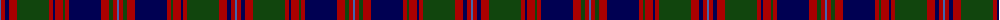

In pattern [BRBRGRBRGRBRGRB](/patterns/brbrgrbrgrbrgrb/).

This was sourced from weddslist.  It is a [15 stripes tartan](/stripes/stripes15/).

Original link http://www.weddslist.com/cgi-bin/tartans/pg.pl?source=tinsel

## Attestations

This cloth appears in 2 source records; the oldest owns this page.

- undated — MacIntyre (weddslist, [record](http://www.weddslist.com/cgi-bin/tartans/pg.pl?source=tinsel))
- undated — MacIntyre (weddslist, [record](http://www.weddslist.com/cgi-bin/tartans/pg.pl?source=x))

## Thread count
B/2 DR4 DB4 DR8 DG32 DR4 DB2 DR8 DG2 DR4 DB32 DR8 DG4 DR4 B/2

## Palette
Each colour and its ΔE from the base-6 reference it is a variant of.

| Colour | Shade | Base | ΔE (OKLab) |
|---|---|---|---|
| B | <code style="background-color:#4367AE;">#4367AE</code> `#4367AE` | B <code style="background-color:#2A418A;">#2A418A</code> | 0.12 |
| DB | <code style="background-color:#000052;">#000052</code> `#000052` | B <code style="background-color:#2A418A;">#2A418A</code> | 0.20 |
| DG | <code style="background-color:#11450D;">#11450D</code> `#11450D` | G <code style="background-color:#006100;">#006100</code> | 0.09 |
| DR | <code style="background-color:#AA0000;">#AA0000</code> `#AA0000` | R <code style="background-color:#CC0000;">#CC0000</code> | 0.07 |

## Nearest tartans

The nearest existing variants by ΔTartan distance.

1. [MacIntyre](/setts/s15/w2r4b4r8g32r4b2r8g2r4b32r8g4r4w2-b000064-g004c00-rc80000-wd0d0d0/) — ΔT 0.87
1. [Kettles, Ryan & Alan (Personal)](/setts/s16/g26k4g4k4g4k24b32k2g4k2b32k24g24k2y4b2-b440044-g006818-k101010-yfccc00/) — ΔT 0.95
1. [Caithelyn (Personal)](/setts/s14/b40k4w4k4b4k20g6k4g40k4g6k20b16k4-b780078-g006818-k101010-we0e0e0/) — ΔT 0.99
1. [MacIntyre of Whitehouse (Clan?)](/setts/s15/b2r4ba4r8g32r4ba4r8g4r4ba32r8g4r4b2-b2888c4-ba2c2c80-g00841c-rc80000/) — ΔT 1.18
1. [MacDonald](/setts/s12/b34r4b4r10b58r4k62g58r10g4r4g34-b2c2c80-g006818-k101010-rc80000/) — ΔT 1.20
1. [Griffiths of Llangynin (Personal)](/setts/s18/b80k16r8k8r16k8r8k16g80k16r8k8r16k8r8k16b80y6-b202060-g285800-k101010-rc80000-ye8c000/) — ΔT 1.21
1. [MacDonald #5](/setts/s12/b24r4b4r10b52r4k58g54r10g4r4g24-b2c4084-g005020-k101010-rdc0000/) — ΔT 1.22
1. [Urbino](/setts/s18/g12b8g8b8g8b80k80g88k4r12k4g88k80b80g8b8g8b8-b780078-g004c00-k000000-ra0783c/) — ΔT 1.24
1. [MacDonald of Clanranald #5](/setts/s14/b20r2b2r5b30r2k32w2g30r5g4r2g4w2-b2c4084-g005020-k101010-rdc0000-we0e0e0/) — ΔT 1.26
1. [New Hampshire District Tartan Tartan Number: 1102. Earliest known date: 1994 New Hampshire State Representative Steven Avery, arranged for Governor Stephen Merrill to proclaim the Tartan as the State Tartan of New Hampshire in June 1994. In January 1995, Avery introduced the bill to the NH Legislature for permanent recognition, which was passed in May, 1995. The purple represents the finch and the lilac, green the forests, black the granite mountains, white for the snow, and red for the States heroes. New Hampshire Revised Statutes Annotated (RSA) 3:21. See products available Copyright © Blair Urquhart, Comrie, 2015](/setts/s21/g40k2g2k12w2k12b2k2b8r6b28r6b8k2b2k12w2k12g2k2g16-b780078-g006818-k101010-rc80000-we0e0e0/) — ΔT 1.28

## Neighbour map

Every grey dot is one of 15726 variants placed by the first two principal components of the ΔTartan feature space (44% of its variance). Red is this tartan; blue dots are its nearest — click one to open its page.

<svg viewBox="0 0 640 380" role="img" style="max-width:100%;height:auto;border:1px solid #e0e0e0;border-radius:4px;display:block" xmlns="http://www.w3.org/2000/svg"><image href="/nn/cloud.v1.png" width="640" height="380"/><a href="/setts/s15/w2r4b4r8g32r4b2r8g2r4b32r8g4r4w2-b000064-g004c00-rc80000-wd0d0d0/"><circle cx="204.0" cy="121.9" r="4" fill="#3465a4"><title>MacIntyre</title></circle></a><a href="/setts/s16/g26k4g4k4g4k24b32k2g4k2b32k24g24k2y4b2-b440044-g006818-k101010-yfccc00/"><circle cx="221.9" cy="156.1" r="4" fill="#3465a4"><title>Kettles, Ryan &amp; Alan (Personal)</title></circle></a><a href="/setts/s14/b40k4w4k4b4k20g6k4g40k4g6k20b16k4-b780078-g006818-k101010-we0e0e0/"><circle cx="194.8" cy="164.0" r="4" fill="#3465a4"><title>Caithelyn (Personal)</title></circle></a><a href="/setts/s15/b2r4ba4r8g32r4ba4r8g4r4ba32r8g4r4b2-b2888c4-ba2c2c80-g00841c-rc80000/"><circle cx="208.0" cy="127.2" r="4" fill="#3465a4"><title>MacIntyre of Whitehouse (Clan?)</title></circle></a><a href="/setts/s12/b34r4b4r10b58r4k62g58r10g4r4g34-b2c2c80-g006818-k101010-rc80000/"><circle cx="205.2" cy="165.4" r="4" fill="#3465a4"><title>MacDonald</title></circle></a><a href="/setts/s18/b80k16r8k8r16k8r8k16g80k16r8k8r16k8r8k16b80y6-b202060-g285800-k101010-rc80000-ye8c000/"><circle cx="206.8" cy="125.0" r="4" fill="#3465a4"><title>Griffiths of Llangynin (Personal)</title></circle></a><a href="/setts/s12/b24r4b4r10b52r4k58g54r10g4r4g24-b2c4084-g005020-k101010-rdc0000/"><circle cx="208.0" cy="170.1" r="4" fill="#3465a4"><title>MacDonald #5</title></circle></a><a href="/setts/s18/g12b8g8b8g8b80k80g88k4r12k4g88k80b80g8b8g8b8-b780078-g004c00-k000000-ra0783c/"><circle cx="223.4" cy="119.6" r="4" fill="#3465a4"><title>Urbino</title></circle></a><a href="/setts/s14/b20r2b2r5b30r2k32w2g30r5g4r2g4w2-b2c4084-g005020-k101010-rdc0000-we0e0e0/"><circle cx="197.5" cy="126.9" r="4" fill="#3465a4"><title>MacDonald of Clanranald #5</title></circle></a><a href="/setts/s21/g40k2g2k12w2k12b2k2b8r6b28r6b8k2b2k12w2k12g2k2g16-b780078-g006818-k101010-rc80000-we0e0e0/"><circle cx="181.2" cy="96.2" r="4" fill="#3465a4"><title>New Hampshire District Tartan Tartan Number: 1102. Earliest known date: 1994 New Hampshire State Representative Steven Avery, arranged for Governor Stephen Merrill to proclaim the Tartan as the State Tartan of New Hampshire in June 1994. In January 1995, Avery introduced the bill to the NH Legislature for permanent recognition, which was passed in May, 1995. The purple represents the finch and the lilac, green the forests, black the granite mountains, white for the snow, and red for the States heroes. New Hampshire Revised Statutes Annotated (RSA) 3:21. See products available Copyright © Blair Urquhart, Comrie, 2015</title></circle></a><circle cx="227.7" cy="134.7" r="5" fill="#c00000"/></svg>

ID: /setts/s15/b2r4ba4r8g32r4ba2r8g2r4ba32r8g4r4b2-b4367ae-ba000052-g11450d-raa0000/
