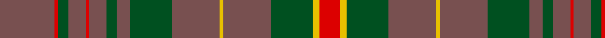

In pattern [BRGBRBGBGBYBGYR](/patterns/brgbrbgbgbybgyr/).

This was sourced from register-of-tartans.  It is a [15 stripes tartan](/stripes/stripes15/).

Original link https://www.tartanregister.gov.uk/tartanDetails.aspx?ref=5859

## Thread count
N/32 R2 G6 N10 R2 N10 G6 N8 G24 N28 Y2 N28 G24 Y4 R/12

## Palette
Each colour and its ΔE from the base-6 reference it is a variant of.

| Colour | Shade | Base | ΔE (OKLab) |
|---|---|---|---|
| G | <code style="background-color:#005020;">#005020</code> `#005020` | G <code style="background-color:#006400;">#006400</code> | 0.08 |
| N | <code style="background-color:#785050;">#785050</code> `#785050` | B <code style="background-color:#2C4084;">#2C4084</code> | 0.17 |
| R | <code style="background-color:#DC0000;">#DC0000</code> `#DC0000` | R <code style="background-color:#C80000;">#C80000</code> | 0.04 |
| Y | <code style="background-color:#E8C000;">#E8C000</code> `#E8C000` | Y <code style="background-color:#E8C000;">#E8C000</code> | 0.00 |

## Nearest tartans

The nearest existing variants by ΔTartan distance.

1. [Glen Affric (Artefact)](/setts/s13/g8b4ba56g8b20g8b28g8b28g8b40g8k8-b5c5c5c-ba4c0000-g006818-k101010/) — ΔT 1.18
1. [Bute Heather, Midnight (Fashion)](/setts/s11/b12w3ba36k10ba8k8ba16k2ba16k4b10-b585858-ba5c5c5c-k101010-wf0bcbc/) — ΔT 1.33
1. [MacGillivray Htg (Clan)](/setts/s14/g16r10g10r10g10r12b2r4g16r4b2r48b8r12-b1c0070-g006818-r98481c/) — ΔT 1.42
1. [Land's End (Unnamed Camel)](/setts/s9/r48b4r6ra12r6b4g30r40b8-b401000-g003000-r906030-ra806050/) — ΔT 1.44
1. [Aberlour Bicentenary](/setts/s15/g16b6g6ba46g5ba8g5b10g6y8g48b6g6b6g16-b580b5b-ba25375f-g5c6428-yc88c00/) — ΔT 1.45
1. [Bute Heather, Midnight](/setts/s11/b12w3ba36k12ba8k8ba16k2ba16k4b10-b646464-ba3c3c3c-k101010-wd2d2d2/) — ΔT 1.47
1. [Bute Heather, Hunting (Fashion)](/setts/s11/b12g3ba36k12ba8k8ba16k2ba18k4b10-b646464-ba484848-g84886c-k101010/) — ΔT 1.53
1. [Rice of Wales](/setts/s18/r42y2r42g16b8g10b8g8y8g8b8g10b8g16r42y2r42y8-b202060-g5c6428-r901c38-ybc8c00/) — ΔT 1.54
1. [Scottish Piping Society of London](/setts/s12/g42r6g42b10g6r60g6b10g42r6g42b4-b202060-g5c6428-rc8002c/) — ΔT 1.54
1. [Livingstone (Australia) NSW](/setts/s12/g24r8k2y2r4k2y2r8g32r40g4r16-g003820-k101010-r780808-ye1ad29/) — ΔT 1.59

## Neighbour map

Every grey dot is one of 15726 variants placed by the first two principal components of the ΔTartan feature space (44% of its variance). Red is this tartan; blue dots are its nearest — click one to open its page.

<svg viewBox="0 0 640 380" role="img" style="max-width:100%;height:auto;border:1px solid #e0e0e0;border-radius:4px;display:block" xmlns="http://www.w3.org/2000/svg"><image href="/nn/cloud.v1.png" width="640" height="380"/><a href="/setts/s13/g8b4ba56g8b20g8b28g8b28g8b40g8k8-b5c5c5c-ba4c0000-g006818-k101010/"><circle cx="338.9" cy="198.2" r="4" fill="#3465a4"><title>Glen Affric (Artefact)</title></circle></a><a href="/setts/s11/b12w3ba36k10ba8k8ba16k2ba16k4b10-b585858-ba5c5c5c-k101010-wf0bcbc/"><circle cx="398.2" cy="205.1" r="4" fill="#3465a4"><title>Bute Heather, Midnight (Fashion)</title></circle></a><a href="/setts/s14/g16r10g10r10g10r12b2r4g16r4b2r48b8r12-b1c0070-g006818-r98481c/"><circle cx="445.2" cy="178.3" r="4" fill="#3465a4"><title>MacGillivray Htg (Clan)</title></circle></a><a href="/setts/s9/r48b4r6ra12r6b4g30r40b8-b401000-g003000-r906030-ra806050/"><circle cx="409.5" cy="207.2" r="4" fill="#3465a4"><title>Land's End (Unnamed Camel)</title></circle></a><a href="/setts/s15/g16b6g6ba46g5ba8g5b10g6y8g48b6g6b6g16-b580b5b-ba25375f-g5c6428-yc88c00/"><circle cx="347.6" cy="190.0" r="4" fill="#3465a4"><title>Aberlour Bicentenary</title></circle></a><a href="/setts/s11/b12w3ba36k12ba8k8ba16k2ba16k4b10-b646464-ba3c3c3c-k101010-wd2d2d2/"><circle cx="393.1" cy="208.3" r="4" fill="#3465a4"><title>Bute Heather, Midnight</title></circle></a><a href="/setts/s11/b12g3ba36k12ba8k8ba16k2ba18k4b10-b646464-ba484848-g84886c-k101010/"><circle cx="418.6" cy="217.8" r="4" fill="#3465a4"><title>Bute Heather, Hunting (Fashion)</title></circle></a><a href="/setts/s18/r42y2r42g16b8g10b8g8y8g8b8g10b8g16r42y2r42y8-b202060-g5c6428-r901c38-ybc8c00/"><circle cx="390.5" cy="153.8" r="4" fill="#3465a4"><title>Rice of Wales</title></circle></a><a href="/setts/s12/g42r6g42b10g6r60g6b10g42r6g42b4-b202060-g5c6428-rc8002c/"><circle cx="443.8" cy="203.6" r="4" fill="#3465a4"><title>Scottish Piping Society of London</title></circle></a><a href="/setts/s12/g24r8k2y2r4k2y2r8g32r40g4r16-g003820-k101010-r780808-ye1ad29/"><circle cx="406.7" cy="173.5" r="4" fill="#3465a4"><title>Livingstone (Australia) NSW</title></circle></a><circle cx="388.6" cy="190.7" r="5" fill="#c00000"/></svg>

ID: /setts/s15/b32r2g6b10r2b10g6b8g24b28y2b28g24y4r12-b785050-g005020-rdc0000-ye8c000/
