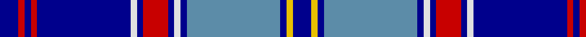

In pattern [BRBRBWBRBWBBBYB](/patterns/brbrbwbrbwbbbyb/).

This was sourced from register-of-tartans.  It is a [15 stripes tartan](/stripes/stripes15/).

Original link https://www.tartanregister.gov.uk/tartanDetails.aspx?ref=1156

## Attestations

This cloth appears in 2 source records; the oldest owns this page.

- 01/01/1998 — Federal Memorial (register-of-tartans, [record](https://www.tartanregister.gov.uk/tartanDetails.aspx?ref=1156))
- 1998 — Federal Memorial (Military) (tartans-authority, [record](http://www.tartansauthority.com/tartan-ferret/display/4191/))

## Register references

External register numbers recorded for this tartan.

- Scottish Register of Tartans: [1156](https://www.tartanregister.gov.uk/tartanDetails.aspx?ref=1156)
- Scottish Tartans Authority (ITI): 4191

## Thread count
DB/12 R4 DB4 R4 DB60 LN4 DB4 R16 DB4 LN4 DB4 B60 DB4 Y4 DB/12

## Palette
Each colour and its ΔE from the base-6 reference it is a variant of.

| Colour | Shade | Base | ΔE (OKLab) |
|---|---|---|---|
| B | <code style="background-color:#5C8CA8;">#5C8CA8</code> `#5C8CA8` | B <code style="background-color:#2A418A;">#2A418A</code> | 0.23 |
| DB | <code style="background-color:#00008C;">#00008C</code> `#00008C` | B <code style="background-color:#2A418A;">#2A418A</code> | 0.13 |
| LN | <code style="background-color:#E0E0E0;">#E0E0E0</code> `#E0E0E0` | W <code style="background-color:#F7F7F7;">#F7F7F7</code> | 0.07 |
| R | <code style="background-color:#C80000;">#C80000</code> `#C80000` | R <code style="background-color:#CC0000;">#CC0000</code> | 0.01 |
| Y | <code style="background-color:#E8C000;">#E8C000</code> `#E8C000` | Y <code style="background-color:#F2BF00;">#F2BF00</code> | 0.02 |

## Nearest tartans

The nearest existing variants by ΔTartan distance.

1. [St. Andrews (District)](/setts/s14/b48w3b4w3b3ba16g2ba5g3ba4g4ba3g5y2~b1c0070-ba1870a4-g006818-we0e0e0-ye8c000~x2/) — ΔT 1.06
1. [Yamaue](/setts/s13/w2r5b4g8b40r5w2r5b4g8b4r5w2~b0000ee-g008000-rcd0000-wffffff~x2/) — ΔT 1.27
1. [Dinwiddie Hunting](/setts/s10/y6b3k3b36k10ba18b6k2g4k3~b0000cd-ba666666-g008b00-k101010-yffe600~x2/) — ΔT 1.36
1. [Philadelphia Police and Fire Pipes and Drums](/setts/s12/b9y4b4ba41b4r4ba4r15ba4r4b41w4~b1c0070-ba0596fa-rc80000-wffffff-yfccc00~x2/) — ΔT 1.37
1. [Historic Scotland](/setts/s12/b8w8b4ba4b36ba4b4g26b2g26ga2b5~b000050-ba800080-g808080-ga008000-we0e0e0/) — ΔT 1.41
1. [St. Andrews University (Corporate)](/setts/s10/b6y3k2y5ba30g2k4g2ba6b4~b202060-ba2c2c80-g006818-k101010-ye8c000~x2/) — ΔT 1.48
1. [Anthony Plaid Blue](/setts/s10/b18g1y3g1ya1b1r2g2r2ya2~b1c0070-g006818-r880000-ye8c000-yab8b8b8~x4/) — ΔT 1.49
1. [Carstairs](/setts/s14/g5y2w2b8k2b5k2b28k2b10w4g3w2y4~b2c2c80-g006818-k101010-we0e0e0-ybc8c00~x2/) — ΔT 1.50
1. [Blue Knights, The](/setts/s9/w3y15b6ba2b1ba2b1ba21ya2~b1c1c50-ba2c2c80-wffffff-y48a4c0-yae8c000~x2/) — ΔT 1.50
1. [Blue Knights, The (Corporate))](/setts/s9/w3y15b6ba2b1ba2b1ba21ya2~b1c1c50-ba2c2c80-we0e0e0-y48a4c0-yae8c000~x2/) — ΔT 1.52

## Neighbour map

Every grey dot is one of 15726 variants placed by the first two principal components of the ΔTartan feature space (44% of its variance). Red is this tartan; blue dots are its nearest — click one to open its page.

<svg viewBox="0 0 640 380" role="img" style="max-width:100%;height:auto;border:1px solid #e0e0e0;border-radius:4px;display:block" xmlns="http://www.w3.org/2000/svg"><image href="/nn/cloud.v1.png" width="640" height="380"/><a href="/setts/s14/b48w3b4w3b3ba16g2ba5g3ba4g4ba3g5y2~b1c0070-ba1870a4-g006818-we0e0e0-ye8c000~x2/"><circle cx="300.6" cy="90.7" r="4" fill="#3465a4"><title>St. Andrews (District)</title></circle></a><a href="/setts/s13/w2r5b4g8b40r5w2r5b4g8b4r5w2~b0000ee-g008000-rcd0000-wffffff~x2/"><circle cx="291.7" cy="111.0" r="4" fill="#3465a4"><title>Yamaue</title></circle></a><a href="/setts/s10/y6b3k3b36k10ba18b6k2g4k3~b0000cd-ba666666-g008b00-k101010-yffe600~x2/"><circle cx="233.8" cy="131.8" r="4" fill="#3465a4"><title>Dinwiddie Hunting</title></circle></a><a href="/setts/s12/b9y4b4ba41b4r4ba4r15ba4r4b41w4~b1c0070-ba0596fa-rc80000-wffffff-yfccc00~x2/"><circle cx="188.5" cy="127.7" r="4" fill="#3465a4"><title>Philadelphia Police and Fire Pipes and Drums</title></circle></a><a href="/setts/s12/b8w8b4ba4b36ba4b4g26b2g26ga2b5~b000050-ba800080-g808080-ga008000-we0e0e0/"><circle cx="236.1" cy="125.5" r="4" fill="#3465a4"><title>Historic Scotland</title></circle></a><a href="/setts/s10/b6y3k2y5ba30g2k4g2ba6b4~b202060-ba2c2c80-g006818-k101010-ye8c000~x2/"><circle cx="298.0" cy="137.7" r="4" fill="#3465a4"><title>St. Andrews University (Corporate)</title></circle></a><a href="/setts/s10/b18g1y3g1ya1b1r2g2r2ya2~b1c0070-g006818-r880000-ye8c000-yab8b8b8~x4/"><circle cx="303.0" cy="107.5" r="4" fill="#3465a4"><title>Anthony Plaid Blue</title></circle></a><a href="/setts/s14/g5y2w2b8k2b5k2b28k2b10w4g3w2y4~b2c2c80-g006818-k101010-we0e0e0-ybc8c00~x2/"><circle cx="327.3" cy="126.3" r="4" fill="#3465a4"><title>Carstairs</title></circle></a><a href="/setts/s9/w3y15b6ba2b1ba2b1ba21ya2~b1c1c50-ba2c2c80-wffffff-y48a4c0-yae8c000~x2/"><circle cx="243.7" cy="124.8" r="4" fill="#3465a4"><title>Blue Knights, The</title></circle></a><a href="/setts/s9/w3y15b6ba2b1ba2b1ba21ya2~b1c1c50-ba2c2c80-we0e0e0-y48a4c0-yae8c000~x2/"><circle cx="249.4" cy="127.3" r="4" fill="#3465a4"><title>Blue Knights, The (Corporate))</title></circle></a><circle cx="267.2" cy="102.9" r="5" fill="#c00000"/></svg>

ID: /setts/s15/b3r1b1r1b15w1b1r4b1w1b1ba15b1y1b3~b00008c-ba5c8ca8-rc80000-we0e0e0-ye8c000~x4/
