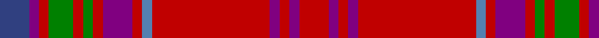

In pattern [BBRGRGRBRBRBRBR](/patterns/bbrgrgrbrbrbrbr/).

This was sourced from weddslist.  It is a [15 stripes tartan](/stripes/stripes15/).

Original link http://www.weddslist.com/cgi-bin/tartans/pg.pl?source=sts

## Thread count
B/12 P4 R4 G10 R4 G4 R4 P12 R4 Ba4 R48 P4 R4 P4 R/12

## Palette
Each colour and its ΔE from the base-6 reference it is a variant of.

| Colour | Shade | Base | ΔE (OKLab) |
|---|---|---|---|
| B | <code style="background-color:#304080;">#304080</code> `#304080` | B <code style="background-color:#2A418A;">#2A418A</code> | 0.02 |
| Ba | <code style="background-color:#5480B0;">#5480B0</code> `#5480B0` | B <code style="background-color:#2A418A;">#2A418A</code> | 0.19 |
| G | <code style="background-color:#008000;">#008000</code> `#008000` | G <code style="background-color:#006100;">#006100</code> | 0.10 |
| P | <code style="background-color:#800080;">#800080</code> `#800080` | B <code style="background-color:#2A418A;">#2A418A</code> | 0.17 |
| R | <code style="background-color:#C00000;">#C00000</code> `#C00000` | R <code style="background-color:#CC0000;">#CC0000</code> | 0.03 |

## Nearest tartans

The nearest existing variants by ΔTartan distance.

1. [MacColl #2](/setts/s14/r12g1r1ga8r2ga1r1b3r1ga1r12g1r1g4x2~b2c4084-g005020-ga503c14-rdc0000/) — ΔT 1.27
1. [London Caledonian Games Association](/setts/s13/r9b2r21g2r2b8r2ga2r2ga17r2b2r8x2~b780078-g789484-ga006818-rc80000/) — ΔT 1.29
1. [Methodist Church](/setts/s12/r6g2r2g3k2r2b16k3g4r34y2r2x2~b1c1c50-g285800-k101010-rb00000-ybc8c00/) — ΔT 1.32
1. [Mair](/setts/s12/r23g3y1g3r2b18r2w1g3r2b2r23x2~b304080-g008000-rc00000-we0e0e0-yf0c000/) — ΔT 1.49
1. [Wcwm 9275-1422-2](/setts/s17/k2r3w2r3b2r3b2r14g2k2g2k2g2k2g2r20y2x2~b1c0070-g603800-k101010-r880000-wa8ace8-yb8b8b8/) — ΔT 1.49
1. [MacColl #3](/setts/s14/r12g1r1ga8r2g1r1b3r1g1r12ga1r1ga4x2~b2c4084-g503c14-ga005020-rdc0000/) — ΔT 1.52
1. [Mair Family Tartan Tartan Number: 1406. Earliest known date: 1985 Based on an unnamed tartan from South Uist, the yellow represents the gold and red of the original sett form the colours of the 'Mair' coat of arms registered with Lord Lyon. Head of the family, Duine Usail, Robert George Alexander Mair esq. F.S.A. Scot, Sunshine, Melbourne, Victoria, Australia. He is the son of Alexander Smith Mair who arrived in Australia in 1924 from Govan, Glasgow. See products available Copyright © Blair Urquhart, Comrie, 2015](/setts/s12/r23g3y1g3r2b18r2w1g3r2b2r23x2~b2c2c80-g006818-rc80000-we0e0e0-ye8c000/) — ΔT 1.58
1. [London Caledonian Commemorative Tartan Tartan Number: 1388. Earliest known date: 1953 For London Caledonian Games Association. See products available Copyright © Blair Urquhart, Comrie, 2015](/setts/s13/r9b2r21ba2r2b8r2g2r2g17r2b2r8x2~b2c2c80-ba5c8ca8-g006818-rc80000/) — ΔT 1.59
1. [Mair (Personal)](/setts/s12/r23g3y1g3r2b18r2w1g3r2b2r23x2~b2c2c80-g006818-rc80000-wfcfcfc-yd8b000/) — ΔT 1.60
1. [Glendronach Corporate Tartan Tartan Number: 2293. Earliest known date: 1989 A copyright design created for the Glendronach Company. See products available Copyright © Blair Urquhart, Comrie, 2015](/setts/s12/g21r2w1y3r2g5r21y1y1y1r1g8x2~g604000-ra00048-we0e0e0-ye8c000/) — ΔT 1.60

## Neighbour map

Every grey dot is one of 15726 variants placed by the first two principal components of the ΔTartan feature space (44% of its variance). Red is this tartan; blue dots are its nearest — click one to open its page.

<svg viewBox="0 0 640 380" role="img" style="max-width:100%;height:auto;border:1px solid #e0e0e0;border-radius:4px;display:block" xmlns="http://www.w3.org/2000/svg"><image href="/nn/cloud.v1.png" width="640" height="380"/><a href="/setts/s14/r12g1r1ga8r2ga1r1b3r1ga1r12g1r1g4x2~b2c4084-g005020-ga503c14-rdc0000/"><circle cx="382.7" cy="147.7" r="4" fill="#3465a4"><title>MacColl #2</title></circle></a><a href="/setts/s13/r9b2r21g2r2b8r2ga2r2ga17r2b2r8x2~b780078-g789484-ga006818-rc80000/"><circle cx="353.7" cy="163.0" r="4" fill="#3465a4"><title>London Caledonian Games Association</title></circle></a><a href="/setts/s12/r6g2r2g3k2r2b16k3g4r34y2r2x2~b1c1c50-g285800-k101010-rb00000-ybc8c00/"><circle cx="369.1" cy="113.5" r="4" fill="#3465a4"><title>Methodist Church</title></circle></a><a href="/setts/s12/r23g3y1g3r2b18r2w1g3r2b2r23x2~b304080-g008000-rc00000-we0e0e0-yf0c000/"><circle cx="398.8" cy="109.0" r="4" fill="#3465a4"><title>Mair</title></circle></a><a href="/setts/s17/k2r3w2r3b2r3b2r14g2k2g2k2g2k2g2r20y2x2~b1c0070-g603800-k101010-r880000-wa8ace8-yb8b8b8/"><circle cx="366.0" cy="120.4" r="4" fill="#3465a4"><title>Wcwm 9275-1422-2</title></circle></a><a href="/setts/s14/r12g1r1ga8r2g1r1b3r1g1r12ga1r1ga4x2~b2c4084-g503c14-ga005020-rdc0000/"><circle cx="374.7" cy="144.7" r="4" fill="#3465a4"><title>MacColl #3</title></circle></a><a href="/setts/s12/r23g3y1g3r2b18r2w1g3r2b2r23x2~b2c2c80-g006818-rc80000-we0e0e0-ye8c000/"><circle cx="391.5" cy="105.2" r="4" fill="#3465a4"><title>Mair Family Tartan Tartan Number: 1406. Earliest known date: 1985 Based on an unnamed tartan from South Uist, the yellow represents the gold and red of the original sett form the colours of the 'Mair' coat of arms registered with Lord Lyon. Head of the family, Duine Usail, Robert George Alexander Mair esq. F.S.A. Scot, Sunshine, Melbourne, Victoria, Australia. He is the son of Alexander Smith Mair who arrived in Australia in 1924 from Govan, Glasgow. See products available Copyright © Blair Urquhart, Comrie, 2015</title></circle></a><a href="/setts/s13/r9b2r21ba2r2b8r2g2r2g17r2b2r8x2~b2c2c80-ba5c8ca8-g006818-rc80000/"><circle cx="338.2" cy="160.9" r="4" fill="#3465a4"><title>London Caledonian Commemorative Tartan Tartan Number: 1388. Earliest known date: 1953 For London Caledonian Games Association. See products available Copyright © Blair Urquhart, Comrie, 2015</title></circle></a><a href="/setts/s12/r23g3y1g3r2b18r2w1g3r2b2r23x2~b2c2c80-g006818-rc80000-wfcfcfc-yd8b000/"><circle cx="390.5" cy="104.8" r="4" fill="#3465a4"><title>Mair (Personal)</title></circle></a><a href="/setts/s12/g21r2w1y3r2g5r21y1y1y1r1g8x2~g604000-ra00048-we0e0e0-ye8c000/"><circle cx="353.9" cy="114.9" r="4" fill="#3465a4"><title>Glendronach Corporate Tartan Tartan Number: 2293. Earliest known date: 1989 A copyright design created for the Glendronach Company. See products available Copyright © Blair Urquhart, Comrie, 2015</title></circle></a><circle cx="361.2" cy="124.5" r="5" fill="#c00000"/></svg>

ID: /setts/s15/b6ba2r2g5r2g2r2ba6r2bb2r24ba2r2ba2r6x2~b304080-ba800080-bb5480b0-g008000-rc00000/
