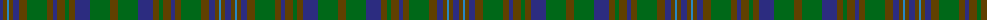

In pattern [BGBGBGGGBGGGBGG](/patterns/bgbgbgggbgggbgg/).

This was sourced from house-of-tartan.  It is a [15 stripes tartan](/stripes/stripes15/).

Original link http://www.house-of-tartan.scotland.net/house/TartanViewjs.asp?colr=Def&tnam=2018

## Thread count
DB/6 T4 B2 T4 DB6 T8 G20 T6 DB4 T8 G4 T6 DB15 G20 T/8

## Palette
Each colour and its ΔE from the base-6 reference it is a variant of.

| Colour | Shade | Base | ΔE (OKLab) |
|---|---|---|---|
| B | <code style="background-color:#2888C4;">#2888C4</code> `#2888C4` | B <code style="background-color:#2C4084;">#2C4084</code> | 0.21 |
| DB | <code style="background-color:#2C2C80;">#2C2C80</code> `#2C2C80` | B <code style="background-color:#2C4084;">#2C4084</code> | 0.05 |
| G | <code style="background-color:#006818;">#006818</code> `#006818` | G <code style="background-color:#006400;">#006400</code> | 0.02 |
| T | <code style="background-color:#604000;">#604000</code> `#604000` | G <code style="background-color:#006400;">#006400</code> | 0.14 |

ID: /setts/s15/b6g4ba2g4b6g8ga20g6b4g8ga4g6b15ga20g8-b2c2c80-ba2888c4-g604000-ga006818/
