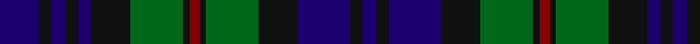

In pattern [BKBKBKGKRKGKBKB](/stripes/bkbkbkgkrkgkbkb/).

This was sourced from register-of-tartans.  It is a [15 stripe tartan](/stripes/stripes15/).

Original link https://www.tartanregister.gov.uk/tartanDetails.aspx?ref=5201

## Register references

External register numbers recorded for this tartan.

- Scottish Register of Tartans: [5201](https://www.tartanregister.gov.uk/tartanDetails.aspx?ref=5201)
- Scottish Tartans Authority (ITI): 3423

## Thread count
DB/12 K4 DB4 K4 DB4 K12 G16 K2 DR3 K2 G16 K12 DB16 K4 DB/4

## Palette
Each colour and its ΔE from the base-6 reference it is a variant of.

| Colour | Shade | Base | ΔE (OKLab) |
|---|---|---|---|
| DB | <code style="background-color:#1C0070;">#1C0070</code> `#1C0070` | B <code style="background-color:#2A418A;">#2A418A</code> | 0.14 |
| DR | <code style="background-color:#880000;">#880000</code> `#880000` | R <code style="background-color:#CC0000;">#CC0000</code> | 0.15 |
| G | <code style="background-color:#006818;">#006818</code> `#006818` | G <code style="background-color:#006100;">#006100</code> | 0.02 |
| K | <code style="background-color:#101010;">#101010</code> `#101010` | K <code style="background-color:#000000;">#000000</code> | 0.17 |

## Nearest tartans

The nearest existing variants by ΔTartan distance.

1. [Forbes #2](/setts/s15/db17k3db3k3db3k16dg15k2w3k2dg15k16db16k3db3~x2/) — ΔT 0.60
1. [Lorne, Louise of](/setts/s15/db2r1g8k2g2k2g2k8db2k2db2k2db8k1g2~x2/) — ΔT 0.64
1. [Cheape of Torosay (Clan)](/setts/s13/db6k1db1k1db1k6g6t2g6k6db6k1db2~x4/) — ΔT 0.66
1. [Murray #2](/setts/s13/db6k1db1k1db1k6g6r2g6k6db6k1db2~x4/) — ΔT 0.67
1. [New South Wales Scottish Rifles](/setts/s13/db6k1db1k1db1k6g6r2g6k6db6k1db2~x2/) — ΔT 0.67
1. [Stephenson Hunting](/setts/s13/db9k9dg9k1w1k2w1k1dg9k9db9k1dg2~x4/) — ΔT 0.73
1. [Safeway](/setts/s15/db19k3db3k3db3k20g19k2r5k2g19k20db19k3db3~x2/) — ΔT 0.74
1. [Urquhart](/setts/s13/g4k1g1k1g1k8db8r1db8k8g8k1g1~x8/) — ΔT 0.75
1. [Cheape of Torosay #2 (Personal)](/setts/s13/db6k1db1k1db1k6g6t2g6k6db6k1g2~x4/) — ΔT 0.77
1. [MacKinlay](/setts/s15/db6k2db2k2db2k6dg8k1r2k1dg8k6db8k2db2~x2/) — ΔT 0.78

## Neighbour map

Every grey dot is one of 14299 variants placed by the first two principal components of the ΔTartan feature space (44% of its variance). Red is this tartan; blue dots are its nearest — click one to open its page.

<svg viewBox="0 0 640 380" role="img" style="max-width:100%;height:auto;border:1px solid #e0e0e0;border-radius:4px;display:block" xmlns="http://www.w3.org/2000/svg"><image href="/nn/cloud.v1.png" width="640" height="380"/><a href="/setts/s15/db17k3db3k3db3k16dg15k2w3k2dg15k16db16k3db3~x2/"><circle cx="216.5" cy="211.0" r="4" fill="#3465a4"><title>Forbes #2</title></circle></a><a href="/setts/s15/db2r1g8k2g2k2g2k8db2k2db2k2db8k1g2~x2/"><circle cx="206.4" cy="208.3" r="4" fill="#3465a4"><title>Lorne, Louise of</title></circle></a><a href="/setts/s13/db6k1db1k1db1k6g6t2g6k6db6k1db2~x4/"><circle cx="177.3" cy="235.4" r="4" fill="#3465a4"><title>Cheape of Torosay (Clan)</title></circle></a><a href="/setts/s13/db6k1db1k1db1k6g6r2g6k6db6k1db2~x4/"><circle cx="177.1" cy="233.1" r="4" fill="#3465a4"><title>Murray #2</title></circle></a><a href="/setts/s13/db6k1db1k1db1k6g6r2g6k6db6k1db2~x2/"><circle cx="177.1" cy="233.1" r="4" fill="#3465a4"><title>New South Wales Scottish Rifles</title></circle></a><a href="/setts/s13/db9k9dg9k1w1k2w1k1dg9k9db9k1dg2~x4/"><circle cx="208.6" cy="212.7" r="4" fill="#3465a4"><title>Stephenson Hunting</title></circle></a><a href="/setts/s15/db19k3db3k3db3k20g19k2r5k2g19k20db19k3db3~x2/"><circle cx="215.6" cy="196.7" r="4" fill="#3465a4"><title>Safeway</title></circle></a><a href="/setts/s13/g4k1g1k1g1k8db8r1db8k8g8k1g1~x8/"><circle cx="214.8" cy="212.1" r="4" fill="#3465a4"><title>Urquhart</title></circle></a><a href="/setts/s13/db6k1db1k1db1k6g6t2g6k6db6k1g2~x4/"><circle cx="165.9" cy="234.3" r="4" fill="#3465a4"><title>Cheape of Torosay #2 (Personal)</title></circle></a><a href="/setts/s15/db6k2db2k2db2k6dg8k1r2k1dg8k6db8k2db2~x2/"><circle cx="204.8" cy="229.9" r="4" fill="#3465a4"><title>MacKinlay</title></circle></a><circle cx="190.8" cy="221.2" r="5" fill="#c00000"/></svg>

ID: /setts/s15/db12k4db4k4db4k12g16k2r3k2g16k12db16k4db4/
