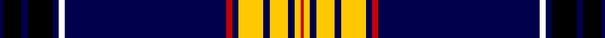

In pattern [BKBKBKBRBYBYBYR](/stripes/bkbkbkbrbybybyr/).

This was sourced from weddslist.  It is a [15 stripe tartan](/stripes/stripes15/).

Original link http://www.weddslist.com/cgi-bin/tartans/pg.pl?source=misc

## Thread count
DB/2 K12 DB4 K16 DB4 W4 DB104 R4 DB4 Y16 DB4 Y12 DB4 Y4 R/2

## Palette
Each colour and the base-6 reference it is a variant of.

| Colour | Shade | Base |
|---|---|---|
| DB | <code style="background-color:#00004C;">#00004C</code> `oklch(18.8% 0.130 264.1)` <small>#00004C</small> | B <code style="background-color:#2A418A;">#2A418A</code> |
| K | <code style="background-color:#000000;">#000000</code> `oklch(0.0% 0.000 0.0)` <small>#000000</small> | K <code style="background-color:#000000;">#000000</code> |
| R | <code style="background-color:#C80000;">#C80000</code> `oklch(52.3% 0.215 29.2)` <small>#C80000</small> | R <code style="background-color:#CC0000;">#CC0000</code> |
| Y | <code style="background-color:#FFC800;">#FFC800</code> `oklch(85.7% 0.175 88.5)` <small>#FFC800</small> | Y <code style="background-color:#F2BF00;">#F2BF00</code> |

## Nearest tartans

The nearest existing variants by ΔTartan distance.

1. [Racing Stewart](/setts/s10/db108w6k10w3k3w3k3g12r12w4/) — ΔT 1.10
1. [Parr](/setts/s10/db62r1db2r1db4k14g4w2g6k4~x2/) — ΔT 1.57
1. [Marsa Scout Group](/setts/s11/r4k1db8k1r2k44g8k1ly2k1g4~x2/) — ΔT 1.58
1. [J.C.M. Customs](/setts/s19/k3w1lb1r5lb1w1k1db1r1k1lb1w1k1db4k1lb1w4k40r3~x2/) — ΔT 1.59
1. [Khalsa](/setts/s22/dt5w1dt5w1dt5w1dt5w1dt5w1o5db1ly5db1o5ly1k36w1db3w1k72w1~x2/) — ΔT 1.62
1. [Estonian National Tartan (District)](/setts/s10/k53b3k2w1k2b3k5b32ly1r3~x2/) — ΔT 1.64
1. [Park](/setts/s10/db62r1db2r1db4k14g4k2g6k4~x2/) — ΔT 1.66
1. [JCM Customs](/setts/s19/k3w1w1r5w1w1k1db1r1k1w1w1k1db4k1w1w4k40r3~x2/) — ΔT 1.68
1. [Niagara Region](/setts/s12/w4k2w2k28dt4k2dt2r1k13r1dg13r2~x2/) — ΔT 1.72
1. [Langtree](/setts/s12/k86y6k4w3k3r3k3y22o14k3o6w4/) — ΔT 1.72

## Neighbour map

Every grey dot is one of 14299 variants placed by the first two principal components of the ΔTartan feature space (44% of its variance). Red is this tartan; blue dots are its nearest — click one to open its page.

<svg viewBox="0 0 640 380" role="img" style="max-width:100%;height:auto;border:1px solid #e0e0e0;border-radius:4px;display:block" xmlns="http://www.w3.org/2000/svg"><image href="/nn/cloud.v1.png" width="640" height="380"/><a href="/setts/s10/db108w6k10w3k3w3k3g12r12w4/"><circle cx="399.7" cy="76.9" r="4" fill="#3465a4"><title>Racing Stewart</title></circle></a><a href="/setts/s10/db62r1db2r1db4k14g4w2g6k4~x2/"><circle cx="451.4" cy="78.0" r="4" fill="#3465a4"><title>Parr</title></circle></a><a href="/setts/s11/r4k1db8k1r2k44g8k1ly2k1g4~x2/"><circle cx="399.7" cy="73.6" r="4" fill="#3465a4"><title>Marsa Scout Group</title></circle></a><a href="/setts/s19/k3w1lb1r5lb1w1k1db1r1k1lb1w1k1db4k1lb1w4k40r3~x2/"><circle cx="397.9" cy="22.0" r="4" fill="#3465a4"><title>J.C.M. Customs</title></circle></a><a href="/setts/s22/dt5w1dt5w1dt5w1dt5w1dt5w1o5db1ly5db1o5ly1k36w1db3w1k72w1~x2/"><circle cx="403.6" cy="14.0" r="4" fill="#3465a4"><title>Khalsa</title></circle></a><a href="/setts/s10/k53b3k2w1k2b3k5b32ly1r3~x2/"><circle cx="409.6" cy="86.1" r="4" fill="#3465a4"><title>Estonian National Tartan (District)</title></circle></a><a href="/setts/s10/db62r1db2r1db4k14g4k2g6k4~x2/"><circle cx="458.0" cy="82.1" r="4" fill="#3465a4"><title>Park</title></circle></a><a href="/setts/s19/k3w1w1r5w1w1k1db1r1k1w1w1k1db4k1w1w4k40r3~x2/"><circle cx="394.7" cy="20.5" r="4" fill="#3465a4"><title>JCM Customs</title></circle></a><a href="/setts/s12/w4k2w2k28dt4k2dt2r1k13r1dg13r2~x2/"><circle cx="339.7" cy="110.7" r="4" fill="#3465a4"><title>Niagara Region</title></circle></a><a href="/setts/s12/k86y6k4w3k3r3k3y22o14k3o6w4/"><circle cx="366.6" cy="77.0" r="4" fill="#3465a4"><title>Langtree</title></circle></a><circle cx="393.4" cy="44.3" r="5" fill="#c00000"/></svg>

ID: /setts/s15/db1k6db2k8db2k2db52r2db2ly8db2ly6db2ly2r1~x2/
