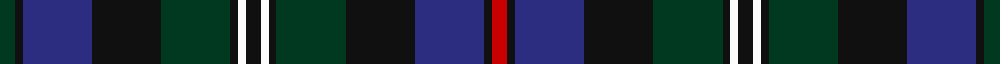

**Bands:** [RKBKGKWKWKGKBKG](/stripes/rkbkgkwkwkgkbkg/) · **Stripes:** [R K DB K DG K W K W K DG K DB K DG](/stripes/stripes15/) R K DB K DG K W K W K DG K DB K DG

This was sourced from tartans-authority.  It is a [15 band tartan](/bands/bands15/).

Original link http://www.tartansauthority.com/tartan-ferret/display/770/

## Thread count
DG/8 K4 DB36 K36 DG36 K4 W4 K8 W4 K4 DG36 K36 DB36 K4 R/8

## Palette
Each colour and its ΔE from the base-6 reference it is a variant of.

| Colour | Shade | Base | ΔE (OKLab) |
|---|---|---|---|
| DB | <code style="background-color:#2C2C80;">#2C2C80</code> `#2C2C80` | B <code style="background-color:#2A418A;">#2A418A</code> | 0.06 |
| DG | <code style="background-color:#003820;">#003820</code> `#003820` | G <code style="background-color:#006100;">#006100</code> | 0.15 |
| K | <code style="background-color:#101010;">#101010</code> `#101010` | K <code style="background-color:#000000;">#000000</code> | 0.17 |
| R | <code style="background-color:#C80000;">#C80000</code> `#C80000` | R <code style="background-color:#CC0000;">#CC0000</code> | 0.01 |
| W | <code style="background-color:#FCFCFC;">#FCFCFC</code> `#FCFCFC` | W <code style="background-color:#F7F7F7;">#F7F7F7</code> | 0.01 |

## Nearest tartans

The nearest existing variants by ΔTartan distance.

1. [Cumbernauld District Tartan Tartan Number: 1566. Earliest known date: 1987 The Cumbernauld tartan is the same as the MacKenzie, except for a change in the colour scheme. Ancient green was incorporated with modern blue, black and red to represent a new thriving community, proud of its heritage. Cumbernauld is one of Scotlands new towns. See products available Copyright © Blair Urquhart, Comrie, 2015](/setts/s15/db17k3db3k3db3k17g17k2w3k2g17k17db17k2r3~x2/) — ΔT 0.40
1. [Polaris Corporate Tartan Tartan Number: 222. Earliest known date: 1964 Designed for the Officers and men of the American Submarine base at the Holy Loch - making the Polaris submarine the first ship in history to have its own tartan. The idea came from Captain Walter F Schlech, Commander of the submarine squadron. The arrangement of stripes between the cornflower yellows is blue-sky-blue (Dalgliesh). It was previously recorded as green-blue-green (STS). The sindex card created by Davidson c1964 is Black-Royal Blue-Black. The sky blue version was recently confirmed as the correct one by R. E. Trygstad, LCDR USN (Retired), who has in his possession an original scarf with the sky blue colours. See products available Copyright © Blair Urquhart, Comrie, 2015](/setts/s17/db6k1db1k1db1k7dg6ly1db1lb1db1ly1dg6k7db7k1db1~x4/) — ΔT 0.54
1. [Urquhart (Brydone)](/setts/s14/dg1k1dg8k8db8r1db8k8dg1k1dg1k1dg3w1~x2/) — ΔT 0.59
1. [Van Ingelgem (Personal)](/setts/s18/ly3k18k3k3k3k3k18n3k3n3k3n12w2n12k9n12k2w2~x2/) — ΔT 0.70
1. [MacLeod of Gesto](/setts/s13/db9k1db1k1db1k7dg8ly2dg8k7db8k1r2~x2/) — ΔT 0.83
1. [Baillie (William Wilson)](/setts/s15/db28k4db4k4db4k28g27k3ly5k3g27k28db27k3r5~x2/) — ΔT 0.85
1. [MacClellan](/setts/s14/db18k5dg3r3dg6k2ly2k2dg6r3dg3k10db5k10/) — ΔT 0.87
1. [78th Regiment (Highlanders) (Mil.)](/setts/s15/dt30k5dt5k5dt5k31dg31k3w7k3dg31k31dt31k3r7/) — ΔT 0.91
1. [Campbell of Loudoun](/setts/s13/w2k1dg12k12db12k1db1k1db12k12dg12k1ly2~x2/) — ΔT 0.92
1. [Humphries (Personal)](/setts/s14/k16k4k4k4k6k14dg17k2r3k2dg17k14k18w4~x2/) — ΔT 0.93

## Neighbour map

Every grey dot is one of 14299 variants placed by the first two principal components of the ΔTartan feature space (44% of its variance). Red is this tartan; blue dots are its nearest — click one to open its page.

<svg viewBox="0 0 640 380" role="img" style="max-width:100%;height:auto;border:1px solid #e0e0e0;border-radius:4px;display:block" xmlns="http://www.w3.org/2000/svg"><image href="/nn/cloud.v1.png" width="640" height="380"/><a href="/setts/s15/db17k3db3k3db3k17g17k2w3k2g17k17db17k2r3~x2/"><circle cx="187.1" cy="188.5" r="4" fill="#3465a4"><title>Cumbernauld District Tartan Tartan Number: 1566. Earliest known date: 1987 The Cumbernauld tartan is the same as the MacKenzie, except for a change in the colour scheme. Ancient green was incorporated with modern blue, black and red to represent a new thriving community, proud of its heritage. Cumbernauld is one of Scotlands new towns. See products available Copyright © Blair Urquhart, Comrie, 2015</title></circle></a><a href="/setts/s17/db6k1db1k1db1k7dg6ly1db1lb1db1ly1dg6k7db7k1db1~x4/"><circle cx="186.8" cy="189.6" r="4" fill="#3465a4"><title>Polaris Corporate Tartan Tartan Number: 222. Earliest known date: 1964 Designed for the Officers and men of the American Submarine base at the Holy Loch - making the Polaris submarine the first ship in history to have its own tartan. The idea came from Captain Walter F Schlech, Commander of the submarine squadron. The arrangement of stripes between the cornflower yellows is blue-sky-blue (Dalgliesh). It was previously recorded as green-blue-green (STS). The sindex card created by Davidson c1964 is Black-Royal Blue-Black. The sky blue version was recently confirmed as the correct one by R. E. Trygstad, LCDR USN (Retired), who has in his possession an original scarf with the sky blue colours. See products available Copyright © Blair Urquhart, Comrie, 2015</title></circle></a><a href="/setts/s14/dg1k1dg8k8db8r1db8k8dg1k1dg1k1dg3w1~x2/"><circle cx="200.3" cy="190.9" r="4" fill="#3465a4"><title>Urquhart (Brydone)</title></circle></a><a href="/setts/s18/ly3k18k3k3k3k3k18n3k3n3k3n12w2n12k9n12k2w2~x2/"><circle cx="179.3" cy="171.4" r="4" fill="#3465a4"><title>Van Ingelgem (Personal)</title></circle></a><a href="/setts/s13/db9k1db1k1db1k7dg8ly2dg8k7db8k1r2~x2/"><circle cx="166.1" cy="193.2" r="4" fill="#3465a4"><title>MacLeod of Gesto</title></circle></a><a href="/setts/s15/db28k4db4k4db4k28g27k3ly5k3g27k28db27k3r5~x2/"><circle cx="181.3" cy="175.5" r="4" fill="#3465a4"><title>Baillie (William Wilson)</title></circle></a><a href="/setts/s14/db18k5dg3r3dg6k2ly2k2dg6r3dg3k10db5k10/"><circle cx="168.8" cy="184.9" r="4" fill="#3465a4"><title>MacClellan</title></circle></a><a href="/setts/s15/dt30k5dt5k5dt5k31dg31k3w7k3dg31k31dt31k3r7/"><circle cx="182.5" cy="176.8" r="4" fill="#3465a4"><title>78th Regiment (Highlanders) (Mil.)</title></circle></a><a href="/setts/s13/w2k1dg12k12db12k1db1k1db12k12dg12k1ly2~x2/"><circle cx="186.7" cy="175.9" r="4" fill="#3465a4"><title>Campbell of Loudoun</title></circle></a><a href="/setts/s14/k16k4k4k4k6k14dg17k2r3k2dg17k14k18w4~x2/"><circle cx="182.0" cy="212.0" r="4" fill="#3465a4"><title>Humphries (Personal)</title></circle></a><circle cx="190.6" cy="186.7" r="5" fill="#c00000"/></svg>

ID: /setts/s15/dg2k1db9k9dg9k1w1k2w1k1dg9k9db9k1r2~x4/
