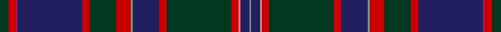

In pattern [GBRRGRBGRGRBRRG](/stripes/gbrrgrbgrgrbrrg/).

This was sourced from tartans-authority.  It is a [15 stripe tartan](/stripes/stripes15/).

Original link http://www.tartansauthority.com/tartan-ferret/display/5045/

## Thread count
DG/10 R8 P2 DB72 R8 DG30 R16 LG2 DB30 R8 DG72 R8 LR2 DB10 LG/2

## Palette
Each colour and its ΔE from the base-6 reference it is a variant of.

| Colour | Shade | Base | ΔE (OKLab) |
|---|---|---|---|
| DB | <code style="background-color:#202060;">#202060</code> `#202060` | B <code style="background-color:#2A418A;">#2A418A</code> | 0.11 |
| DG | <code style="background-color:#003820;">#003820</code> `#003820` | G <code style="background-color:#006100;">#006100</code> | 0.15 |
| LG | <code style="background-color:#789484;">#789484</code> `#789484` | G <code style="background-color:#006100;">#006100</code> | 0.24 |
| LR | <code style="background-color:#E87878;">#E87878</code> `#E87878` | R <code style="background-color:#CC0000;">#CC0000</code> | 0.19 |
| P | <code style="background-color:#981C70;">#981C70</code> `#981C70` | R <code style="background-color:#CC0000;">#CC0000</code> | 0.17 |
| R | <code style="background-color:#C80000;">#C80000</code> `#C80000` | R <code style="background-color:#CC0000;">#CC0000</code> | 0.01 |

## Nearest tartans

The nearest existing variants by ΔTartan distance.

1. [McGuirk (2013)](/setts/s12/dg4r1dg1r3dg16k12r1db27lb2db3lb1ly2~x2/) — ΔT 1.08
1. [Highland Pride of Scotland (Fashion)](/setts/s11/db9dg2dp2dp2dg18dp2k2dg1k19db33w2~x2/) — ΔT 1.09
1. [Trew 40th (Personal)](/setts/s15/r4dg3k11do3db3do30k1w4k1dg3k3dg3k3do12r2~x2/) — ΔT 1.13
1. [Highland Pride of Scotland](/setts/s20/db9dg2dp2dp2dg18dp2k2dg1k19db33w2~x2/) — ΔT 1.14
1. [Capercaillie Corporate Tartan Tartan Number: 6857. Earliest known date: 2005 RSPB Scotland will receive a 7% royalty on all products made from the new tartan, created in the colours of the world's largest woodland grouse, in a deal struck with the leading tartan weavers Lochcarron. See products available Copyright © Blair Urquhart, Comrie, 2015](/setts/s14/n4o3n4o2n4dt8n30k4dt4k36n4r2k4w2/) — ΔT 1.14
1. [Scragg Moran (Personal)](/setts/s10/g1dt28k11r5w1r5k11lr1k2g1~x2/) — ΔT 1.16
1. [Unidentified #7](/setts/s11/db2r2db2r2db20k24dg12ly1k2dg2t2~x2/) — ΔT 1.25
1. [McGuirk (2013)](/setts/s12/dg4r1dg1r3dg16k12r1db27t2db3t1ly2~x2/) — ΔT 1.30
1. [Livingstone - Australia (Personal)](/setts/s11/g15r25g4k2lo1db1lo1k2g4db12w1~x2/) — ΔT 1.31
1. [Capercaillie](/setts/s14/do4o3do4o2do4db8do30k4db4k36do4r2k4w2/) — ΔT 1.33

## Neighbour map

Every grey dot is one of 14299 variants placed by the first two principal components of the ΔTartan feature space (44% of its variance). Red is this tartan; blue dots are its nearest — click one to open its page.

<svg viewBox="0 0 640 380" role="img" style="max-width:100%;height:auto;border:1px solid #e0e0e0;border-radius:4px;display:block" xmlns="http://www.w3.org/2000/svg"><image href="/nn/cloud.v1.png" width="640" height="380"/><a href="/setts/s12/dg4r1dg1r3dg16k12r1db27lb2db3lb1ly2~x2/"><circle cx="257.3" cy="112.0" r="4" fill="#3465a4"><title>McGuirk (2013)</title></circle></a><a href="/setts/s11/db9dg2dp2dp2dg18dp2k2dg1k19db33w2~x2/"><circle cx="297.0" cy="119.8" r="4" fill="#3465a4"><title>Highland Pride of Scotland (Fashion)</title></circle></a><a href="/setts/s15/r4dg3k11do3db3do30k1w4k1dg3k3dg3k3do12r2~x2/"><circle cx="311.4" cy="96.4" r="4" fill="#3465a4"><title>Trew 40th (Personal)</title></circle></a><a href="/setts/s20/db9dg2dp2dp2dg18dp2k2dg1k19db33w2~x2/"><circle cx="285.4" cy="100.0" r="4" fill="#3465a4"><title>Highland Pride of Scotland</title></circle></a><a href="/setts/s14/n4o3n4o2n4dt8n30k4dt4k36n4r2k4w2/"><circle cx="270.0" cy="118.7" r="4" fill="#3465a4"><title>Capercaillie Corporate Tartan Tartan Number: 6857. Earliest known date: 2005 RSPB Scotland will receive a 7% royalty on all products made from the new tartan, created in the colours of the world's largest woodland grouse, in a deal struck with the leading tartan weavers Lochcarron. See products available Copyright © Blair Urquhart, Comrie, 2015</title></circle></a><a href="/setts/s10/g1dt28k11r5w1r5k11lr1k2g1~x2/"><circle cx="276.5" cy="116.2" r="4" fill="#3465a4"><title>Scragg Moran (Personal)</title></circle></a><a href="/setts/s11/db2r2db2r2db20k24dg12ly1k2dg2t2~x2/"><circle cx="232.6" cy="118.4" r="4" fill="#3465a4"><title>Unidentified #7</title></circle></a><a href="/setts/s12/dg4r1dg1r3dg16k12r1db27t2db3t1ly2~x2/"><circle cx="241.0" cy="100.6" r="4" fill="#3465a4"><title>McGuirk (2013)</title></circle></a><a href="/setts/s11/g15r25g4k2lo1db1lo1k2g4db12w1~x2/"><circle cx="242.9" cy="111.1" r="4" fill="#3465a4"><title>Livingstone - Australia (Personal)</title></circle></a><a href="/setts/s14/do4o3do4o2do4db8do30k4db4k36do4r2k4w2/"><circle cx="285.9" cy="126.6" r="4" fill="#3465a4"><title>Capercaillie</title></circle></a><circle cx="287.7" cy="96.9" r="5" fill="#c00000"/></svg>

ID: /setts/s15/dg5r4m1db36r4dg15r8y1db15r4dg36r4r1db5y1~x2/
