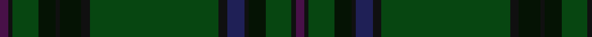

This page is one **sett** — a single exact thread-count. It belongs to the [tartan](/tartans/dp2ka1dg6k4ka1k5ka2dg30ka2db4ka1k4dg6ka1dp2/)
(the same proportion at any scale), whose colour order is pattern [BKGKKBKGKKKKGKB](/stripes/bkgkkbkgkkkkgkb/).

Sourced from register-of-tartans.  It is a [15 stripe tartan](/stripes/stripes15/).

Original link https://www.tartanregister.gov.uk/tartanDetails.aspx?ref=10025

## Register references

External register numbers recorded for this tartan.

- Scottish Register of Tartans: [10025](https://www.tartanregister.gov.uk/tartanDetails.aspx?ref=10025)

## Thread count
DP/4 Ka2 DG12 K8 Ka2 K10 Ka4 DG60 Ka4 DB8 Ka2 K8 DG12 Ka2 DP/4

## Palette
Each colour and the base-6 reference it is a variant of.

| Colour | Shade | Base |
|---|---|---|
| DB | <code style="background-color:#1F2056;">#1F2056</code> `oklch(27.9% 0.096 277.4)` <small>#1F2056</small> | B <code style="background-color:#2A418A;">#2A418A</code> |
| DG | <code style="background-color:#074611;">#074611</code> `oklch(34.5% 0.103 144.9)` <small>#074611</small> | G <code style="background-color:#006100;">#006100</code> |
| DP | <code style="background-color:#481148;">#481148</code> `oklch(29.7% 0.110 327.9)` <small>#481148</small> | B <code style="background-color:#2A418A;">#2A418A</code> |
| K | <code style="background-color:#051304;">#051304</code> `oklch(16.8% 0.039 141.8)` <small>#051304</small> | K <code style="background-color:#000000;">#000000</code> |
| Ka | <code style="background-color:#101010;">#101010</code> `oklch(17.3% 0.000 89.9)` <small>#101010</small> | K <code style="background-color:#000000;">#000000</code> |

## Nearest tartans

The nearest existing variants by ΔTartan distance, with this tartan at the top so the swatches line up against it.

ΔTartan

Tartan

Sett

—

<a href="/ttd/edit/#slug=dp2k1dg6k4k1k5k2dg30k2db4k1k4dg6k1dp2~x2">Letham Hunting</a> <a class="nn-out" href="/setts/s15/dp2k1dg6k4k1k5k2dg30k2db4k1k4dg6k1dp2~x2/" title="open its dictionary page">↗</a>

1.35

<a href="/ttd/edit/#slug=dg18k6dg1k1db1k6db1k2db1k6db1k1dg1k6dg21ly1~x2">Grand Lodge of Scotland Corporate Weavers Tartan Tartan Number: 5776. Earliest known date: 2002 This is not a general Masonic tartan but one designed for the Grand Lodge of Scotland which is custodian to the oldest Lodge Minutes in the world dating from 1599. Masons in other parts of the world wishing to obtain this tartan must, in the first instance, contact the Curator of the Grand Lodge of Scotland Museum, Robert L D Cooper See products available Copyright © Blair Urquhart, Comrie, 2015</a> <a class="nn-out" href="/setts/s16/dg18k6dg1k1db1k6db1k2db1k6db1k1dg1k6dg21ly1~x2/" title="open its dictionary page">↗</a>

1.70

<a href="/ttd/edit/#slug=dg36k52lo2k8dg8dy8lo2dy6dg36r1~x2">Grenauld</a> <a class="nn-out" href="/setts/s10/dg36k52lo2k8dg8dy8lo2dy6dg36r1~x2/" title="open its dictionary page">↗</a>

1.82

<a href="/ttd/edit/#slug=dg38k3dg3k3dt6o1k2r2k2o1dt6k3dt3k3dt19~x2">Doyel (Name)</a> <a class="nn-out" href="/setts/s15/dg38k3dg3k3dt6o1k2r2k2o1dt6k3dt3k3dt19~x2/" title="open its dictionary page">↗</a>

1.95

<a href="/ttd/edit/#slug=k9dg5w1dg15k2dg1k44r1~x2">Ata?, H.M. &amp; I.C. (Personal)</a> <a class="nn-out" href="/setts/s8/k9dg5w1dg15k2dg1k44r1~x2/" title="open its dictionary page">↗</a>

1.95

<a href="/ttd/edit/#slug=dy10k2y5k2dg46ly2k2~x2">Green Rover, The</a> <a class="nn-out" href="/setts/s7/dy10k2y5k2dg46ly2k2~x2/" title="open its dictionary page">↗</a>

1.96

<a href="/ttd/edit/#slug=dt36k3dg3g1dg3k3dt4dg6k1g2~x4">Verdon</a> <a class="nn-out" href="/setts/s10/dt36k3dg3g1dg3k3dt4dg6k1g2~x4/" title="open its dictionary page">↗</a>

1.96

<a href="/ttd/edit/#slug=dg3g1lo2dg3g1lo2dy21dg18dy2dg3dy2dg18dy21g1lo2~x2">Prince David Royal Family Tartan Tartan Number: 2125. Earliest known date: 1930 Mackinlay suggests that David was the pet name of the Duke of Windsor when he was a boy and that the tartan was designed for his personal use. See products available Copyright © Blair Urquhart, Comrie, 2015</a> <a class="nn-out" href="/setts/s15/dg3g1lo2dg3g1lo2dy21dg18dy2dg3dy2dg18dy21g1lo2~x2/" title="open its dictionary page">↗</a>

1.97

<a href="/ttd/edit/#slug=dg24g2dg4g16dg1lb2dg1g16dg3ly1dg12o2dg5~x2">O'Neill (Personal)</a> <a class="nn-out" href="/setts/s13/dg24g2dg4g16dg1lb2dg1g16dg3ly1dg12o2dg5~x2/" title="open its dictionary page">↗</a>

2.04

<a href="/ttd/edit/#slug=k2do6k2do1k2do1k2do4k4k2do4k19r2k2r2~x4">Lochcarron Mill (Corporate)</a> <a class="nn-out" href="/setts/s15/k2do6k2do1k2do1k2do4k4k2do4k19r2k2r2~x4/" title="open its dictionary page">↗</a>

2.11

<a href="/ttd/edit/#slug=g38n8b3db4n12lo1g4n1~x2">Del Forno Wolf (Personal)</a> <a class="nn-out" href="/setts/s8/g38n8b3db4n12lo1g4n1~x2/" title="open its dictionary page">↗</a>

## Neighbour map

Every grey dot is one of 14299 variants placed by the first two principal components of the ΔTartan feature space (44% of its variance). Red is this tartan; blue dots are its nearest — click one to open its page.

<svg viewBox="0 0 640 380" role="img" style="max-width:100%;height:auto;border:1px solid #e0e0e0;border-radius:4px;display:block" xmlns="http://www.w3.org/2000/svg"><image href="/nn/cloud.v1.png" width="640" height="380"/><a href="/setts/s16/dg18k6dg1k1db1k6db1k2db1k6db1k1dg1k6dg21ly1~x2/"><circle cx="462.8" cy="192.5" r="4" fill="#3465a4"><title>Grand Lodge of Scotland Corporate Weavers Tartan Tartan Number: 5776. Earliest known date: 2002 This is not a general Masonic tartan but one designed for the Grand Lodge of Scotland which is custodian to the oldest Lodge Minutes in the world dating from 1599. Masons in other parts of the world wishing to obtain this tartan must, in the first instance, contact the Curator of the Grand Lodge of Scotland Museum, Robert L D Cooper See products available Copyright © Blair Urquhart, Comrie, 2015</title></circle></a><a href="/setts/s10/dg36k52lo2k8dg8dy8lo2dy6dg36r1~x2/"><circle cx="432.3" cy="170.5" r="4" fill="#3465a4"><title>Grenauld</title></circle></a><a href="/setts/s15/dg38k3dg3k3dt6o1k2r2k2o1dt6k3dt3k3dt19~x2/"><circle cx="401.4" cy="148.6" r="4" fill="#3465a4"><title>Doyel (Name)</title></circle></a><a href="/setts/s8/k9dg5w1dg15k2dg1k44r1~x2/"><circle cx="488.6" cy="169.8" r="4" fill="#3465a4"><title>Ata?, H.M. &amp; I.C. (Personal)</title></circle></a><a href="/setts/s7/dy10k2y5k2dg46ly2k2~x2/"><circle cx="509.4" cy="187.4" r="4" fill="#3465a4"><title>Green Rover, The</title></circle></a><a href="/setts/s10/dt36k3dg3g1dg3k3dt4dg6k1g2~x4/"><circle cx="512.3" cy="158.9" r="4" fill="#3465a4"><title>Verdon</title></circle></a><a href="/setts/s15/dg3g1lo2dg3g1lo2dy21dg18dy2dg3dy2dg18dy21g1lo2~x2/"><circle cx="407.7" cy="187.5" r="4" fill="#3465a4"><title>Prince David Royal Family Tartan Tartan Number: 2125. Earliest known date: 1930 Mackinlay suggests that David was the pet name of the Duke of Windsor when he was a boy and that the tartan was designed for his personal use. See products available Copyright © Blair Urquhart, Comrie, 2015</title></circle></a><a href="/setts/s13/dg24g2dg4g16dg1lb2dg1g16dg3ly1dg12o2dg5~x2/"><circle cx="444.2" cy="197.3" r="4" fill="#3465a4"><title>O'Neill (Personal)</title></circle></a><a href="/setts/s15/k2do6k2do1k2do1k2do4k4k2do4k19r2k2r2~x4/"><circle cx="434.2" cy="191.7" r="4" fill="#3465a4"><title>Lochcarron Mill (Corporate)</title></circle></a><a href="/setts/s8/g38n8b3db4n12lo1g4n1~x2/"><circle cx="488.8" cy="180.8" r="4" fill="#3465a4"><title>Del Forno Wolf (Personal)</title></circle></a><circle cx="461.2" cy="156.7" r="5" fill="#c00000"/></svg>

ID: /setts/s15/dp2k1dg6k4k1k5k2dg30k2db4k1k4dg6k1dp2~x2/
