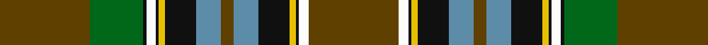

**Bands:** [GGKWKYKBGBKYKWG](/stripes/ggkwkykbgbkykwg/) · **Stripes:** [DY G K W K LY K T DY T K LY K W DY](/stripes/stripes15/) DY G K W K LY K T DY T K LY K W DY

This was sourced from register-of-tartans.  It is a [15 band tartan](/bands/bands15/).

Original link https://www.tartanregister.gov.uk/tartanDetails.aspx?ref=2852

## Also known as

This cloth is also recorded under:

- Massie/Massey
- Wilson's No.017 #2

## Attestations

This cloth appears in 2 source records; the oldest owns this page.

- 01/01/1819 — Massie/Massey (register-of-tartans, [record](https://www.tartanregister.gov.uk/tartanDetails.aspx?ref=2852))
- 1819? — Massie/Massey (Name) (tartans-authority, [record](http://www.tartansauthority.com/tartan-ferret/display/6631/))

## Register references

External register numbers recorded for this tartan.

- Scottish Register of Tartans: [2852](https://www.tartanregister.gov.uk/tartanDetails.aspx?ref=2852)
- Scottish Tartans Authority (ITI): 6631

## Thread count
T/58 G34 K2 W6 K2 Y4 K20 B16 T8 B16 K20 Y4 K2 W6 T/58

## Palette
Each colour and its ΔE from the base-6 reference it is a variant of.

| Colour | Shade | Base | ΔE (OKLab) |
|---|---|---|---|
| B | <code style="background-color:#5C8CA8;">#5C8CA8</code> `#5C8CA8` | B <code style="background-color:#2A418A;">#2A418A</code> | 0.23 |
| G | <code style="background-color:#006818;">#006818</code> `#006818` | G <code style="background-color:#006100;">#006100</code> | 0.02 |
| K | <code style="background-color:#101010;">#101010</code> `#101010` | K <code style="background-color:#000000;">#000000</code> | 0.17 |
| T | <code style="background-color:#604000;">#604000</code> `#604000` | G <code style="background-color:#006100;">#006100</code> | 0.14 |
| W | <code style="background-color:#FCFCFC;">#FCFCFC</code> `#FCFCFC` | W <code style="background-color:#F7F7F7;">#F7F7F7</code> | 0.01 |
| Y | <code style="background-color:#E8C000;">#E8C000</code> `#E8C000` | Y <code style="background-color:#F2BF00;">#F2BF00</code> | 0.02 |

## Nearest tartans

The nearest existing variants by ΔTartan distance.

1. [Zambia](/setts/s11/w4k1db16k1dg32r6k6o6dg4o2dg1~x2/) — ΔT 1.02
1. [Coigach](/setts/s15/r3lb3k3lb3r3db8k1ly2k1db8k2g30k1g10k2~x2/) — ΔT 1.10
1. [Goldstraw (Name)](/setts/s16/g5w2r8k2lo4k2ly2k7g40k3r10k6lo7k7ly2k2~x2/) — ΔT 1.21
1. [Recycled Lamb, The](/setts/s14/g15r1g8r3dp1r1w1r3dp1r3dp12r1g7ly1~x2/) — ΔT 1.23
1. [National Millennium](/setts/s9/w2db4r16k12g36ly1db6k2w2~x2/) — ΔT 1.25
1. [Holyoke St. Patrick's](/setts/s10/r8db8dg1db1dg27dp1ly1dp3ly3w1~x2/) — ΔT 1.26
1. [California State American District Tartan Tartan Number: 2454. Earliest known date: 1998 Designed by J.Howard Standing of Tarzana, California and Thomas Ferguson of Sydney, British Columbia. Adopted as the 'official' California State tartan by the State Legislature. For general use by all those living in the State. Based on Muir, after the famous botanist and environmentalist John Muir who lived in California. Assembly Bill 2362, february 20th 1998. See products available Copyright © Blair Urquhart, Comrie, 2015](/setts/s13/lo4k1g10r2g10r4g10r2g10k16t28k1lb4~x2/) — ΔT 1.28
1. [Murphy, Andrew (Personal)](/setts/s14/k8lt2r2k6r2k2ly1k2r16dg30k1r2k4lt2~x2/) — ΔT 1.28
1. [California State](/setts/s13/ly4k1g10r2g10r4g10r2g10k16t28k1lb4~x2/) — ΔT 1.28
1. [Stirling University #2](/setts/s14/g22r3w1g2r3t16k3ly2~x4/) — ΔT 1.31

## Neighbour map

Every grey dot is one of 14299 variants placed by the first two principal components of the ΔTartan feature space (44% of its variance). Red is this tartan; blue dots are its nearest — click one to open its page.

<svg viewBox="0 0 640 380" role="img" style="max-width:100%;height:auto;border:1px solid #e0e0e0;border-radius:4px;display:block" xmlns="http://www.w3.org/2000/svg"><image href="/nn/cloud.v1.png" width="640" height="380"/><a href="/setts/s11/w4k1db16k1dg32r6k6o6dg4o2dg1~x2/"><circle cx="250.8" cy="91.3" r="4" fill="#3465a4"><title>Zambia</title></circle></a><a href="/setts/s15/r3lb3k3lb3r3db8k1ly2k1db8k2g30k1g10k2~x2/"><circle cx="258.5" cy="74.3" r="4" fill="#3465a4"><title>Coigach</title></circle></a><a href="/setts/s16/g5w2r8k2lo4k2ly2k7g40k3r10k6lo7k7ly2k2~x2/"><circle cx="196.2" cy="75.3" r="4" fill="#3465a4"><title>Goldstraw (Name)</title></circle></a><a href="/setts/s14/g15r1g8r3dp1r1w1r3dp1r3dp12r1g7ly1~x2/"><circle cx="251.6" cy="113.2" r="4" fill="#3465a4"><title>Recycled Lamb, The</title></circle></a><a href="/setts/s9/w2db4r16k12g36ly1db6k2w2~x2/"><circle cx="236.7" cy="88.9" r="4" fill="#3465a4"><title>National Millennium</title></circle></a><a href="/setts/s10/r8db8dg1db1dg27dp1ly1dp3ly3w1~x2/"><circle cx="287.6" cy="86.6" r="4" fill="#3465a4"><title>Holyoke St. Patrick's</title></circle></a><a href="/setts/s13/lo4k1g10r2g10r4g10r2g10k16t28k1lb4~x2/"><circle cx="187.7" cy="107.4" r="4" fill="#3465a4"><title>California State American District Tartan Tartan Number: 2454. Earliest known date: 1998 Designed by J.Howard Standing of Tarzana, California and Thomas Ferguson of Sydney, British Columbia. Adopted as the 'official' California State tartan by the State Legislature. For general use by all those living in the State. Based on Muir, after the famous botanist and environmentalist John Muir who lived in California. Assembly Bill 2362, february 20th 1998. See products available Copyright © Blair Urquhart, Comrie, 2015</title></circle></a><a href="/setts/s14/k8lt2r2k6r2k2ly1k2r16dg30k1r2k4lt2~x2/"><circle cx="214.0" cy="72.0" r="4" fill="#3465a4"><title>Murphy, Andrew (Personal)</title></circle></a><a href="/setts/s13/ly4k1g10r2g10r4g10r2g10k16t28k1lb4~x2/"><circle cx="181.4" cy="103.3" r="4" fill="#3465a4"><title>California State</title></circle></a><a href="/setts/s14/g22r3w1g2r3t16k3ly2~x4/"><circle cx="204.7" cy="93.4" r="4" fill="#3465a4"><title>Stirling University #2</title></circle></a><circle cx="240.2" cy="88.0" r="5" fill="#c00000"/></svg>

ID: /setts/s15/dy29g17k1w3k1ly2k10t8dy4t8k10ly2k1w3dy29~x2/
