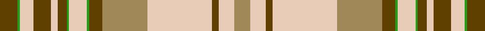

This page is one **sett** — a single exact thread-count. It belongs to the [tartan](/tartans/dy8g1lb6dy8lb3dy4g1lb8g1dy6lo20lb29dy3lb7lo7/)
(the same proportion at any scale), whose colour order is pattern [GGWGWGGWGGYWGWY](/stripes/ggwgwggwggywgwy/).

Sourced from tartans-authority.  It is a [15 stripe tartan](/stripes/stripes15/).

Original link http://www.tartansauthority.com/tartan-ferret/display/6091/

## Register references

External register numbers recorded for this tartan.

- Scottish Tartans Authority (ITI): 6091

## Thread count
T/16 G2 LR12 T16 LR6 T8 G2 LR16 G2 T12 LT40 LR58 T6 LR14 LT/14

## Palette

Palette: <strong>Tartan Register</strong>
<table><thead><tr><th>Colour</th><th>Threads</th><th>Shade</th><th>Base</th><th>OKLCh</th></tr></thead><tbody><tr><td>T/</td><td style="text-align:right;font-variant-numeric:tabular-nums">16</td><td><code style="background-color:#604000;">#604000</code> <small style="color:#888">#604000</small></td><td>G <code style="background-color:#006100;">#006100</code></td><td><small style="color:#888">oklch(39.8% 0.083 76.8)</small></td></tr><tr><td>G</td><td style="text-align:right;font-variant-numeric:tabular-nums">2</td><td><code style="background-color:#289C18;">#289C18</code> <small style="color:#888">#289C18</small></td><td>G <code style="background-color:#006100;">#006100</code></td><td><small style="color:#888">oklch(60.6% 0.191 141.6)</small></td></tr><tr><td>LR</td><td style="text-align:right;font-variant-numeric:tabular-nums">12</td><td><code style="background-color:#E8CCB8;">#E8CCB8</code> <small style="color:#888">#E8CCB8</small></td><td>W <code style="background-color:#F7F7F7;">#F7F7F7</code></td><td><small style="color:#888">oklch(86.3% 0.042 57.7)</small></td></tr><tr><td>T</td><td style="text-align:right;font-variant-numeric:tabular-nums">16</td><td><code style="background-color:#604000;">#604000</code> <small style="color:#888">#604000</small></td><td>G <code style="background-color:#006100;">#006100</code></td><td><small style="color:#888">oklch(39.8% 0.083 76.8)</small></td></tr><tr><td>LR</td><td style="text-align:right;font-variant-numeric:tabular-nums">6</td><td><code style="background-color:#E8CCB8;">#E8CCB8</code> <small style="color:#888">#E8CCB8</small></td><td>W <code style="background-color:#F7F7F7;">#F7F7F7</code></td><td><small style="color:#888">oklch(86.3% 0.042 57.7)</small></td></tr><tr><td>T</td><td style="text-align:right;font-variant-numeric:tabular-nums">8</td><td><code style="background-color:#604000;">#604000</code> <small style="color:#888">#604000</small></td><td>G <code style="background-color:#006100;">#006100</code></td><td><small style="color:#888">oklch(39.8% 0.083 76.8)</small></td></tr><tr><td>G</td><td style="text-align:right;font-variant-numeric:tabular-nums">2</td><td><code style="background-color:#289C18;">#289C18</code> <small style="color:#888">#289C18</small></td><td>G <code style="background-color:#006100;">#006100</code></td><td><small style="color:#888">oklch(60.6% 0.191 141.6)</small></td></tr><tr><td>LR</td><td style="text-align:right;font-variant-numeric:tabular-nums">16</td><td><code style="background-color:#E8CCB8;">#E8CCB8</code> <small style="color:#888">#E8CCB8</small></td><td>W <code style="background-color:#F7F7F7;">#F7F7F7</code></td><td><small style="color:#888">oklch(86.3% 0.042 57.7)</small></td></tr><tr><td>G</td><td style="text-align:right;font-variant-numeric:tabular-nums">2</td><td><code style="background-color:#289C18;">#289C18</code> <small style="color:#888">#289C18</small></td><td>G <code style="background-color:#006100;">#006100</code></td><td><small style="color:#888">oklch(60.6% 0.191 141.6)</small></td></tr><tr><td>T</td><td style="text-align:right;font-variant-numeric:tabular-nums">12</td><td><code style="background-color:#604000;">#604000</code> <small style="color:#888">#604000</small></td><td>G <code style="background-color:#006100;">#006100</code></td><td><small style="color:#888">oklch(39.8% 0.083 76.8)</small></td></tr><tr><td>LT</td><td style="text-align:right;font-variant-numeric:tabular-nums">40</td><td><code style="background-color:#A08858;">#A08858</code> <small style="color:#888">#A08858</small></td><td>Y <code style="background-color:#F2BF00;">#F2BF00</code></td><td><small style="color:#888">oklch(63.7% 0.071 84.0)</small></td></tr><tr><td>LR</td><td style="text-align:right;font-variant-numeric:tabular-nums">58</td><td><code style="background-color:#E8CCB8;">#E8CCB8</code> <small style="color:#888">#E8CCB8</small></td><td>W <code style="background-color:#F7F7F7;">#F7F7F7</code></td><td><small style="color:#888">oklch(86.3% 0.042 57.7)</small></td></tr><tr><td>T</td><td style="text-align:right;font-variant-numeric:tabular-nums">6</td><td><code style="background-color:#604000;">#604000</code> <small style="color:#888">#604000</small></td><td>G <code style="background-color:#006100;">#006100</code></td><td><small style="color:#888">oklch(39.8% 0.083 76.8)</small></td></tr><tr><td>LR</td><td style="text-align:right;font-variant-numeric:tabular-nums">14</td><td><code style="background-color:#E8CCB8;">#E8CCB8</code> <small style="color:#888">#E8CCB8</small></td><td>W <code style="background-color:#F7F7F7;">#F7F7F7</code></td><td><small style="color:#888">oklch(86.3% 0.042 57.7)</small></td></tr><tr><td>LT/</td><td style="text-align:right;font-variant-numeric:tabular-nums">14</td><td><code style="background-color:#A08858;">#A08858</code> <small style="color:#888">#A08858</small></td><td>Y <code style="background-color:#F2BF00;">#F2BF00</code></td><td><small style="color:#888">oklch(63.7% 0.071 84.0)</small></td></tr></tbody></table>

## Nearest tartans

The nearest existing variants by ΔTartan distance, with this tartan at the top so the swatches line up against it.

ΔTartan

Tartan

Sett

—

<a href="/ttd/edit/#slug=dy8g1lb6dy8lb3dy4g1lb8g1dy6lo20lb29dy3lb7lo7~x2">Isle of Skye (Fashion)</a> <a class="nn-out" href="/setts/s15/dy8g1lb6dy8lb3dy4g1lb8g1dy6lo20lb29dy3lb7lo7~x2/" title="open its dictionary page">↗</a>

1.12

<a href="/ttd/edit/#slug=r24k2g8k2r8k1g24lb6k2r14lb18k4~x2">Grant - 1714 (Piper) (Portrait)</a> <a class="nn-out" href="/setts/s12/r24k2g8k2r8k1g24lb6k2r14lb18k4~x2/" title="open its dictionary page">↗</a>

1.25

<a href="/ttd/edit/#slug=o68w3o3w8o3w3w24dy16r3dy20w3~x2">Ben Cleuch (Fashion)</a> <a class="nn-out" href="/setts/s11/o68w3o3w8o3w3w24dy16r3dy20w3~x2/" title="open its dictionary page">↗</a>

1.31

<a href="/setts/s28/lo7lb7dy3lb29lo20dy6g1lb8g1dy4lb3dy8lb6g1dy8g1lb6dy8lb3dy4g1lb8g1dy6lo20lb29dy3lb7~x2/">Isle of Skye (Dalgety)</a>

1.32

<a href="/ttd/edit/#slug=r4g5w2g5r4g14r10w30k1r2g4~x2">Scott, dress</a> <a class="nn-out" href="/setts/s11/r4g5w2g5r4g14r10w30k1r2g4~x2/" title="open its dictionary page">↗</a>

1.40

<a href="/ttd/edit/#slug=k2g2lr10g2lr7g2lr7g2lr5g2r14lr1g2~x2">Glen Affric, Fragment</a> <a class="nn-out" href="/setts/s13/k2g2lr10g2lr7g2lr7g2lr5g2r14lr1g2~x2/" title="open its dictionary page">↗</a>

1.48

<a href="/ttd/edit/#slug=w68o3w3o8w3o27dy16r3dy20o3~x2">Ben Cleuch</a> <a class="nn-out" href="/setts/s10/w68o3w3o8w3o27dy16r3dy20o3~x2/" title="open its dictionary page">↗</a>

1.53

<a href="/ttd/edit/#slug=n3w3w38n25r3n6w7n3r2~x2">Greater St. Louis Firefighters (Cor)</a> <a class="nn-out" href="/setts/s9/n3w3w38n25r3n6w7n3r2~x2/" title="open its dictionary page">↗</a>

1.53

<a href="/ttd/edit/#slug=k2dg2lr10dg2lr7dg2lr7dg2lr5dg2r14lr1dg2~x2">Glenaffric Fragment</a> <a class="nn-out" href="/setts/s13/k2dg2lr10dg2lr7dg2lr7dg2lr5dg2r14lr1dg2~x2/" title="open its dictionary page">↗</a>

1.57

<a href="/ttd/edit/#slug=g26r5k1r2k1r5g16r5w16g2w8~x2">Livingston (Personal)</a> <a class="nn-out" href="/setts/s11/g26r5k1r2k1r5g16r5w16g2w8~x2/" title="open its dictionary page">↗</a>

1.57

<a href="/setts/s13/wi4n1lr29n6w13n13w6n13w13n6lr29n1lg4~x2/">Delta Dental Association</a>

## Neighbour map

Every grey dot is one of 14359 variants placed by the first two principal components of the ΔTartan feature space (44% of its variance). Red is this tartan; blue dots are its nearest — click one to open its page.

<svg viewBox="0 0 640 380" role="img" style="max-width:100%;height:auto;border:1px solid #e0e0e0;border-radius:4px;display:block" xmlns="http://www.w3.org/2000/svg"><image href="/nn/cloud.v1.png" width="640" height="380"/><a href="/setts/s12/r24k2g8k2r8k1g24lb6k2r14lb18k4~x2/"><circle cx="214.1" cy="129.0" r="4" fill="#3465a4"><title>Grant - 1714 (Piper) (Portrait)</title></circle></a><a href="/setts/s11/o68w3o3w8o3w3w24dy16r3dy20w3~x2/"><circle cx="291.1" cy="102.9" r="4" fill="#3465a4"><title>Ben Cleuch (Fashion)</title></circle></a><a href="/setts/s28/lo7lb7dy3lb29lo20dy6g1lb8g1dy4lb3dy8lb6g1dy8g1lb6dy8lb3dy4g1lb8g1dy6lo20lb29dy3lb7~x2/"><circle cx="281.4" cy="78.4" r="4" fill="#3465a4"><title>Isle of Skye (Dalgety)</title></circle></a><a href="/setts/s11/r4g5w2g5r4g14r10w30k1r2g4~x2/"><circle cx="234.3" cy="101.5" r="4" fill="#3465a4"><title>Scott, dress</title></circle></a><a href="/setts/s13/k2g2lr10g2lr7g2lr7g2lr5g2r14lr1g2~x2/"><circle cx="258.6" cy="149.1" r="4" fill="#3465a4"><title>Glen Affric, Fragment</title></circle></a><a href="/setts/s10/w68o3w3o8w3o27dy16r3dy20o3~x2/"><circle cx="269.8" cy="99.5" r="4" fill="#3465a4"><title>Ben Cleuch</title></circle></a><a href="/setts/s9/n3w3w38n25r3n6w7n3r2~x2/"><circle cx="266.3" cy="129.6" r="4" fill="#3465a4"><title>Greater St. Louis Firefighters (Cor)</title></circle></a><a href="/setts/s13/k2dg2lr10dg2lr7dg2lr7dg2lr5dg2r14lr1dg2~x2/"><circle cx="260.3" cy="147.8" r="4" fill="#3465a4"><title>Glenaffric Fragment</title></circle></a><a href="/setts/s11/g26r5k1r2k1r5g16r5w16g2w8~x2/"><circle cx="271.4" cy="123.7" r="4" fill="#3465a4"><title>Livingston (Personal)</title></circle></a><a href="/setts/s13/wi4n1lr29n6w13n13w6n13w13n6lr29n1lg4~x2/"><circle cx="223.1" cy="108.5" r="4" fill="#3465a4"><title>Delta Dental Association</title></circle></a><circle cx="274.9" cy="106.9" r="5" fill="#c00000"/></svg>

ID: /setts/s15/dy8g1lb6dy8lb3dy4g1lb8g1dy6lo20lb29dy3lb7lo7~x2/
