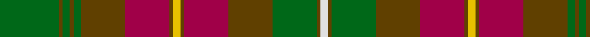

This page is one **sett** — a single exact thread-count. It belongs to the [tartan](/tartans/g16dy1g2dy1g2dy12m12dy1ly2dy1m12dy12g12dy1w2/)
(the same proportion at any scale), whose colour order is pattern [GGGGGGRGYGRGGGW](/stripes/ggggggrgygrgggw/).

Sourced from house-of-tartan.  It is a [15 stripe tartan](/stripes/stripes15/).

Original link http://www.house-of-tartan.scotland.net/house/TartanViewjs.asp?colr=Def&tnam=918

## Thread count
G/32 T2 G4 T2 G4 T24 R24 T2 Y4 T2 R24 T24 G24 T2 LN/4

## Palette

Palette: <strong>Tartan Register</strong>
<table><thead><tr><th>Colour</th><th>Threads</th><th>Shade</th><th>Base</th><th>OKLCh</th></tr></thead><tbody><tr><td>G/</td><td style="text-align:right;font-variant-numeric:tabular-nums">32</td><td><code style="background-color:#006818;">#006818</code> <small style="color:#888">#006818</small></td><td>G <code style="background-color:#006100;">#006100</code></td><td><small style="color:#888">oklch(45.0% 0.142 145.0)</small></td></tr><tr><td>T</td><td style="text-align:right;font-variant-numeric:tabular-nums">2</td><td><code style="background-color:#604000;">#604000</code> <small style="color:#888">#604000</small></td><td>G <code style="background-color:#006100;">#006100</code></td><td><small style="color:#888">oklch(39.8% 0.083 76.8)</small></td></tr><tr><td>G</td><td style="text-align:right;font-variant-numeric:tabular-nums">4</td><td><code style="background-color:#006818;">#006818</code> <small style="color:#888">#006818</small></td><td>G <code style="background-color:#006100;">#006100</code></td><td><small style="color:#888">oklch(45.0% 0.142 145.0)</small></td></tr><tr><td>T</td><td style="text-align:right;font-variant-numeric:tabular-nums">2</td><td><code style="background-color:#604000;">#604000</code> <small style="color:#888">#604000</small></td><td>G <code style="background-color:#006100;">#006100</code></td><td><small style="color:#888">oklch(39.8% 0.083 76.8)</small></td></tr><tr><td>G</td><td style="text-align:right;font-variant-numeric:tabular-nums">4</td><td><code style="background-color:#006818;">#006818</code> <small style="color:#888">#006818</small></td><td>G <code style="background-color:#006100;">#006100</code></td><td><small style="color:#888">oklch(45.0% 0.142 145.0)</small></td></tr><tr><td>T</td><td style="text-align:right;font-variant-numeric:tabular-nums">24</td><td><code style="background-color:#604000;">#604000</code> <small style="color:#888">#604000</small></td><td>G <code style="background-color:#006100;">#006100</code></td><td><small style="color:#888">oklch(39.8% 0.083 76.8)</small></td></tr><tr><td>R</td><td style="text-align:right;font-variant-numeric:tabular-nums">24</td><td><code style="background-color:#A00048;">#A00048</code> <small style="color:#888">#A00048</small></td><td>R <code style="background-color:#CC0000;">#CC0000</code></td><td><small style="color:#888">oklch(45.4% 0.182 5.3)</small></td></tr><tr><td>T</td><td style="text-align:right;font-variant-numeric:tabular-nums">2</td><td><code style="background-color:#604000;">#604000</code> <small style="color:#888">#604000</small></td><td>G <code style="background-color:#006100;">#006100</code></td><td><small style="color:#888">oklch(39.8% 0.083 76.8)</small></td></tr><tr><td>Y</td><td style="text-align:right;font-variant-numeric:tabular-nums">4</td><td><code style="background-color:#E8C000;">#E8C000</code> <small style="color:#888">#E8C000</small></td><td>Y <code style="background-color:#F2BF00;">#F2BF00</code></td><td><small style="color:#888">oklch(81.9% 0.168 93.7)</small></td></tr><tr><td>T</td><td style="text-align:right;font-variant-numeric:tabular-nums">2</td><td><code style="background-color:#604000;">#604000</code> <small style="color:#888">#604000</small></td><td>G <code style="background-color:#006100;">#006100</code></td><td><small style="color:#888">oklch(39.8% 0.083 76.8)</small></td></tr><tr><td>R</td><td style="text-align:right;font-variant-numeric:tabular-nums">24</td><td><code style="background-color:#A00048;">#A00048</code> <small style="color:#888">#A00048</small></td><td>R <code style="background-color:#CC0000;">#CC0000</code></td><td><small style="color:#888">oklch(45.4% 0.182 5.3)</small></td></tr><tr><td>T</td><td style="text-align:right;font-variant-numeric:tabular-nums">24</td><td><code style="background-color:#604000;">#604000</code> <small style="color:#888">#604000</small></td><td>G <code style="background-color:#006100;">#006100</code></td><td><small style="color:#888">oklch(39.8% 0.083 76.8)</small></td></tr><tr><td>G</td><td style="text-align:right;font-variant-numeric:tabular-nums">24</td><td><code style="background-color:#006818;">#006818</code> <small style="color:#888">#006818</small></td><td>G <code style="background-color:#006100;">#006100</code></td><td><small style="color:#888">oklch(45.0% 0.142 145.0)</small></td></tr><tr><td>T</td><td style="text-align:right;font-variant-numeric:tabular-nums">2</td><td><code style="background-color:#604000;">#604000</code> <small style="color:#888">#604000</small></td><td>G <code style="background-color:#006100;">#006100</code></td><td><small style="color:#888">oklch(39.8% 0.083 76.8)</small></td></tr><tr><td>LN/</td><td style="text-align:right;font-variant-numeric:tabular-nums">4</td><td><code style="background-color:#E0E0E0;">#E0E0E0</code> <small style="color:#888">#E0E0E0</small></td><td>W <code style="background-color:#F7F7F7;">#F7F7F7</code></td><td><small style="color:#888">oklch(90.7% 0.000 89.9)</small></td></tr></tbody></table>

## Nearest tartans

The nearest existing variants by ΔTartan distance, with this tartan at the top so the swatches line up against it.

ΔTartan

Tartan

Sett

—

<a href="/ttd/edit/#slug=g16dy1g2dy1g2dy12m12dy1ly2dy1m12dy12g12dy1w2~x2">Prince Edward Island District Tartan Tartan Number: 918. Earliest known date: 1964 The warmth and glow of the fertile soil, The green field and tree, The yellow and the brown of Autumn, The white of surf or a summer snow, Rust, green, yellow and white, Yes! That's our Island Tartan. See products available Copyright © Blair Urquhart, Comrie, 2015</a> <a class="nn-out" href="/setts/s15/g16dy1g2dy1g2dy12m12dy1ly2dy1m12dy12g12dy1w2~x2/" title="open its dictionary page">↗</a>

0.54

<a href="/ttd/edit/#slug=g16o1g2o1g2o12r12o1ly2o1r12o12g12o1w2~x2">Prince Edward Island</a> <a class="nn-out" href="/setts/s15/g16o1g2o1g2o12r12o1ly2o1r12o12g12o1w2~x2/" title="open its dictionary page">↗</a>

0.61

<a href="/ttd/edit/#slug=g20dy2g4dy2g4dy18r18dy1ly4dy1r18dy18g18dy1w4~x2">Prince Edward Island (District)</a> <a class="nn-out" href="/setts/s15/g20dy2g4dy2g4dy18r18dy1ly4dy1r18dy18g18dy1w4~x2/" title="open its dictionary page">↗</a>

0.91

<a href="/ttd/edit/#slug=r8k5r8g27r8w2r3g3r3w2r8o27r8o3r3~x2">McCall (Name)</a> <a class="nn-out" href="/setts/s15/r8k5r8g27r8w2r3g3r3w2r8o27r8o3r3~x2/" title="open its dictionary page">↗</a>

1.03

<a href="/ttd/edit/#slug=o2dg3dy18o2dy2o21g2dg2g2dg24lo2~x2">Methven</a> <a class="nn-out" href="/setts/s11/o2dg3dy18o2dy2o21g2dg2g2dg24lo2~x2/" title="open its dictionary page">↗</a>

1.24

<a href="/ttd/edit/#slug=r2t2dy3t14do1t1y7dy3t2dy3do7t3y2t3y16r2dy3t2~x2">Unidentified (Woven sample)</a> <a class="nn-out" href="/setts/s18/r2t2dy3t14do1t1y7dy3t2dy3do7t3y2t3y16r2dy3t2~x2/" title="open its dictionary page">↗</a>

1.26

<a href="/ttd/edit/#slug=dy16r16lr3dg16o2r1o2dy6r2~x4">Henry, W. A.</a> <a class="nn-out" href="/setts/s9/dy16r16lr3dg16o2r1o2dy6r2~x4/" title="open its dictionary page">↗</a>

1.27

<a href="/ttd/edit/#slug=k3r9k4dy9y3dy9k4g26k2y3~x2">Cavan, County</a> <a class="nn-out" href="/setts/s10/k3r9k4dy9y3dy9k4g26k2y3~x2/" title="open its dictionary page">↗</a>

1.29

<a href="/ttd/edit/#slug=y14lo1y1lo1y2k3y3k3doi3do1doi9lo1~x4">Glen Nevis #2 (Personal)</a> <a class="nn-out" href="/setts/s12/y14lo1y1lo1y2k3y3k3doi3do1doi9lo1~x4/" title="open its dictionary page">↗</a>

1.30

<a href="/ttd/edit/#slug=lo18do3lo3do3lo3do16y16r2ly2r2y16do16lo17do3lo3~x2">Lander (2013)</a> <a class="nn-out" href="/setts/s15/lo18do3lo3do3lo3do16y16r2ly2r2y16do16lo17do3lo3~x2/" title="open its dictionary page">↗</a>

1.31

<a href="/ttd/edit/#slug=r6k4r8g16r6lb2r2g2r2lb2r6g18dp6g2dp1~x2">MacCall Family Tartan Tartan Number: 2238. Earliest known date: 2000 Originally designed for a wedding in the McCall family in Aberdeen, and permission was given for anyone of the name to wear it. It was designed by John C McCall &amp; M McCall who are related to Nancy McCall the former owner of McCall's of Aberdeen (01224 405300). MacCall Chieftain is a Peter J.D. MacCall of Birkenshaw who is believed to be elderly and living with a daughter in Lockerbie (October 2002). See products available Copyright © Blair Urquhart, Comrie, 2015</a> <a class="nn-out" href="/setts/s15/r6k4r8g16r6lb2r2g2r2lb2r6g18dp6g2dp1~x2/" title="open its dictionary page">↗</a>

## Neighbour map

Every grey dot is one of 14359 variants placed by the first two principal components of the ΔTartan feature space (44% of its variance). Red is this tartan; blue dots are its nearest — click one to open its page.

<svg viewBox="0 0 640 380" role="img" style="max-width:100%;height:auto;border:1px solid #e0e0e0;border-radius:4px;display:block" xmlns="http://www.w3.org/2000/svg"><image href="/nn/cloud.v1.png" width="640" height="380"/><a href="/setts/s15/g16o1g2o1g2o12r12o1ly2o1r12o12g12o1w2~x2/"><circle cx="225.1" cy="146.1" r="4" fill="#3465a4"><title>Prince Edward Island</title></circle></a><a href="/setts/s15/g20dy2g4dy2g4dy18r18dy1ly4dy1r18dy18g18dy1w4~x2/"><circle cx="223.5" cy="145.3" r="4" fill="#3465a4"><title>Prince Edward Island (District)</title></circle></a><a href="/setts/s15/r8k5r8g27r8w2r3g3r3w2r8o27r8o3r3~x2/"><circle cx="247.0" cy="145.3" r="4" fill="#3465a4"><title>McCall (Name)</title></circle></a><a href="/setts/s11/o2dg3dy18o2dy2o21g2dg2g2dg24lo2~x2/"><circle cx="242.1" cy="159.5" r="4" fill="#3465a4"><title>Methven</title></circle></a><a href="/setts/s18/r2t2dy3t14do1t1y7dy3t2dy3do7t3y2t3y16r2dy3t2~x2/"><circle cx="229.0" cy="149.7" r="4" fill="#3465a4"><title>Unidentified (Woven sample)</title></circle></a><a href="/setts/s9/dy16r16lr3dg16o2r1o2dy6r2~x4/"><circle cx="237.9" cy="183.4" r="4" fill="#3465a4"><title>Henry, W. A.</title></circle></a><a href="/setts/s10/k3r9k4dy9y3dy9k4g26k2y3~x2/"><circle cx="206.5" cy="177.1" r="4" fill="#3465a4"><title>Cavan, County</title></circle></a><a href="/setts/s12/y14lo1y1lo1y2k3y3k3doi3do1doi9lo1~x4/"><circle cx="274.8" cy="146.9" r="4" fill="#3465a4"><title>Glen Nevis #2 (Personal)</title></circle></a><a href="/setts/s15/lo18do3lo3do3lo3do16y16r2ly2r2y16do16lo17do3lo3~x2/"><circle cx="222.0" cy="190.3" r="4" fill="#3465a4"><title>Lander (2013)</title></circle></a><a href="/setts/s15/r6k4r8g16r6lb2r2g2r2lb2r6g18dp6g2dp1~x2/"><circle cx="260.1" cy="141.4" r="4" fill="#3465a4"><title>MacCall Family Tartan Tartan Number: 2238. Earliest known date: 2000 Originally designed for a wedding in the McCall family in Aberdeen, and permission was given for anyone of the name to wear it. It was designed by John C McCall &amp; M McCall who are related to Nancy McCall the former owner of McCall's of Aberdeen (01224 405300). MacCall Chieftain is a Peter J.D. MacCall of Birkenshaw who is believed to be elderly and living with a daughter in Lockerbie (October 2002). See products available Copyright © Blair Urquhart, Comrie, 2015</title></circle></a><circle cx="232.9" cy="151.1" r="5" fill="#c00000"/></svg>

ID: /setts/s15/g16dy1g2dy1g2dy12m12dy1ly2dy1m12dy12g12dy1w2~x2/
