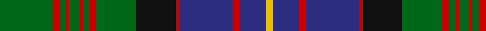

In pattern [GRGRGRGRGKRBRBY](/patterns/grgrgrgrgkrbrby/).

This was sourced from house-of-tartan.  It is a [15 stripes tartan](/stripes/stripes15/).

Original link http://www.house-of-tartan.scotland.net/house/TartanViewjs.asp?colr=Def&tnam=994

## Thread count
G/32 R4 G4 R2 G6 R2 G4 R4 G24 K24 R2 DB32 R4 DB16 Y/4

## Palette
Each colour and its ΔE from the base-6 reference it is a variant of.

| Colour | Shade | Base | ΔE (OKLab) |
|---|---|---|---|
| DB | <code style="background-color:#2C2C80;">#2C2C80</code> `#2C2C80` | B <code style="background-color:#2A418A;">#2A418A</code> | 0.06 |
| G | <code style="background-color:#006818;">#006818</code> `#006818` | G <code style="background-color:#006100;">#006100</code> | 0.02 |
| K | <code style="background-color:#101010;">#101010</code> `#101010` | K <code style="background-color:#000000;">#000000</code> | 0.17 |
| R | <code style="background-color:#C80000;">#C80000</code> `#C80000` | R <code style="background-color:#CC0000;">#CC0000</code> | 0.01 |
| Y | <code style="background-color:#E8C000;">#E8C000</code> `#E8C000` | Y <code style="background-color:#F2BF00;">#F2BF00</code> | 0.02 |

## Nearest tartans

The nearest existing variants by ΔTartan distance.

1. [Cochrane (1984)](/setts/s15/g16r2g2r1g3r1g2r2g12k12r1b16r2b8y2x2~b2c4084-g005020-k101010-rdc0000-ye8c000/) — ΔT 0.54
1. [Unidentified B'gowrie Unknown Tartan Tartan Number: 2144. Earliest known date: c. 1945 Do you recognise this tartan. It was discovered by Robin Birch of Connell Reid Kiltmakers in Blairgowrie, attached to a Teddy Bear that he thought had a regimental connection dating from 1945. The unidentified sample was recorded here on 2nd February, 1995. See products available Copyright © Blair Urquhart, Comrie, 2015](/setts/s15/g30y2g5y2g4k15b29r2b29k15g5y2g4y2g17x2~b2c2c80-g006818-k101010-rc80000-ye8c000/) — ΔT 0.58
1. [Ontario (Official)](/setts/s13/g19r1g2r2g15r1b13w1ba2r2ba21r1w3x2~b1c1c1c-ba2c2c80-g006818-rc80000-we0e0e0/) — ΔT 0.67
1. [Glen Orchy #2 or MacIntyre](/setts/s14/g2k2r3g18r3b6ba1r4g6r2b18r3g2k2x2~b2c2c80-ba5c8ca8-g006818-k101010-rc80000/) — ΔT 0.69
1. [Glen Orchy, or MacIntyre](/setts/s14/g2k2r3g18r3b6ba1r4g6r2b18r3g2k2x2~b304080-ba5480b0-g008000-k000000-rc00000/) — ΔT 0.76
1. [Farquharson (Clan)](/setts/s14/r8b30k4b4k4b4k56g55y8g55k56b46k4r8~b1474b4-g006818-k101010-rc80000-ye8c000/) — ΔT 0.80
1. [Glenorchy - National Archives](/setts/s15/g3b2r1b17ra2g8ra4ba1b8ra2g17ra2r1b3ba1x2~b2c2c80-ba5c8ca8-g006818-re87878-rac80000/) — ΔT 0.84
1. [Sutherland Old Clan Tartan Tartan Number: 930. Earliest known date: 1842 (1618) The earlier date refers to a letter from Gordon Earl of Sutherland instructing Murray of Dulrossie to 'remove the red and white lines from the plaids of the men so as to bring their dress into harmony with that of the other Septs.' This sett is also recorded by Smibert in 1850. Smiberts work lends greater authority to the accuracy of the tartan. Worn by the City of Nunawading Highland pipe band (Australia) (Strathallan 1994) See products available Copyright © Blair Urquhart, Comrie, 2015](/setts/s12/g6w2g24k12b3k2b2k2b12r1b1r3x2~b2c2c80-g006818-k101010-rc80000-we0e0e0/) — ΔT 0.89
1. [Sutherland (Clan)](/setts/s12/g6w2g24k12b3k2b2k2b12r1b1r3x2~b2c2c80-g006818-k101010-rc80000-wfcfcfc/) — ΔT 0.91
1. [Glen Orchy](/setts/s15/g3r2ra1b18r2g8r4ba1b8r2g18r2ra1b3ba1x2~b304080-ba5480b0-g008000-rc00000-rad03030/) — ΔT 0.93

## Neighbour map

Every grey dot is one of 15726 variants placed by the first two principal components of the ΔTartan feature space (44% of its variance). Red is this tartan; blue dots are its nearest — click one to open its page.

<svg viewBox="0 0 640 380" role="img" style="max-width:100%;height:auto;border:1px solid #e0e0e0;border-radius:4px;display:block" xmlns="http://www.w3.org/2000/svg"><image href="/nn/cloud.v1.png" width="640" height="380"/><a href="/setts/s15/g16r2g2r1g3r1g2r2g12k12r1b16r2b8y2x2~b2c4084-g005020-k101010-rdc0000-ye8c000/"><circle cx="230.3" cy="138.6" r="4" fill="#3465a4"><title>Cochrane (1984)</title></circle></a><a href="/setts/s15/g30y2g5y2g4k15b29r2b29k15g5y2g4y2g17x2~b2c2c80-g006818-k101010-rc80000-ye8c000/"><circle cx="206.8" cy="141.1" r="4" fill="#3465a4"><title>Unidentified B'gowrie Unknown Tartan Tartan Number: 2144. Earliest known date: c. 1945 Do you recognise this tartan. It was discovered by Robin Birch of Connell Reid Kiltmakers in Blairgowrie, attached to a Teddy Bear that he thought had a regimental connection dating from 1945. The unidentified sample was recorded here on 2nd February, 1995. See products available Copyright © Blair Urquhart, Comrie, 2015</title></circle></a><a href="/setts/s13/g19r1g2r2g15r1b13w1ba2r2ba21r1w3x2~b1c1c1c-ba2c2c80-g006818-rc80000-we0e0e0/"><circle cx="234.0" cy="118.4" r="4" fill="#3465a4"><title>Ontario (Official)</title></circle></a><a href="/setts/s14/g2k2r3g18r3b6ba1r4g6r2b18r3g2k2x2~b2c2c80-ba5c8ca8-g006818-k101010-rc80000/"><circle cx="222.9" cy="126.3" r="4" fill="#3465a4"><title>Glen Orchy #2 or MacIntyre</title></circle></a><a href="/setts/s14/g2k2r3g18r3b6ba1r4g6r2b18r3g2k2x2~b304080-ba5480b0-g008000-k000000-rc00000/"><circle cx="206.5" cy="120.3" r="4" fill="#3465a4"><title>Glen Orchy, or MacIntyre</title></circle></a><a href="/setts/s14/r8b30k4b4k4b4k56g55y8g55k56b46k4r8~b1474b4-g006818-k101010-rc80000-ye8c000/"><circle cx="173.0" cy="143.7" r="4" fill="#3465a4"><title>Farquharson (Clan)</title></circle></a><a href="/setts/s15/g3b2r1b17ra2g8ra4ba1b8ra2g17ra2r1b3ba1x2~b2c2c80-ba5c8ca8-g006818-re87878-rac80000/"><circle cx="246.6" cy="127.0" r="4" fill="#3465a4"><title>Glenorchy - National Archives</title></circle></a><a href="/setts/s12/g6w2g24k12b3k2b2k2b12r1b1r3x2~b2c2c80-g006818-k101010-rc80000-we0e0e0/"><circle cx="242.6" cy="120.9" r="4" fill="#3465a4"><title>Sutherland Old Clan Tartan Tartan Number: 930. Earliest known date: 1842 (1618) The earlier date refers to a letter from Gordon Earl of Sutherland instructing Murray of Dulrossie to 'remove the red and white lines from the plaids of the men so as to bring their dress into harmony with that of the other Septs.' This sett is also recorded by Smibert in 1850. Smiberts work lends greater authority to the accuracy of the tartan. Worn by the City of Nunawading Highland pipe band (Australia) (Strathallan 1994) See products available Copyright © Blair Urquhart, Comrie, 2015</title></circle></a><a href="/setts/s12/g6w2g24k12b3k2b2k2b12r1b1r3x2~b2c2c80-g006818-k101010-rc80000-wfcfcfc/"><circle cx="238.3" cy="119.2" r="4" fill="#3465a4"><title>Sutherland (Clan)</title></circle></a><a href="/setts/s15/g3r2ra1b18r2g8r4ba1b8r2g18r2ra1b3ba1x2~b304080-ba5480b0-g008000-rc00000-rad03030/"><circle cx="239.0" cy="121.4" r="4" fill="#3465a4"><title>Glen Orchy</title></circle></a><circle cx="216.0" cy="132.7" r="5" fill="#c00000"/></svg>

ID: /setts/s15/g16r2g2r1g3r1g2r2g12k12r1b16r2b8y2x2~b2c2c80-g006818-k101010-rc80000-ye8c000/
