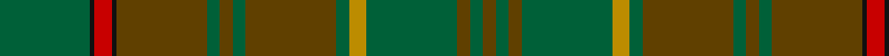

In pattern [GGGGYGGGGGGKRKG](/patterns/ggggyggggggkrkg/).

This was sourced from tartans-authority.  It is a [15 stripes tartan](/stripes/stripes15/).

Original link http://www.tartansauthority.com/tartan-ferret/display/2032/

## Thread count
G/42 K2 R8 K2 T42 G6 T6 G6 T42 G6 DY8 G42 T6 G6 T/6

## Palette
Each colour and its ΔE from the base-6 reference it is a variant of.

| Colour | Shade | Base | ΔE (OKLab) |
|---|---|---|---|
| DY | <code style="background-color:#BC8C00;">#BC8C00</code> `#BC8C00` | Y <code style="background-color:#F2BF00;">#F2BF00</code> | 0.16 |
| G | <code style="background-color:#006038;">#006038</code> `#006038` | G <code style="background-color:#006100;">#006100</code> | 0.05 |
| K | <code style="background-color:#101010;">#101010</code> `#101010` | K <code style="background-color:#000000;">#000000</code> | 0.17 |
| R | <code style="background-color:#C80000;">#C80000</code> `#C80000` | R <code style="background-color:#CC0000;">#CC0000</code> | 0.01 |
| T | <code style="background-color:#604000;">#604000</code> `#604000` | G <code style="background-color:#006100;">#006100</code> | 0.14 |

## Nearest tartans

The nearest existing variants by ΔTartan distance.

1. [Ensign of Ontario](/setts/s15/g21k1r4k1ga21g3ga3g3ga21g3y4g21ga3g3ga3~g003820-ga604000-k101010-rc80000-ybc8c00~x2/) — ΔT 1.01
1. [Prince David](/setts/s15/g3ga1y2g3ga1y2gb21g18gb2g3gb2g18gb21ga1y2~g006818-ga5c6428-gb604000-yd87c00~x2/) — ΔT 1.04
1. [Prince David Royal Family Tartan Tartan Number: 2125. Earliest known date: 1930 Mackinlay suggests that David was the pet name of the Duke of Windsor when he was a boy and that the tartan was designed for his personal use. See products available Copyright © Blair Urquhart, Comrie, 2015](/setts/s15/g3ga1y2g3ga1y2gb21g18gb2g3gb2g18gb21ga1y2~g003820-ga006818-gb604000-yd87c00~x2/) — ΔT 1.33
1. [Tricor](/setts/s12/g4w1g4ga6gb6r4g23r4gb6ga6g4w1~g8c7038-ga00643c-gb604000-r98481c-wc0c0c0~x4/) — ΔT 1.46
1. [Ensign of Ontario Canadian Tartan Tartan Number: 2032. Earliest known date: 1965 The Ensign tartan owes its inspiration to the Provincial Coat of Arms which was granted to the province by Royal Warrant of Queen Victoria in 1868. The yellow is taken from the three golden maple leaves of the lower shield and the red from the cross of St George on the upper. The black and brown come from the bear, the moose and the deer. There is also a District tartan called Northern Ontario. See products available Copyright © Blair Urquhart, Comrie, 2015](/setts/s15/g21k1r4k1ga21g3ga3g3ga21g3y4g21ga3g3ga3~g006818-ga604000-k101010-rc80000-ye8c000~x2/) — ΔT 1.56
1. [Mack of Stoneywood Hunting (Pers.)](/setts/s11/g18ga4b1ga5g6ga3k1gb6k1ga25b1~b2888c4-g003820-ga285800-gb604000-k101010~x2/) — ΔT 1.56
1. [Galloway District Tartan Tartan Number: 1469. Earliest known date: 1950 In contemporary correspondence Mr Hannay said that the Galloway 'everyday' tartan was 'in four shades of green with yellow and red stripe'. Cree Mills of Newton-Stewart, however, used only two shades in the manufacture on Mr Hannay's behalf. MacGregor Hastie's collection includes this sett with the pale yellow rendered in white and called Galloway Hunting. See products available Copyright © Blair Urquhart, Comrie, 2015](/setts/s11/g20ga2y3ga2g32ga32g2r3g2ga32g12~g003820-ga285800-rc80000-yc4bc68~x2/) — ΔT 1.56
1. [Historic Scotland Corporate Tartan Tartan Number: 2122. Earliest known date: 1988 Custodians at Historic Scotland properties throughout Scotland, including Edinburgh Castle, wear this distinctive tartan. See products available Copyright © Blair Urquhart, Comrie, 2015](/setts/s9/g2r1g1r2g21ga9k1ga7k2~g604000-ga5c6428-k101010-r888888~x2/) — ΔT 1.60
1. [O'Neill (Personal)](/setts/s13/g24ga2g4ga16g1w2g1ga16g3y1g12r2g5~g004828-ga006810-r888888-wc0c0c0-ye8c000~x2/) — ΔT 1.62
1. [Scottish Borderland](/setts/s16/g2b1g30ba10b20g1b2y1b2g1b20ba10g30b1g2w2~b405460-ba646464-g005020-wc8c8c8-yc88c00~x2/) — ΔT 1.77

## Neighbour map

Every grey dot is one of 15726 variants placed by the first two principal components of the ΔTartan feature space (44% of its variance). Red is this tartan; blue dots are its nearest — click one to open its page.

<svg viewBox="0 0 640 380" role="img" style="max-width:100%;height:auto;border:1px solid #e0e0e0;border-radius:4px;display:block" xmlns="http://www.w3.org/2000/svg"><image href="/nn/cloud.v1.png" width="640" height="380"/><a href="/setts/s15/g21k1r4k1ga21g3ga3g3ga21g3y4g21ga3g3ga3~g003820-ga604000-k101010-rc80000-ybc8c00~x2/"><circle cx="389.2" cy="166.4" r="4" fill="#3465a4"><title>Ensign of Ontario</title></circle></a><a href="/setts/s15/g3ga1y2g3ga1y2gb21g18gb2g3gb2g18gb21ga1y2~g006818-ga5c6428-gb604000-yd87c00~x2/"><circle cx="423.0" cy="179.9" r="4" fill="#3465a4"><title>Prince David</title></circle></a><a href="/setts/s15/g3ga1y2g3ga1y2gb21g18gb2g3gb2g18gb21ga1y2~g003820-ga006818-gb604000-yd87c00~x2/"><circle cx="406.7" cy="173.7" r="4" fill="#3465a4"><title>Prince David Royal Family Tartan Tartan Number: 2125. Earliest known date: 1930 Mackinlay suggests that David was the pet name of the Duke of Windsor when he was a boy and that the tartan was designed for his personal use. See products available Copyright © Blair Urquhart, Comrie, 2015</title></circle></a><a href="/setts/s12/g4w1g4ga6gb6r4g23r4gb6ga6g4w1~g8c7038-ga00643c-gb604000-r98481c-wc0c0c0~x4/"><circle cx="385.2" cy="174.2" r="4" fill="#3465a4"><title>Tricor</title></circle></a><a href="/setts/s15/g21k1r4k1ga21g3ga3g3ga21g3y4g21ga3g3ga3~g006818-ga604000-k101010-rc80000-ye8c000~x2/"><circle cx="365.1" cy="155.9" r="4" fill="#3465a4"><title>Ensign of Ontario Canadian Tartan Tartan Number: 2032. Earliest known date: 1965 The Ensign tartan owes its inspiration to the Provincial Coat of Arms which was granted to the province by Royal Warrant of Queen Victoria in 1868. The yellow is taken from the three golden maple leaves of the lower shield and the red from the cross of St George on the upper. The black and brown come from the bear, the moose and the deer. There is also a District tartan called Northern Ontario. See products available Copyright © Blair Urquhart, Comrie, 2015</title></circle></a><a href="/setts/s11/g18ga4b1ga5g6ga3k1gb6k1ga25b1~b2888c4-g003820-ga285800-gb604000-k101010~x2/"><circle cx="448.5" cy="188.9" r="4" fill="#3465a4"><title>Mack of Stoneywood Hunting (Pers.)</title></circle></a><a href="/setts/s11/g20ga2y3ga2g32ga32g2r3g2ga32g12~g003820-ga285800-rc80000-yc4bc68~x2/"><circle cx="426.6" cy="224.4" r="4" fill="#3465a4"><title>Galloway District Tartan Tartan Number: 1469. Earliest known date: 1950 In contemporary correspondence Mr Hannay said that the Galloway 'everyday' tartan was 'in four shades of green with yellow and red stripe'. Cree Mills of Newton-Stewart, however, used only two shades in the manufacture on Mr Hannay's behalf. MacGregor Hastie's collection includes this sett with the pale yellow rendered in white and called Galloway Hunting. See products available Copyright © Blair Urquhart, Comrie, 2015</title></circle></a><a href="/setts/s9/g2r1g1r2g21ga9k1ga7k2~g604000-ga5c6428-k101010-r888888~x2/"><circle cx="457.3" cy="197.6" r="4" fill="#3465a4"><title>Historic Scotland Corporate Tartan Tartan Number: 2122. Earliest known date: 1988 Custodians at Historic Scotland properties throughout Scotland, including Edinburgh Castle, wear this distinctive tartan. See products available Copyright © Blair Urquhart, Comrie, 2015</title></circle></a><a href="/setts/s13/g24ga2g4ga16g1w2g1ga16g3y1g12r2g5~g004828-ga006810-r888888-wc0c0c0-ye8c000~x2/"><circle cx="442.7" cy="180.5" r="4" fill="#3465a4"><title>O'Neill (Personal)</title></circle></a><a href="/setts/s16/g2b1g30ba10b20g1b2y1b2g1b20ba10g30b1g2w2~b405460-ba646464-g005020-wc8c8c8-yc88c00~x2/"><circle cx="435.9" cy="160.3" r="4" fill="#3465a4"><title>Scottish Borderland</title></circle></a><circle cx="405.7" cy="172.9" r="5" fill="#c00000"/></svg>

ID: /setts/s15/g21k1r4k1ga21g3ga3g3ga21g3y4g21ga3g3ga3~g006038-ga604000-k101010-rc80000-ybc8c00~x2/
