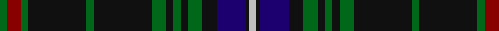

In pattern [GRGKGKGKGKGKBKW](/patterns/grgkgkgkgkgkbkw/).

This was sourced from register-of-tartans.  It is a [15 stripes tartan](/stripes/stripes15/).

Original link https://www.tartanregister.gov.uk/tartanDetails.aspx?ref=2510

## Register references

External register numbers recorded for this tartan.

- Scottish Register of Tartans: [2510](https://www.tartanregister.gov.uk/tartanDetails.aspx?ref=2510)
- Scottish Tartans Authority (ITI): 985
- Scottish Tartans World Register: 985

## Thread count
G/4 DR8 G4 K32 G4 K32 G8 K4 G4 K4 G8 K8 DB16 K2 N/4

## Palette
Each colour and its ΔE from the base-6 reference it is a variant of.

| Colour | Shade | Base | ΔE (OKLab) |
|---|---|---|---|
| DB | <code style="background-color:#1C0070;">#1C0070</code> `#1C0070` | B <code style="background-color:#2A418A;">#2A418A</code> | 0.14 |
| DR | <code style="background-color:#880000;">#880000</code> `#880000` | R <code style="background-color:#CC0000;">#CC0000</code> | 0.15 |
| G | <code style="background-color:#006818;">#006818</code> `#006818` | G <code style="background-color:#006100;">#006100</code> | 0.02 |
| K | <code style="background-color:#101010;">#101010</code> `#101010` | K <code style="background-color:#000000;">#000000</code> | 0.17 |
| N | <code style="background-color:#C0C0C0;">#C0C0C0</code> `#C0C0C0` | W <code style="background-color:#F7F7F7;">#F7F7F7</code> | 0.17 |

## Nearest tartans

The nearest existing variants by ΔTartan distance.

1. [MacKean Hunting Family Tartan Tartan Number: 985. Earliest known date: 1987 1987 See products available Copyright © Blair Urquhart, Comrie, 2015](/setts/s15/g2r4g2k16g4k16g4k2g2k2g4k4b8k1w2~b2c2c80-g006818-k101010-rc80000-we0e0e0~x2/) — ΔT 0.53
1. [Heneghan (Personal)](/setts/s14/g16r3ra1b2g4r2b4g2r1y1ya1y1b6g12~b202060-g003820-rc80000-ra888888-yd87c00-yae8c000~x4/) — ΔT 1.23
1. [Hydesville Tower](/setts/s12/b15y2b2r2b6g30b6r2b2y2b15w2~b202060-g285800-rc80000-we0e0e0-ye8c000~x2/) — ΔT 1.29
1. [Kennedy](/setts/s17/b2g2y1g3r1g2r1g13b4k3b3k3b3k3b4g23r2~b00004c-g004c00-k000000-rc80000-yffc800~x2/) — ΔT 1.30
1. [Lochcarron Hunting Corporate Tartan Tartan Number: 5464. Earliest known date: 01/01/2002 Woven sample. See products available Copyright © Blair Urquhart, Comrie, 2015](/setts/s14/g3b10k3b2k2b2g3k5g2k5g22r2g3r2~b000064-g004c00-k000000-r8c0000~x2/) — ΔT 1.31
1. [Lochcarron Hunting](/setts/s14/g3b10ba3b2ba2b2g3k5g2k5g22r2g3r2~b000064-ba346488-g004c00-k000000-r8c0000~x2/) — ΔT 1.31
1. [Moggach (Strathspey)](/setts/s11/k4b4k4b18k9r2k9y1b18ba2k3~b545458-ba438cbf-k101010-rcf1222-y94a494~x2/) — ΔT 1.32
1. [Kells Irish Pubs (Corporate)](/setts/s12/k17r2k3g2k3g2k24b8g4b4g3b8~b1474b4-g006818-k101010-r888888~x2/) — ΔT 1.34
1. [Apache](/setts/s12/k15b7r3k13r3b7k23r3b7y2ba4y2~b2c2c80-ba780078-k101010-r888888-ye8c000~x2/) — ΔT 1.36
1. [Moggach (Strathspey)](/setts/s11/k4b4k4b18k9r4k9ra1b18ba2k3~b5c5c5c-ba003c64-k101010-rc80000-ra888888~x2/) — ΔT 1.36

## Neighbour map

Every grey dot is one of 15726 variants placed by the first two principal components of the ΔTartan feature space (44% of its variance). Red is this tartan; blue dots are its nearest — click one to open its page.

<svg viewBox="0 0 640 380" role="img" style="max-width:100%;height:auto;border:1px solid #e0e0e0;border-radius:4px;display:block" xmlns="http://www.w3.org/2000/svg"><image href="/nn/cloud.v1.png" width="640" height="380"/><a href="/setts/s15/g2r4g2k16g4k16g4k2g2k2g4k4b8k1w2~b2c2c80-g006818-k101010-rc80000-we0e0e0~x2/"><circle cx="289.5" cy="143.5" r="4" fill="#3465a4"><title>MacKean Hunting Family Tartan Tartan Number: 985. Earliest known date: 1987 1987 See products available Copyright © Blair Urquhart, Comrie, 2015</title></circle></a><a href="/setts/s14/g16r3ra1b2g4r2b4g2r1y1ya1y1b6g12~b202060-g003820-rc80000-ra888888-yd87c00-yae8c000~x4/"><circle cx="334.9" cy="129.9" r="4" fill="#3465a4"><title>Heneghan (Personal)</title></circle></a><a href="/setts/s12/b15y2b2r2b6g30b6r2b2y2b15w2~b202060-g285800-rc80000-we0e0e0-ye8c000~x2/"><circle cx="302.0" cy="138.9" r="4" fill="#3465a4"><title>Hydesville Tower</title></circle></a><a href="/setts/s17/b2g2y1g3r1g2r1g13b4k3b3k3b3k3b4g23r2~b00004c-g004c00-k000000-rc80000-yffc800~x2/"><circle cx="332.3" cy="111.5" r="4" fill="#3465a4"><title>Kennedy</title></circle></a><a href="/setts/s14/g3b10k3b2k2b2g3k5g2k5g22r2g3r2~b000064-g004c00-k000000-r8c0000~x2/"><circle cx="246.0" cy="153.6" r="4" fill="#3465a4"><title>Lochcarron Hunting Corporate Tartan Tartan Number: 5464. Earliest known date: 01/01/2002 Woven sample. See products available Copyright © Blair Urquhart, Comrie, 2015</title></circle></a><a href="/setts/s14/g3b10ba3b2ba2b2g3k5g2k5g22r2g3r2~b000064-ba346488-g004c00-k000000-r8c0000~x2/"><circle cx="247.4" cy="153.2" r="4" fill="#3465a4"><title>Lochcarron Hunting</title></circle></a><a href="/setts/s11/k4b4k4b18k9r2k9y1b18ba2k3~b545458-ba438cbf-k101010-rcf1222-y94a494~x2/"><circle cx="337.6" cy="168.3" r="4" fill="#3465a4"><title>Moggach (Strathspey)</title></circle></a><a href="/setts/s12/k17r2k3g2k3g2k24b8g4b4g3b8~b1474b4-g006818-k101010-r888888~x2/"><circle cx="321.9" cy="179.0" r="4" fill="#3465a4"><title>Kells Irish Pubs (Corporate)</title></circle></a><a href="/setts/s12/k15b7r3k13r3b7k23r3b7y2ba4y2~b2c2c80-ba780078-k101010-r888888-ye8c000~x2/"><circle cx="277.7" cy="171.6" r="4" fill="#3465a4"><title>Apache</title></circle></a><a href="/setts/s11/k4b4k4b18k9r4k9ra1b18ba2k3~b5c5c5c-ba003c64-k101010-rc80000-ra888888~x2/"><circle cx="317.8" cy="167.6" r="4" fill="#3465a4"><title>Moggach (Strathspey)</title></circle></a><circle cx="314.2" cy="147.9" r="5" fill="#c00000"/></svg>

ID: /setts/s15/g2r4g2k16g2k16g4k2g2k2g4k4b8k1w2~b1c0070-g006818-k101010-r880000-wc0c0c0~x2/
