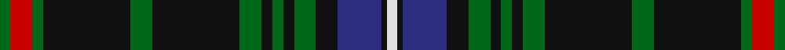

In pattern [GRGKGKGKGKGKBKW](/stripes/grgkgkgkgkgkbkw/).

This was sourced from house-of-tartan.  It is a [15 stripe tartan](/stripes/stripes15/).

Original link http://www.house-of-tartan.scotland.net/house/TartanViewjs.asp?colr=Def&tnam=985

## Thread count
G/4 R8 G4 K32 G8 K32 G8 K4 G4 K4 G8 K8 DB16 K2 LN/4

## Palette
Each colour and the base-6 reference it is a variant of.

| Colour | Shade | Base |
|---|---|---|
| DB | <code style="background-color:#2C2C80;">#2C2C80</code> `oklch(35.0% 0.138 276.6)` <small>#2C2C80</small> | B <code style="background-color:#2A418A;">#2A418A</code> |
| G | <code style="background-color:#006818;">#006818</code> `oklch(45.0% 0.142 145.0)` <small>#006818</small> | G <code style="background-color:#006100;">#006100</code> |
| K | <code style="background-color:#101010;">#101010</code> `oklch(17.3% 0.000 89.9)` <small>#101010</small> | K <code style="background-color:#000000;">#000000</code> |
| LN | <code style="background-color:#E0E0E0;">#E0E0E0</code> `oklch(90.7% 0.000 89.9)` <small>#E0E0E0</small> | W <code style="background-color:#F7F7F7;">#F7F7F7</code> |
| R | <code style="background-color:#C80000;">#C80000</code> `oklch(52.3% 0.215 29.2)` <small>#C80000</small> | R <code style="background-color:#CC0000;">#CC0000</code> |

## Nearest tartans

The nearest existing variants by ΔTartan distance.

1. [MacKean Hunting](/setts/s15/g2r4g2k16g2k16g4k2g2k2g4k4db8k1lb2~x2/) — ΔT 0.53
1. [Hydesville Tower](/setts/s12/db15ly2db2r2db6dg30db6r2db2ly2db15w2~x2/) — ΔT 1.18
1. [Highlands of Durham #2](/setts/s10/k37g27w2k4r6k4w2g27k37ly2~x2/) — ΔT 1.23
1. [Highlands of Durham](/setts/s10/dt37g27w2dt4r6dt4w2g27dt37ly2~x2/) — ΔT 1.26
1. [Otago Peninsula](/setts/s12/dg4k4m4k2dg12k2dg12k2m4dg4w1r4~x2/) — ΔT 1.27
1. [Kennedy](/setts/s17/db2dg2ly1dg3r1dg2r1dg13db4k3db3k3db3k3db4dg23r2~x2/) — ΔT 1.28
1. [Apache](/setts/s12/k15db7o3k13o3db7k23o3db7ly2dp4ly2~x2/) — ΔT 1.28
1. [Lochcarron Hunting Corporate Tartan Tartan Number: 5464. Earliest known date: 01/01/2002 Woven sample. See products available Copyright © Blair Urquhart, Comrie, 2015](/setts/s14/dg3db10k3db2k2db2dg3k5dg2k5dg22r2dg3r2~x2/) — ΔT 1.29
1. [Lochcarron Hunting](/setts/s14/dg3db10n3db2n2db2dg3k5dg2k5dg22r2dg3r2~x2/) — ΔT 1.29
1. [Kells Irish Pubs (Corporate)](/setts/s12/k17o2k3g2k3g2k24b8g4b4g3b8~x2/) — ΔT 1.32

## Neighbour map

Every grey dot is one of 14299 variants placed by the first two principal components of the ΔTartan feature space (44% of its variance). Red is this tartan; blue dots are its nearest — click one to open its page.

<svg viewBox="0 0 640 380" role="img" style="max-width:100%;height:auto;border:1px solid #e0e0e0;border-radius:4px;display:block" xmlns="http://www.w3.org/2000/svg"><image href="/nn/cloud.v1.png" width="640" height="380"/><a href="/setts/s15/g2r4g2k16g2k16g4k2g2k2g4k4db8k1lb2~x2/"><circle cx="316.8" cy="151.8" r="4" fill="#3465a4"><title>MacKean Hunting</title></circle></a><a href="/setts/s12/db15ly2db2r2db6dg30db6r2db2ly2db15w2~x2/"><circle cx="304.9" cy="141.1" r="4" fill="#3465a4"><title>Hydesville Tower</title></circle></a><a href="/setts/s10/k37g27w2k4r6k4w2g27k37ly2~x2/"><circle cx="312.6" cy="153.7" r="4" fill="#3465a4"><title>Highlands of Durham #2</title></circle></a><a href="/setts/s10/dt37g27w2dt4r6dt4w2g27dt37ly2~x2/"><circle cx="311.9" cy="148.8" r="4" fill="#3465a4"><title>Highlands of Durham</title></circle></a><a href="/setts/s12/dg4k4m4k2dg12k2dg12k2m4dg4w1r4~x2/"><circle cx="281.3" cy="180.6" r="4" fill="#3465a4"><title>Otago Peninsula</title></circle></a><a href="/setts/s17/db2dg2ly1dg3r1dg2r1dg13db4k3db3k3db3k3db4dg23r2~x2/"><circle cx="335.4" cy="114.6" r="4" fill="#3465a4"><title>Kennedy</title></circle></a><a href="/setts/s12/k15db7o3k13o3db7k23o3db7ly2dp4ly2~x2/"><circle cx="280.4" cy="173.1" r="4" fill="#3465a4"><title>Apache</title></circle></a><a href="/setts/s14/dg3db10k3db2k2db2dg3k5dg2k5dg22r2dg3r2~x2/"><circle cx="249.6" cy="158.6" r="4" fill="#3465a4"><title>Lochcarron Hunting Corporate Tartan Tartan Number: 5464. Earliest known date: 01/01/2002 Woven sample. See products available Copyright © Blair Urquhart, Comrie, 2015</title></circle></a><a href="/setts/s14/dg3db10n3db2n2db2dg3k5dg2k5dg22r2dg3r2~x2/"><circle cx="250.9" cy="158.5" r="4" fill="#3465a4"><title>Lochcarron Hunting</title></circle></a><a href="/setts/s12/k17o2k3g2k3g2k24b8g4b4g3b8~x2/"><circle cx="325.0" cy="180.4" r="4" fill="#3465a4"><title>Kells Irish Pubs (Corporate)</title></circle></a><circle cx="292.2" cy="146.0" r="5" fill="#c00000"/></svg>

ID: /setts/s15/g2r4g2k16g4k16g4k2g2k2g4k4db8k1w2~x2/
