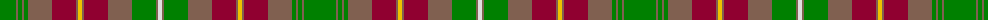

In pattern [GRGRGRRRYRRRGRW](/patterns/grgrgrrryrrrgrw/).

This was sourced from weddslist.  It is a [15 stripes tartan](/stripes/stripes15/).

Original link http://www.weddslist.com/cgi-bin/tartans/pg.pl?source=sts

## Thread count
G/32 LT2 G4 LT2 G4 LT24 DR24 LT2 Y4 LT2 DR24 LT24 G24 LT2 LN/4

## Palette
Each colour and its ΔE from the base-6 reference it is a variant of.

| Colour | Shade | Base | ΔE (OKLab) |
|---|---|---|---|
| DR | <code style="background-color:#900030;">#900030</code> `#900030` | R <code style="background-color:#CC0000;">#CC0000</code> | 0.14 |
| G | <code style="background-color:#008000;">#008000</code> `#008000` | G <code style="background-color:#006100;">#006100</code> | 0.10 |
| LN | <code style="background-color:#E0E0E0;">#E0E0E0</code> `#E0E0E0` | W <code style="background-color:#F7F7F7;">#F7F7F7</code> | 0.07 |
| LT | <code style="background-color:#806050;">#806050</code> `#806050` | R <code style="background-color:#CC0000;">#CC0000</code> | 0.17 |
| Y | <code style="background-color:#F0C000;">#F0C000</code> `#F0C000` | Y <code style="background-color:#F2BF00;">#F2BF00</code> | 0.00 |

## Nearest tartans

The nearest existing variants by ΔTartan distance.

1. [Prince Edward Island District Tartan Tartan Number: 918. Earliest known date: 1964 The warmth and glow of the fertile soil, The green field and tree, The yellow and the brown of Autumn, The white of surf or a summer snow, Rust, green, yellow and white, Yes! That's our Island Tartan. See products available Copyright © Blair Urquhart, Comrie, 2015](/setts/s15/g32ga2g4ga2g4ga24r24ga2y4ga2r24ga24g24ga2w4-g006818-ga604000-ra00048-we0e0e0-ye8c000/) — ΔT 0.54
1. [Prince Edward Island (District)](/setts/s15/g40ga4g8ga4g8ga36r36ga2y8ga2r36ga36g36ga2w8-g006818-ga604000-ra00000-wfcfcfc-ye8c000/) — ΔT 0.74
1. [McCall (Name)](/setts/s15/r16k10r16g54r16w4r6g6r6w4r16ra54r16ra6r6-g408060-k101010-r880000-ra906000-we0e0e0/) — ΔT 1.09
1. [MacPherson 1](/setts/s15/r26y8r26g56y6ra52y20ra4b4ra4y20r28y8ra8r8-b401000-g008000-r900030-ra806050-yb0b0b0/) — ΔT 1.18
1. [Unidentified (Woven sample)](/setts/s18/b4g6r4ga32b6ga4b6ba14g6b4g6ga14b2ba2b28g6b4r4-b5c8ca8-ba441800-g604000-ga5c6428-rc80000/) — ΔT 1.24
1. [Methven](/setts/s11/r4g6ga36r4ga4r42gb4g4gb4g48y4-g003820-ga603800-gb408060-rc04c08-yd09800/) — ΔT 1.26
1. [MacPherson #9](/setts/s15/r26y8r26g56y6ga52y20ga4gb4ga4y20r28y8ga8r8-g005020-ga503c14-gb2a2303-r960028-yb0b0b0/) — ΔT 1.34
1. [MacCall Family Tartan Tartan Number: 2238. Earliest known date: 2000 Originally designed for a wedding in the McCall family in Aberdeen, and permission was given for anyone of the name to wear it. It was designed by John C McCall & M McCall who are related to Nancy McCall the former owner of McCall's of Aberdeen (01224 405300). MacCall Chieftain is a Peter J.D. MacCall of Birkenshaw who is believed to be elderly and living with a daughter in Lockerbie (October 2002). See products available Copyright © Blair Urquhart, Comrie, 2015](/setts/s15/r12k8r16g32r12w4r4g4r4w4r12g36b12g4b2-b6c0070-g006818-k101010-r880000-wc0c0c0/) — ΔT 1.34
1. [Glen Nevis #2 (Personal)](/setts/s12/g56y4g4y4g8k12g12k12b12ba4b36y4-b4c3428-ba441800-g8c7038-k101010-ydc943c/) — ΔT 1.34
1. [Harmony 5](/setts/s12/g18r6g8ga6g6ga8g6b22ra60r6ra8g6-b840068-g005020-ga503c14-rc82828-rabe7832/) — ΔT 1.35

## Neighbour map

Every grey dot is one of 15726 variants placed by the first two principal components of the ΔTartan feature space (44% of its variance). Red is this tartan; blue dots are its nearest — click one to open its page.

<svg viewBox="0 0 640 380" role="img" style="max-width:100%;height:auto;border:1px solid #e0e0e0;border-radius:4px;display:block" xmlns="http://www.w3.org/2000/svg"><image href="/nn/cloud.v1.png" width="640" height="380"/><a href="/setts/s15/g32ga2g4ga2g4ga24r24ga2y4ga2r24ga24g24ga2w4-g006818-ga604000-ra00048-we0e0e0-ye8c000/"><circle cx="229.1" cy="145.4" r="4" fill="#3465a4"><title>Prince Edward Island District Tartan Tartan Number: 918. Earliest known date: 1964 The warmth and glow of the fertile soil, The green field and tree, The yellow and the brown of Autumn, The white of surf or a summer snow, Rust, green, yellow and white, Yes! That's our Island Tartan. See products available Copyright © Blair Urquhart, Comrie, 2015</title></circle></a><a href="/setts/s15/g40ga4g8ga4g8ga36r36ga2y8ga2r36ga36g36ga2w8-g006818-ga604000-ra00000-wfcfcfc-ye8c000/"><circle cx="219.8" cy="140.0" r="4" fill="#3465a4"><title>Prince Edward Island (District)</title></circle></a><a href="/setts/s15/r16k10r16g54r16w4r6g6r6w4r16ra54r16ra6r6-g408060-k101010-r880000-ra906000-we0e0e0/"><circle cx="244.3" cy="140.7" r="4" fill="#3465a4"><title>McCall (Name)</title></circle></a><a href="/setts/s15/r26y8r26g56y6ra52y20ra4b4ra4y20r28y8ra8r8-b401000-g008000-r900030-ra806050-yb0b0b0/"><circle cx="162.4" cy="137.4" r="4" fill="#3465a4"><title>MacPherson 1</title></circle></a><a href="/setts/s18/b4g6r4ga32b6ga4b6ba14g6b4g6ga14b2ba2b28g6b4r4-b5c8ca8-ba441800-g604000-ga5c6428-rc80000/"><circle cx="223.8" cy="142.0" r="4" fill="#3465a4"><title>Unidentified (Woven sample)</title></circle></a><a href="/setts/s11/r4g6ga36r4ga4r42gb4g4gb4g48y4-g003820-ga603800-gb408060-rc04c08-yd09800/"><circle cx="238.4" cy="153.9" r="4" fill="#3465a4"><title>Methven</title></circle></a><a href="/setts/s15/r26y8r26g56y6ga52y20ga4gb4ga4y20r28y8ga8r8-g005020-ga503c14-gb2a2303-r960028-yb0b0b0/"><circle cx="158.7" cy="137.8" r="4" fill="#3465a4"><title>MacPherson #9</title></circle></a><a href="/setts/s15/r12k8r16g32r12w4r4g4r4w4r12g36b12g4b2-b6c0070-g006818-k101010-r880000-wc0c0c0/"><circle cx="257.1" cy="137.6" r="4" fill="#3465a4"><title>MacCall Family Tartan Tartan Number: 2238. Earliest known date: 2000 Originally designed for a wedding in the McCall family in Aberdeen, and permission was given for anyone of the name to wear it. It was designed by John C McCall &amp; M McCall who are related to Nancy McCall the former owner of McCall's of Aberdeen (01224 405300). MacCall Chieftain is a Peter J.D. MacCall of Birkenshaw who is believed to be elderly and living with a daughter in Lockerbie (October 2002). See products available Copyright © Blair Urquhart, Comrie, 2015</title></circle></a><a href="/setts/s12/g56y4g4y4g8k12g12k12b12ba4b36y4-b4c3428-ba441800-g8c7038-k101010-ydc943c/"><circle cx="272.0" cy="142.8" r="4" fill="#3465a4"><title>Glen Nevis #2 (Personal)</title></circle></a><a href="/setts/s12/g18r6g8ga6g6ga8g6b22ra60r6ra8g6-b840068-g005020-ga503c14-rc82828-rabe7832/"><circle cx="231.4" cy="146.8" r="4" fill="#3465a4"><title>Harmony 5</title></circle></a><circle cx="221.4" cy="141.0" r="5" fill="#c00000"/></svg>

ID: /setts/s15/g32r2g4r2g4r24ra24r2y4r2ra24r24g24r2w4-g008000-r806050-ra900030-we0e0e0-yf0c000/
