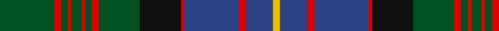

In pattern [GRGRGRGRGKRBRBY](/patterns/grgrgrgrgkrbrby/).

This was sourced from register-of-tartans.  It is a [15 stripes tartan](/stripes/stripes15/).

Original link https://www.tartanregister.gov.uk/tartanDetails.aspx?ref=697

## Thread count
G/32 R4 G4 R2 G6 R2 G4 R4 G24 K24 R2 B32 R4 B16 Y/4

## Palette
Each colour and its ΔE from the base-6 reference it is a variant of.

| Colour | Shade | Base | ΔE (OKLab) |
|---|---|---|---|
| B | <code style="background-color:#2C4084;">#2C4084</code> `#2C4084` | B <code style="background-color:#2C4084;">#2C4084</code> | 0.00 |
| G | <code style="background-color:#005020;">#005020</code> `#005020` | G <code style="background-color:#006400;">#006400</code> | 0.08 |
| K | <code style="background-color:#101010;">#101010</code> `#101010` | K <code style="background-color:#000000;">#000000</code> | 0.17 |
| R | <code style="background-color:#DC0000;">#DC0000</code> `#DC0000` | R <code style="background-color:#C80000;">#C80000</code> | 0.04 |
| Y | <code style="background-color:#E8C000;">#E8C000</code> `#E8C000` | Y <code style="background-color:#E8C000;">#E8C000</code> | 0.00 |

## Nearest tartans

The nearest existing variants by ΔTartan distance.

1. [Cochrane Clan Tartan Tartan Number: 994. Earliest known date: 1934 Lord Dundonald originally registered a version missing a red and a green stripe with Lord Lyon in 1974. There is a story that a fragment of this design was discovered in the foundations of a Perthshire house around the 1930's, thought to be of greater authenticity. However, other reports suggest that the missing stripes were simply a typing error. The sett is based on the old Lochaber district tartan which also provided a base for the MacDonald and the Cameron of Erracht. (All of which have four red stripes). The red and green have been restored in this version, which is now the approved tartan, and appears in the 'Appendix' of the Lyon Court Books dated 12th November 1984. See products available Copyright © Blair Urquhart, Comrie, 2015](/setts/s15/g32r4g4r2g6r2g4r4g24k24r2b32r4b16y4-b2c2c80-g006818-k101010-rc80000-ye8c000/) — ΔT 0.53
1. [Unidentified (Teddy Bear)](/setts/s15/g60y4g10y4g8k30b58r4b58k30g10y4g8y4g34-b2c4084-g005020-k101010-rdc0000-ye8c000/) — ΔT 0.64
1. [Glen Orchy #2 or MacIntyre](/setts/s14/g4k4r6g36r6b12ba2r8g12r4b36r6g4k4-b2c2c80-ba5c8ca8-g006818-k101010-rc80000/) — ΔT 0.72
1. [Rankin](/setts/s16/b72g20r4g20w4g20r4g20k28r4b24r6b4r4b8w4-b2c4084-g005020-k101010-rdc0000-we0e0e0/) — ΔT 0.73
1. [Unidentified B'gowrie Unknown Tartan Tartan Number: 2144. Earliest known date: c. 1945 Do you recognise this tartan. It was discovered by Robin Birch of Connell Reid Kiltmakers in Blairgowrie, attached to a Teddy Bear that he thought had a regimental connection dating from 1945. The unidentified sample was recorded here on 2nd February, 1995. See products available Copyright © Blair Urquhart, Comrie, 2015](/setts/s15/g60y4g10y4g8k30b58r4b58k30g10y4g8y4g34-b2c2c80-g006818-k101010-rc80000-ye8c000/) — ΔT 0.79
1. [Glenorchy - National Archives](/setts/s15/g6b4r2b34ra4g16ra8ba2b16ra4g34ra4r2b6ba2-b2c2c80-ba5c8ca8-g006818-re87878-rac80000/) — ΔT 0.79
1. [Fleming of Castle Carrick (Personal)](/setts/s14/g34k6g6k6g6k32b36k2r6k2b36k32g18ba4-b506878-ba780078-g5c6428-k101010-r9c0000/) — ΔT 0.84
1. [Cypress Presbyterian Church](/setts/s14/g12r8g8r6g8y4b28k8g8k56g36k4g4k4-b202060-g285800-k101010-rc80000-ye8c000/) — ΔT 0.84
1. [Bell's Whisky (SA)](/setts/s12/g20w4g36k6g6k6g6k36b48k6b6y6-b784878-g005030-k101010-wd0d0d0-ybc8c00/) — ΔT 0.85
1. [Ontario (Official)](/setts/s13/g38r2g4r4g30r2b26w2ba4r4ba42r2w6-b1c1c1c-ba2c2c80-g006818-rc80000-we0e0e0/) — ΔT 0.93

## Neighbour map

Every grey dot is one of 15726 variants placed by the first two principal components of the ΔTartan feature space (44% of its variance). Red is this tartan; blue dots are its nearest — click one to open its page.

<svg viewBox="0 0 640 380" role="img" style="max-width:100%;height:auto;border:1px solid #e0e0e0;border-radius:4px;display:block" xmlns="http://www.w3.org/2000/svg"><image href="/nn/cloud.v1.png" width="640" height="380"/><a href="/setts/s15/g32r4g4r2g6r2g4r4g24k24r2b32r4b16y4-b2c2c80-g006818-k101010-rc80000-ye8c000/"><circle cx="213.7" cy="133.4" r="4" fill="#3465a4"><title>Cochrane Clan Tartan Tartan Number: 994. Earliest known date: 1934 Lord Dundonald originally registered a version missing a red and a green stripe with Lord Lyon in 1974. There is a story that a fragment of this design was discovered in the foundations of a Perthshire house around the 1930's, thought to be of greater authenticity. However, other reports suggest that the missing stripes were simply a typing error. The sett is based on the old Lochaber district tartan which also provided a base for the MacDonald and the Cameron of Erracht. (All of which have four red stripes). The red and green have been restored in this version, which is now the approved tartan, and appears in the 'Appendix' of the Lyon Court Books dated 12th November 1984. See products available Copyright © Blair Urquhart, Comrie, 2015</title></circle></a><a href="/setts/s15/g60y4g10y4g8k30b58r4b58k30g10y4g8y4g34-b2c4084-g005020-k101010-rdc0000-ye8c000/"><circle cx="224.6" cy="151.5" r="4" fill="#3465a4"><title>Unidentified (Teddy Bear)</title></circle></a><a href="/setts/s14/g4k4r6g36r6b12ba2r8g12r4b36r6g4k4-b2c2c80-ba5c8ca8-g006818-k101010-rc80000/"><circle cx="220.4" cy="127.0" r="4" fill="#3465a4"><title>Glen Orchy #2 or MacIntyre</title></circle></a><a href="/setts/s16/b72g20r4g20w4g20r4g20k28r4b24r6b4r4b8w4-b2c4084-g005020-k101010-rdc0000-we0e0e0/"><circle cx="245.2" cy="126.0" r="4" fill="#3465a4"><title>Rankin</title></circle></a><a href="/setts/s15/g60y4g10y4g8k30b58r4b58k30g10y4g8y4g34-b2c2c80-g006818-k101010-rc80000-ye8c000/"><circle cx="204.5" cy="141.8" r="4" fill="#3465a4"><title>Unidentified B'gowrie Unknown Tartan Tartan Number: 2144. Earliest known date: c. 1945 Do you recognise this tartan. It was discovered by Robin Birch of Connell Reid Kiltmakers in Blairgowrie, attached to a Teddy Bear that he thought had a regimental connection dating from 1945. The unidentified sample was recorded here on 2nd February, 1995. See products available Copyright © Blair Urquhart, Comrie, 2015</title></circle></a><a href="/setts/s15/g6b4r2b34ra4g16ra8ba2b16ra4g34ra4r2b6ba2-b2c2c80-ba5c8ca8-g006818-re87878-rac80000/"><circle cx="244.1" cy="127.5" r="4" fill="#3465a4"><title>Glenorchy - National Archives</title></circle></a><a href="/setts/s14/g34k6g6k6g6k32b36k2r6k2b36k32g18ba4-b506878-ba780078-g5c6428-k101010-r9c0000/"><circle cx="210.8" cy="152.8" r="4" fill="#3465a4"><title>Fleming of Castle Carrick (Personal)</title></circle></a><a href="/setts/s14/g12r8g8r6g8y4b28k8g8k56g36k4g4k4-b202060-g285800-k101010-rc80000-ye8c000/"><circle cx="225.3" cy="145.6" r="4" fill="#3465a4"><title>Cypress Presbyterian Church</title></circle></a><a href="/setts/s12/g20w4g36k6g6k6g6k36b48k6b6y6-b784878-g005030-k101010-wd0d0d0-ybc8c00/"><circle cx="204.9" cy="163.1" r="4" fill="#3465a4"><title>Bell's Whisky (SA)</title></circle></a><a href="/setts/s13/g38r2g4r4g30r2b26w2ba4r4ba42r2w6-b1c1c1c-ba2c2c80-g006818-rc80000-we0e0e0/"><circle cx="231.5" cy="118.7" r="4" fill="#3465a4"><title>Ontario (Official)</title></circle></a><circle cx="227.7" cy="139.7" r="5" fill="#c00000"/></svg>

ID: /setts/s15/g32r4g4r2g6r2g4r4g24k24r2b32r4b16y4-b2c4084-g005020-k101010-rdc0000-ye8c000/
