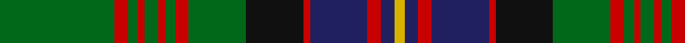

In pattern [GRGRGRGRGKRBRBY](/stripes/grgrgrgrgkrbrby/).

This was sourced from register-of-tartans.  It is a [15 stripe tartan](/stripes/stripes15/).

Original link https://www.tartanregister.gov.uk/tartanDetails.aspx?ref=695

## Attestations

This cloth appears in 2 source records; the oldest owns this page.

- 01/01/1984 — Cochrane (register-of-tartans, [record](https://www.tartanregister.gov.uk/tartanDetails.aspx?ref=695))
- pre 1984 — Cochrane (Clan) (tartans-authority, [record](http://www.tartansauthority.com/tartan-ferret/display/994/))

## Register references

External register numbers recorded for this tartan.

- Scottish Register of Tartans: [695](https://www.tartanregister.gov.uk/tartanDetails.aspx?ref=695)
- Scottish Tartans Authority (ITI): 994
- Scottish Tartans World Register: 994

## Thread count
G/68 R8 G6 R4 G8 R4 G6 R8 G34 K34 R4 DB34 R8 DB8 Y/6

## Palette
Each colour and its ΔE from the base-6 reference it is a variant of.

| Colour | Shade | Base | ΔE (OKLab) |
|---|---|---|---|
| DB | <code style="background-color:#202060;">#202060</code> `#202060` | B <code style="background-color:#2A418A;">#2A418A</code> | 0.11 |
| G | <code style="background-color:#006818;">#006818</code> `#006818` | G <code style="background-color:#006100;">#006100</code> | 0.02 |
| K | <code style="background-color:#101010;">#101010</code> `#101010` | K <code style="background-color:#000000;">#000000</code> | 0.17 |
| R | <code style="background-color:#C80000;">#C80000</code> `#C80000` | R <code style="background-color:#CC0000;">#CC0000</code> | 0.01 |
| Y | <code style="background-color:#D8B000;">#D8B000</code> `#D8B000` | Y <code style="background-color:#F2BF00;">#F2BF00</code> | 0.06 |

## Nearest tartans

The nearest existing variants by ΔTartan distance.

1. [Cochrane (1984) Clan Tartan Tartan Number: 978. Earliest known date: 1984 Lord Dundonald originally registered a version missing a red and a green stripe in 1974. There is a story that a fragment of this design was discovered in the foundations of a Perthshire house in 1934. Around that time, a count was recorded from the sample books of Messrs William Anderson. The red and green have been restored in this version, which is now the 'approved' tartan, and appears in the 'Appendix' of the Lyon Court Books dated 12th November 1984. See products available Copyright © Blair Urquhart, Comrie, 2015](/setts/s15/g34r4g4r2g4r2g3r4g17k17r2db17r4db4ly3~x2/) — ΔT 0.15
1. [Boyle, Cameron (Personal)](/setts/s13/g5db20g20db2g2db2g25r2g2r17k8g2w2~x2/) — ΔT 0.96
1. [Rourke-Frew Hunting](/setts/s11/db6k3r2k3dg31k6dg2k6lo13k2dg2~x2/) — ΔT 1.02
1. [Cochrane of Dundonald](/setts/s13/g44r4g2r2g2r4g12k12r2db10r4db4ly3~x2/) — ΔT 1.06
1. [Sarafilovic](/setts/s16/db15k18g3k2g2k2g44ly4g44k2g2k2g3k18db15r4~x2/) — ΔT 1.06
1. [Kerby/Kirby](/setts/s12/r6g1lb2g24k3g3k3g3k8db8lb2db4~x2/) — ΔT 1.07
1. [MacFarlane Hunting Clan Tartan Tartan Number: 779. Earliest known date: 1930-50 This sett comes from the MacGregor-Hastie collection in the Scottish Tartans Museum. The collection dates between 1930-50 and forms the major part of the cloth archive. The Hunting MacFarlane is based on Logans count (1831) with red changed to green. The MacFarlanes came originally from the lands about Arrochar in the West of Scotland. See products available Copyright © Blair Urquhart, Comrie, 2015](/setts/s14/g16k3g20w2r3k2r3w2g2db18k2r4w2g3~x2/) — ΔT 1.10
1. [Ontario (Official)](/setts/s13/g19r1g2r2g15r1dt13w1db2r2db21r1w3~x2/) — ΔT 1.10
1. [Pilette of Kinnear (Personal)](/setts/s21/k4r2k10g3k10g30k8g3r4lo2r4lb2r4g3k8g30k10g3k10r2k4~x2/) — ΔT 1.12
1. [Park](/setts/s12/r3db16k16g4k2g2k2g34r4g3r2g3~x2/) — ΔT 1.12

## Neighbour map

Every grey dot is one of 14299 variants placed by the first two principal components of the ΔTartan feature space (44% of its variance). Red is this tartan; blue dots are its nearest — click one to open its page.

<svg viewBox="0 0 640 380" role="img" style="max-width:100%;height:auto;border:1px solid #e0e0e0;border-radius:4px;display:block" xmlns="http://www.w3.org/2000/svg"><image href="/nn/cloud.v1.png" width="640" height="380"/><a href="/setts/s15/g34r4g4r2g4r2g3r4g17k17r2db17r4db4ly3~x2/"><circle cx="265.6" cy="128.0" r="4" fill="#3465a4"><title>Cochrane (1984) Clan Tartan Tartan Number: 978. Earliest known date: 1984 Lord Dundonald originally registered a version missing a red and a green stripe in 1974. There is a story that a fragment of this design was discovered in the foundations of a Perthshire house in 1934. Around that time, a count was recorded from the sample books of Messrs William Anderson. The red and green have been restored in this version, which is now the 'approved' tartan, and appears in the 'Appendix' of the Lyon Court Books dated 12th November 1984. See products available Copyright © Blair Urquhart, Comrie, 2015</title></circle></a><a href="/setts/s13/g5db20g20db2g2db2g25r2g2r17k8g2w2~x2/"><circle cx="271.2" cy="160.6" r="4" fill="#3465a4"><title>Boyle, Cameron (Personal)</title></circle></a><a href="/setts/s11/db6k3r2k3dg31k6dg2k6lo13k2dg2~x2/"><circle cx="250.4" cy="140.1" r="4" fill="#3465a4"><title>Rourke-Frew Hunting</title></circle></a><a href="/setts/s13/g44r4g2r2g2r4g12k12r2db10r4db4ly3~x2/"><circle cx="332.1" cy="113.6" r="4" fill="#3465a4"><title>Cochrane of Dundonald</title></circle></a><a href="/setts/s16/db15k18g3k2g2k2g44ly4g44k2g2k2g3k18db15r4~x2/"><circle cx="316.4" cy="121.1" r="4" fill="#3465a4"><title>Sarafilovic</title></circle></a><a href="/setts/s12/r6g1lb2g24k3g3k3g3k8db8lb2db4~x2/"><circle cx="245.2" cy="126.7" r="4" fill="#3465a4"><title>Kerby/Kirby</title></circle></a><a href="/setts/s14/g16k3g20w2r3k2r3w2g2db18k2r4w2g3~x2/"><circle cx="224.6" cy="141.2" r="4" fill="#3465a4"><title>MacFarlane Hunting Clan Tartan Tartan Number: 779. Earliest known date: 1930-50 This sett comes from the MacGregor-Hastie collection in the Scottish Tartans Museum. The collection dates between 1930-50 and forms the major part of the cloth archive. The Hunting MacFarlane is based on Logans count (1831) with red changed to green. The MacFarlanes came originally from the lands about Arrochar in the West of Scotland. See products available Copyright © Blair Urquhart, Comrie, 2015</title></circle></a><a href="/setts/s13/g19r1g2r2g15r1dt13w1db2r2db21r1w3~x2/"><circle cx="237.1" cy="122.7" r="4" fill="#3465a4"><title>Ontario (Official)</title></circle></a><a href="/setts/s21/k4r2k10g3k10g30k8g3r4lo2r4lb2r4g3k8g30k10g3k10r2k4~x2/"><circle cx="255.9" cy="124.8" r="4" fill="#3465a4"><title>Pilette of Kinnear (Personal)</title></circle></a><a href="/setts/s12/r3db16k16g4k2g2k2g34r4g3r2g3~x2/"><circle cx="305.3" cy="152.5" r="4" fill="#3465a4"><title>Park</title></circle></a><circle cx="265.9" cy="128.3" r="5" fill="#c00000"/></svg>

ID: /setts/s15/g34r4g3r2g4r2g3r4g17k17r2db17r4db4ly3~x2/
