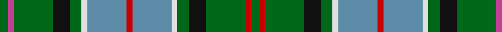

In pattern [GRGKGWBRBWGKGRG](/patterns/grgkgwbrbwgkgrg/).

This was sourced from tartans-authority.  It is a [15 stripes tartan](/stripes/stripes15/).

Original link http://www.tartansauthority.com/tartan-ferret/display/4106/

## Thread count
G/6 P4 G28 K12 G8 LN4 B28 R4 B28 LN4 G8 K12 G28 R4 G/6

## Palette
Each colour and its ΔE from the base-6 reference it is a variant of.

| Colour | Shade | Base | ΔE (OKLab) |
|---|---|---|---|
| B | <code style="background-color:#5C8CA8;">#5C8CA8</code> `#5C8CA8` | B <code style="background-color:#2A418A;">#2A418A</code> | 0.23 |
| G | <code style="background-color:#006818;">#006818</code> `#006818` | G <code style="background-color:#006100;">#006100</code> | 0.02 |
| K | <code style="background-color:#101010;">#101010</code> `#101010` | K <code style="background-color:#000000;">#000000</code> | 0.17 |
| LN | <code style="background-color:#E0E0E0;">#E0E0E0</code> `#E0E0E0` | W <code style="background-color:#F7F7F7;">#F7F7F7</code> | 0.07 |
| P | <code style="background-color:#C04094;">#C04094</code> `#C04094` | R <code style="background-color:#CC0000;">#CC0000</code> | 0.16 |
| R | <code style="background-color:#C80000;">#C80000</code> `#C80000` | R <code style="background-color:#CC0000;">#CC0000</code> | 0.01 |

## Nearest tartans

The nearest existing variants by ΔTartan distance.

1. [Greylock](/setts/s13/g10w2g10k3b12r3b12g15w2b3k2g3y3~b304080-g008000-k000000-rc00000-we0e0e0-yf0c000~x2/) — ΔT 0.82
1. [Greylock Corporate Tartan Tartan Number: 944. Earliest known date: 1987 . See products available Copyright © Blair Urquhart, Comrie, 2015](/setts/s13/g10w2g10k3b12r3b12g15w2b3k2g3y3~b2c2c80-g006818-k101010-rc80000-we0e0e0-ye8c000~x2/) — ΔT 0.85
1. [Wilson's No.033 #2](/setts/s16/g17b3r3b3k19w2g17r4g17w2k19b3r3b3g17ba8~b5c8ca8-ba202060-g006818-k101010-rc80000-wfcfcfc~x2/) — ΔT 1.02
1. [Scott, hunting special](/setts/s14/g8ga2w2ga6y2b14g4ga16g16r2g5w2g4ga7~b304080-g008000-ga003000-rd03030-we0e0e0-yf0c000/) — ΔT 1.02
1. [Presbyterian Synod of Living Waters (USA)](/setts/s14/b6r2b6y3g6k1g2w2g2k1g6k1g2w2~b202060-g006818-k101010-rb03000-wc0c0c0-ye8c000~x2/) — ΔT 1.03
1. [Wilson's No.033](/setts/s16/g17b3r3b3k19y2g17r4g17y2k19b3r3b3g17ba8~b5c8ca8-ba202060-g006818-k101010-rc80000-ye8c000~x2/) — ΔT 1.03
1. [Lundie (Personal)](/setts/s21/r4b2ba5g2ba2g2ba2g13ba2g2ba2g2ba5y2ba3w2g6r5b3ba4w2~b1474b4-ba003c64-g006818-rc80000-we0e0e0-ye8c000~x2/) — ΔT 1.15
1. [Norwich No.038](/setts/s18/g14b2r3b2k16y2b16g16r3g16b16y2k16b2r3b2g14k6~b5c8ca8-g006818-k101010-rc80000-ye8c000~x2/) — ΔT 1.20
1. [Greylock](/setts/s13/g11y2g12k3b15r3b15g19y2b3k2b3ya3~b5c8ca8-g006818-k101010-r880000-yb8b8b8-yabc8c00~x2/) — ΔT 1.21
1. [Wilson's No.225](/setts/s16/g16ga2b13ba2k6y2g16ba2k12ba2g16y2k6ba2b13ga2~b440044-ba5c8ca8-g006818-ga5c6428-k101010-ye8c000~x2/) — ΔT 1.21

## Neighbour map

Every grey dot is one of 15726 variants placed by the first two principal components of the ΔTartan feature space (44% of its variance). Red is this tartan; blue dots are its nearest — click one to open its page.

<svg viewBox="0 0 640 380" role="img" style="max-width:100%;height:auto;border:1px solid #e0e0e0;border-radius:4px;display:block" xmlns="http://www.w3.org/2000/svg"><image href="/nn/cloud.v1.png" width="640" height="380"/><a href="/setts/s13/g10w2g10k3b12r3b12g15w2b3k2g3y3~b304080-g008000-k000000-rc00000-we0e0e0-yf0c000~x2/"><circle cx="158.1" cy="162.2" r="4" fill="#3465a4"><title>Greylock</title></circle></a><a href="/setts/s13/g10w2g10k3b12r3b12g15w2b3k2g3y3~b2c2c80-g006818-k101010-rc80000-we0e0e0-ye8c000~x2/"><circle cx="171.8" cy="167.5" r="4" fill="#3465a4"><title>Greylock Corporate Tartan Tartan Number: 944. Earliest known date: 1987 . See products available Copyright © Blair Urquhart, Comrie, 2015</title></circle></a><a href="/setts/s16/g17b3r3b3k19w2g17r4g17w2k19b3r3b3g17ba8~b5c8ca8-ba202060-g006818-k101010-rc80000-wfcfcfc~x2/"><circle cx="177.2" cy="145.7" r="4" fill="#3465a4"><title>Wilson's No.033 #2</title></circle></a><a href="/setts/s14/g8ga2w2ga6y2b14g4ga16g16r2g5w2g4ga7~b304080-g008000-ga003000-rd03030-we0e0e0-yf0c000/"><circle cx="146.2" cy="162.7" r="4" fill="#3465a4"><title>Scott, hunting special</title></circle></a><a href="/setts/s14/b6r2b6y3g6k1g2w2g2k1g6k1g2w2~b202060-g006818-k101010-rb03000-wc0c0c0-ye8c000~x2/"><circle cx="106.4" cy="173.7" r="4" fill="#3465a4"><title>Presbyterian Synod of Living Waters (USA)</title></circle></a><a href="/setts/s16/g17b3r3b3k19y2g17r4g17y2k19b3r3b3g17ba8~b5c8ca8-ba202060-g006818-k101010-rc80000-ye8c000~x2/"><circle cx="184.1" cy="148.4" r="4" fill="#3465a4"><title>Wilson's No.033</title></circle></a><a href="/setts/s21/r4b2ba5g2ba2g2ba2g13ba2g2ba2g2ba5y2ba3w2g6r5b3ba4w2~b1474b4-ba003c64-g006818-rc80000-we0e0e0-ye8c000~x2/"><circle cx="107.8" cy="152.0" r="4" fill="#3465a4"><title>Lundie (Personal)</title></circle></a><a href="/setts/s18/g14b2r3b2k16y2b16g16r3g16b16y2k16b2r3b2g14k6~b5c8ca8-g006818-k101010-rc80000-ye8c000~x2/"><circle cx="142.9" cy="162.8" r="4" fill="#3465a4"><title>Norwich No.038</title></circle></a><a href="/setts/s13/g11y2g12k3b15r3b15g19y2b3k2b3ya3~b5c8ca8-g006818-k101010-r880000-yb8b8b8-yabc8c00~x2/"><circle cx="215.1" cy="163.0" r="4" fill="#3465a4"><title>Greylock</title></circle></a><a href="/setts/s16/g16ga2b13ba2k6y2g16ba2k12ba2g16y2k6ba2b13ga2~b440044-ba5c8ca8-g006818-ga5c6428-k101010-ye8c000~x2/"><circle cx="146.2" cy="152.4" r="4" fill="#3465a4"><title>Wilson's No.225</title></circle></a><circle cx="159.5" cy="158.4" r="5" fill="#c00000"/></svg>

ID: /setts/s15/g3r2g14k6g4w2b14ra2b14w2g4k6g14ra2g3~b5c8ca8-g006818-k101010-rc04094-rac80000-we0e0e0~x2/
