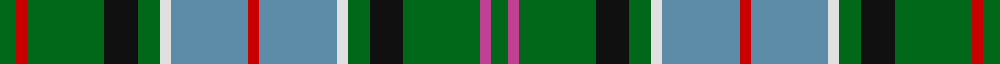

This page is one **sett** — a single exact thread-count. It belongs to the [tartan](/tartans/g3r2g14k6g4ln2b14r2b14ln2g4k6g14p2g3/)
(the same proportion at any scale), whose colour order is pattern [GRGKGWBRBWGKGRG](/stripes/grgkgwbrbwgkgrg/).

Sourced from tartans-authority.  It is a [15 stripe tartan](/stripes/stripes15/).

Original link http://www.tartansauthority.com/tartan-ferret/display/4106/

## Thread count
G/6 R4 G28 K12 G8 LN4 B28 R4 B28 LN4 G8 K12 G28 P4 G/6

## Palette
Each colour and the base-6 reference it is a variant of.

| Colour | Shade | Base |
|---|---|---|
| B | <code style="background-color:#5C8CA8;">#5C8CA8</code> `oklch(61.7% 0.067 235.0)` <small>#5C8CA8</small> | B <code style="background-color:#2A418A;">#2A418A</code> |
| G | <code style="background-color:#006818;">#006818</code> `oklch(45.0% 0.142 145.0)` <small>#006818</small> | G <code style="background-color:#006100;">#006100</code> |
| K | <code style="background-color:#101010;">#101010</code> `oklch(17.3% 0.000 89.9)` <small>#101010</small> | K <code style="background-color:#000000;">#000000</code> |
| LN | <code style="background-color:#E0E0E0;">#E0E0E0</code> `oklch(90.7% 0.000 89.9)` <small>#E0E0E0</small> | W <code style="background-color:#F7F7F7;">#F7F7F7</code> |
| P | <code style="background-color:#C04094;">#C04094</code> `oklch(57.9% 0.185 344.2)` <small>#C04094</small> | R <code style="background-color:#CC0000;">#CC0000</code> |
| R | <code style="background-color:#C80000;">#C80000</code> `oklch(52.3% 0.215 29.2)` <small>#C80000</small> | R <code style="background-color:#CC0000;">#CC0000</code> |

## Nearest tartans

The nearest existing variants by ΔTartan distance, with this tartan at the top so the swatches line up against it.

ΔTartan

Tartan

Sett

—

<a href="/ttd/edit/#slug=g3r2g14k6g4w2t14r2t14w2g4k6g14m2g3~x2">Scottish Heritage USA (SHUSA) (Corp)</a> <a class="nn-out" href="/setts/s15/g3r2g14k6g4w2t14r2t14w2g4k6g14m2g3~x2/" title="open its dictionary page">↗</a>

0.81

<a href="/ttd/edit/#slug=g10w2g10k3db12r3db12g15w2db3k2g3ly3~x2">Greylock</a> <a class="nn-out" href="/setts/s13/g10w2g10k3db12r3db12g15w2db3k2g3ly3~x2/" title="open its dictionary page">↗</a>

1.02

<a href="/ttd/edit/#slug=g17t3r3t3k19w2g17r4g17w2k19t3r3t3g17db8~x2">Wilson's No.033 #2</a> <a class="nn-out" href="/setts/s16/g17t3r3t3k19w2g17r4g17w2k19t3r3t3g17db8~x2/" title="open its dictionary page">↗</a>

1.02

<a href="/ttd/edit/#slug=g8dg2w2dg6ly2db14g4dg16g16r2g5w2g4dg7">Scott, hunting special</a> <a class="nn-out" href="/setts/s14/g8dg2w2dg6ly2db14g4dg16g16r2g5w2g4dg7/" title="open its dictionary page">↗</a>

1.03

<a href="/ttd/edit/#slug=db6r2db6ly3g6k1g2lb2g2k1g6k1g2lb2~x2">Presbyterian Synod of Living Waters (USA)</a> <a class="nn-out" href="/setts/s14/db6r2db6ly3g6k1g2lb2g2k1g6k1g2lb2~x2/" title="open its dictionary page">↗</a>

1.04

<a href="/ttd/edit/#slug=g17t3r3t3k19ly2g17r4g17ly2k19t3r3t3g17db8~x2">Wilson's No.033</a> <a class="nn-out" href="/setts/s16/g17t3r3t3k19ly2g17r4g17ly2k19t3r3t3g17db8~x2/" title="open its dictionary page">↗</a>

1.14

<a href="/ttd/edit/#slug=r4b2dt5g2dt2g2dt2g13dt2g2dt2g2dt5ly2dt3w2g6r5b3dt4w2~x2">Lundie (Personal)</a> <a class="nn-out" href="/setts/s21/r4b2dt5g2dt2g2dt2g13dt2g2dt2g2dt5ly2dt3w2g6r5b3dt4w2~x2/" title="open its dictionary page">↗</a>

1.20

<a href="/ttd/edit/#slug=g14t2r3t2k16ly2t16g16r3g16t16ly2k16t2r3t2g14k6~x2">Norwich No.038</a> <a class="nn-out" href="/setts/s18/g14t2r3t2k16ly2t16g16r3g16t16ly2k16t2r3t2g14k6~x2/" title="open its dictionary page">↗</a>

1.21

<a href="/ttd/edit/#slug=g11lr2g12k3t15r3t15g19lr2t3k2t3lo3~x2">Greylock</a> <a class="nn-out" href="/setts/s13/g11lr2g12k3t15r3t15g19lr2t3k2t3lo3~x2/" title="open its dictionary page">↗</a>

1.22

<a href="/setts/s16/g16y2dp13t2k6ly2g16t2k12~x2/">Wilson's No.225</a>

1.24

<a href="/ttd/edit/#slug=y3g12k5g2k5y2r2y2k5g12w2y3~x2">Wilcox, Yu, Cruikshank Reunion</a> <a class="nn-out" href="/setts/s12/y3g12k5g2k5y2r2y2k5g12w2y3~x2/" title="open its dictionary page">↗</a>

## Neighbour map

Every grey dot is one of 14299 variants placed by the first two principal components of the ΔTartan feature space (44% of its variance). Red is this tartan; blue dots are its nearest — click one to open its page.

<svg viewBox="0 0 640 380" role="img" style="max-width:100%;height:auto;border:1px solid #e0e0e0;border-radius:4px;display:block" xmlns="http://www.w3.org/2000/svg"><image href="/nn/cloud.v1.png" width="640" height="380"/><a href="/setts/s13/g10w2g10k3db12r3db12g15w2db3k2g3ly3~x2/"><circle cx="161.4" cy="164.2" r="4" fill="#3465a4"><title>Greylock</title></circle></a><a href="/setts/s16/g17t3r3t3k19w2g17r4g17w2k19t3r3t3g17db8~x2/"><circle cx="180.2" cy="149.3" r="4" fill="#3465a4"><title>Wilson's No.033 #2</title></circle></a><a href="/setts/s14/g8dg2w2dg6ly2db14g4dg16g16r2g5w2g4dg7/"><circle cx="149.6" cy="167.9" r="4" fill="#3465a4"><title>Scott, hunting special</title></circle></a><a href="/setts/s14/db6r2db6ly3g6k1g2lb2g2k1g6k1g2lb2~x2/"><circle cx="109.6" cy="176.7" r="4" fill="#3465a4"><title>Presbyterian Synod of Living Waters (USA)</title></circle></a><a href="/setts/s16/g17t3r3t3k19ly2g17r4g17ly2k19t3r3t3g17db8~x2/"><circle cx="187.0" cy="152.7" r="4" fill="#3465a4"><title>Wilson's No.033</title></circle></a><a href="/setts/s21/r4b2dt5g2dt2g2dt2g13dt2g2dt2g2dt5ly2dt3w2g6r5b3dt4w2~x2/"><circle cx="111.0" cy="157.9" r="4" fill="#3465a4"><title>Lundie (Personal)</title></circle></a><a href="/setts/s18/g14t2r3t2k16ly2t16g16r3g16t16ly2k16t2r3t2g14k6~x2/"><circle cx="146.2" cy="166.8" r="4" fill="#3465a4"><title>Norwich No.038</title></circle></a><a href="/setts/s13/g11lr2g12k3t15r3t15g19lr2t3k2t3lo3~x2/"><circle cx="217.8" cy="170.2" r="4" fill="#3465a4"><title>Greylock</title></circle></a><a href="/setts/s16/g16y2dp13t2k6ly2g16t2k12~x2/"><circle cx="149.3" cy="157.8" r="4" fill="#3465a4"><title>Wilson's No.225</title></circle></a><a href="/setts/s12/y3g12k5g2k5y2r2y2k5g12w2y3~x2/"><circle cx="189.2" cy="200.3" r="4" fill="#3465a4"><title>Wilcox, Yu, Cruikshank Reunion</title></circle></a><circle cx="162.5" cy="162.9" r="5" fill="#c00000"/></svg>

ID: /setts/s15/g3r2g14k6g4w2t14r2t14w2g4k6g14m2g3~x2/
