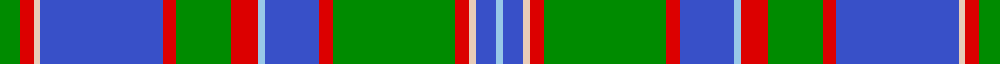

In pattern [GRWBRGRWBRGRWBW](/stripes/grwbrgrwbrgrwbw/).

This was sourced from register-of-tartans.  It is a [15 stripe tartan](/stripes/stripes15/).

Original link https://www.tartanregister.gov.uk/tartanDetails.aspx?ref=1434

## Register references

External register numbers recorded for this tartan.

- Scottish Register of Tartans: [1434](https://www.tartanregister.gov.uk/tartanDetails.aspx?ref=1434)
- Scottish Tartans World Register: 72

## Thread count
G/6 R4 LR2 B36 R4 G16 R8 LB2 B16 R4 G36 R4 LR2 B6 LB/2

## Palette
Each colour and the base-6 reference it is a variant of.

| Colour | Shade | Base |
|---|---|---|
| B | <code style="background-color:#3850C8;">#3850C8</code> `oklch(48.8% 0.188 269.4)` <small>#3850C8</small> | B <code style="background-color:#2A418A;">#2A418A</code> |
| G | <code style="background-color:#008B00;">#008B00</code> `oklch(55.2% 0.188 142.5)` <small>#008B00</small> | G <code style="background-color:#006100;">#006100</code> |
| LB | <code style="background-color:#98C8E8;">#98C8E8</code> `oklch(81.0% 0.068 237.9)` <small>#98C8E8</small> | W <code style="background-color:#F7F7F7;">#F7F7F7</code> |
| LR | <code style="background-color:#E8CCB8;">#E8CCB8</code> `oklch(86.3% 0.042 57.7)` <small>#E8CCB8</small> | W <code style="background-color:#F7F7F7;">#F7F7F7</code> |
| R | <code style="background-color:#DC0000;">#DC0000</code> `oklch(56.2% 0.230 29.2)` <small>#DC0000</small> | R <code style="background-color:#CC0000;">#CC0000</code> |

## Nearest tartans

The nearest existing variants by ΔTartan distance.

1. [Holiday Inn Crown Plaza](/setts/s13/g27r2g3w3db3ly2db14w2db3ly3db3w2db14~x2/) — ΔT 1.04
1. [MacDowall](/setts/s12/w3g14n3k7n48k7w3k3w3k3w12ly3~x2/) — ΔT 1.12
1. [Nova Scotia Dress #2](/setts/s16/ly5g16db8g4db4g4lr38g4lr38g4db4g4db8g16ly5r3~x2/) — ΔT 1.13
1. [Cameron Boyle, The (Personal)](/setts/s13/g5b20g2b2g2b2g25r2g2r17k8g2w2~x2/) — ΔT 1.15
1. [Oromocto](/setts/s15/r6k5ly1k1w3b5w1b20w1b5w3k1r1k5ly6~x2/) — ΔT 1.16
1. [Glenfalloch Corporate Tartan Tartan Number: 2111. Earliest known date: 1990 'Glenfalloch' - Gaelic meaning "hidden valley" - was built as a private residence last century. Some years ago it was acquired by the Otago Peninsulsa Trust, to enable the people of Dunedin and visitors to the area, to enjoy the beautiful gardens. Colours were chosen to represent as follows: Navy Blue - dark shadows in valley, Green/Blue - Overall colours of sea/sky/trees, Salmon Pink/White/Maroon - Wild flowers in season. See products available Copyright © Blair Urquhart, Comrie, 2015](/setts/s12/dt4r1dt12w1r4w1g4w1r4g12dt1w2~x2/) — ΔT 1.18
1. [Maine Dirigo](/setts/s13/db4lb1g4r2g14db2g1db1lb1db1lb13r1g1~x4/) — ΔT 1.20
1. [Scottish Prison Service](/setts/s14/w4b30k3g20r4k1w3k1r4g20k3b30w4r2~x2/) — ΔT 1.20
1. [Rankin](/setts/s16/db36g10r2g10w2g10r2g10k14r2db12r3db2r2db4w2~x2/) — ΔT 1.20
1. [MacAuliffe Name Tartan Tartan Number: 2839. Earliest known date: 2005 The MacAuliffes are Irish in origin, being a branch of the powerful MacCarthys. The MacAuliffe's are descended from Auliffe Alainn (Humphrey the Dandy) MacCarthy, the son of Donough MacCarthy, the son of Murcharch MacCarthy, the son of Teige MacCarthy, who was King of Desmond (south Munster) from 1118 to 1124. The tartan is available from House of Tartan, Scotland. See products available Copyright © Blair Urquhart, Comrie, 2015](/setts/s14/g37w2g6db23ly6db2ly3db2~x2/) — ΔT 1.21

## Neighbour map

Every grey dot is one of 14299 variants placed by the first two principal components of the ΔTartan feature space (44% of its variance). Red is this tartan; blue dots are its nearest — click one to open its page.

<svg viewBox="0 0 640 380" role="img" style="max-width:100%;height:auto;border:1px solid #e0e0e0;border-radius:4px;display:block" xmlns="http://www.w3.org/2000/svg"><image href="/nn/cloud.v1.png" width="640" height="380"/><a href="/setts/s13/g27r2g3w3db3ly2db14w2db3ly3db3w2db14~x2/"><circle cx="231.0" cy="127.2" r="4" fill="#3465a4"><title>Holiday Inn Crown Plaza</title></circle></a><a href="/setts/s12/w3g14n3k7n48k7w3k3w3k3w12ly3~x2/"><circle cx="225.1" cy="103.8" r="4" fill="#3465a4"><title>MacDowall</title></circle></a><a href="/setts/s16/ly5g16db8g4db4g4lr38g4lr38g4db4g4db8g16ly5r3~x2/"><circle cx="202.6" cy="112.6" r="4" fill="#3465a4"><title>Nova Scotia Dress #2</title></circle></a><a href="/setts/s13/g5b20g2b2g2b2g25r2g2r17k8g2w2~x2/"><circle cx="182.2" cy="124.9" r="4" fill="#3465a4"><title>Cameron Boyle, The (Personal)</title></circle></a><a href="/setts/s15/r6k5ly1k1w3b5w1b20w1b5w3k1r1k5ly6~x2/"><circle cx="203.4" cy="95.0" r="4" fill="#3465a4"><title>Oromocto</title></circle></a><a href="/setts/s12/dt4r1dt12w1r4w1g4w1r4g12dt1w2~x2/"><circle cx="164.3" cy="144.1" r="4" fill="#3465a4"><title>Glenfalloch Corporate Tartan Tartan Number: 2111. Earliest known date: 1990 'Glenfalloch' - Gaelic meaning &quot;hidden valley&quot; - was built as a private residence last century. Some years ago it was acquired by the Otago Peninsulsa Trust, to enable the people of Dunedin and visitors to the area, to enjoy the beautiful gardens. Colours were chosen to represent as follows: Navy Blue - dark shadows in valley, Green/Blue - Overall colours of sea/sky/trees, Salmon Pink/White/Maroon - Wild flowers in season. See products available Copyright © Blair Urquhart, Comrie, 2015</title></circle></a><a href="/setts/s13/db4lb1g4r2g14db2g1db1lb1db1lb13r1g1~x4/"><circle cx="230.6" cy="131.5" r="4" fill="#3465a4"><title>Maine Dirigo</title></circle></a><a href="/setts/s14/w4b30k3g20r4k1w3k1r4g20k3b30w4r2~x2/"><circle cx="252.0" cy="99.7" r="4" fill="#3465a4"><title>Scottish Prison Service</title></circle></a><a href="/setts/s16/db36g10r2g10w2g10r2g10k14r2db12r3db2r2db4w2~x2/"><circle cx="214.7" cy="112.9" r="4" fill="#3465a4"><title>Rankin</title></circle></a><a href="/setts/s14/g37w2g6db23ly6db2ly3db2~x2/"><circle cx="246.5" cy="126.9" r="4" fill="#3465a4"><title>MacAuliffe Name Tartan Tartan Number: 2839. Earliest known date: 2005 The MacAuliffes are Irish in origin, being a branch of the powerful MacCarthys. The MacAuliffe's are descended from Auliffe Alainn (Humphrey the Dandy) MacCarthy, the son of Donough MacCarthy, the son of Murcharch MacCarthy, the son of Teige MacCarthy, who was King of Desmond (south Munster) from 1118 to 1124. The tartan is available from House of Tartan, Scotland. See products available Copyright © Blair Urquhart, Comrie, 2015</title></circle></a><circle cx="212.2" cy="110.5" r="5" fill="#c00000"/></svg>

ID: /setts/s15/g3r2lb1b18r2g8r4lb1b8r2g18r2lb1b3lb1~x2/
