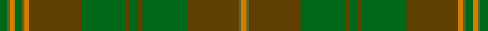

**Bands:** [YGGGGGGGGYGGYGG](/stripes/yggggggggyggygg/) · **Stripes:** [LO Y DY G DY G DY G DY LO Y G LO Y G](/stripes/stripes15/) LO Y DY G DY G DY G DY LO Y G LO Y G

This was sourced from register-of-tartans.  It is a [15 band tartan](/bands/bands15/).

Original link https://www.tartanregister.gov.uk/tartanDetails.aspx?ref=3387

## Register references

External register numbers recorded for this tartan.

- Scottish Register of Tartans: [3387](https://www.tartanregister.gov.uk/tartanDetails.aspx?ref=3387)
- Scottish Tartans Authority (ITI): 826
- Scottish Tartans World Register: 826

## Thread count
Ga/6 G2 O4 Ga6 G2 O4 T42 Ga36 T4 Ga6 T4 Ga36 T42 G2 O/4

## Palette
Each colour and its ΔE from the base-6 reference it is a variant of.

| Colour | Shade | Base | ΔE (OKLab) |
|---|---|---|---|
| G | <code style="background-color:#5C6428;">#5C6428</code> `#5C6428` | G <code style="background-color:#006100;">#006100</code> | 0.10 |
| Ga | <code style="background-color:#006818;">#006818</code> `#006818` | G <code style="background-color:#006100;">#006100</code> | 0.02 |
| O | <code style="background-color:#D87C00;">#D87C00</code> `#D87C00` | Y <code style="background-color:#F2BF00;">#F2BF00</code> | 0.17 |
| T | <code style="background-color:#604000;">#604000</code> `#604000` | G <code style="background-color:#006100;">#006100</code> | 0.14 |

## Nearest tartans

The nearest existing variants by ΔTartan distance.

1. [Ensign of Ontario (Fashion)](/setts/s15/dg21k1r4k1dy21dg3dy3dg3dy21dg3lo4dg21dy3dg3dy3~x2/) — ΔT 1.04
1. [Prince David Royal Family Tartan Tartan Number: 2125. Earliest known date: 1930 Mackinlay suggests that David was the pet name of the Duke of Windsor when he was a boy and that the tartan was designed for his personal use. See products available Copyright © Blair Urquhart, Comrie, 2015](/setts/s15/dg3g1lo2dg3g1lo2dy21dg18dy2dg3dy2dg18dy21g1lo2~x2/) — ΔT 1.17
1. [Terry](/setts/s13/y33lo1y3r3g3lo1g21lo1g3r3g3lo1g21~x2/) — ΔT 1.43
1. [Galloway District Tartan Tartan Number: 1469. Earliest known date: 1950 In contemporary correspondence Mr Hannay said that the Galloway 'everyday' tartan was 'in four shades of green with yellow and red stripe'. Cree Mills of Newton-Stewart, however, used only two shades in the manufacture on Mr Hannay's behalf. MacGregor Hastie's collection includes this sett with the pale yellow rendered in white and called Galloway Hunting. See products available Copyright © Blair Urquhart, Comrie, 2015](/setts/s11/dg20dg2ly3dg2dg32dg32dg2r3dg2dg32dg12~x2/) — ΔT 1.44
1. [MacAlister of Glenbarr Hunting](/setts/s14/g20dy3g6dy6g6dy8db2dy2g20dy2db2dy46db3dy8~x2/) — ΔT 1.44
1. [Historic Scotland Corporate Tartan Tartan Number: 2122. Earliest known date: 1988 Custodians at Historic Scotland properties throughout Scotland, including Edinburgh Castle, wear this distinctive tartan. See products available Copyright © Blair Urquhart, Comrie, 2015](/setts/s9/k2y7k1y9dy21o2dy1o1dy2~x2/) — ΔT 1.50
1. [Ensign of Ontario Canadian Tartan Tartan Number: 2032. Earliest known date: 1965 The Ensign tartan owes its inspiration to the Provincial Coat of Arms which was granted to the province by Royal Warrant of Queen Victoria in 1868. The yellow is taken from the three golden maple leaves of the lower shield and the red from the cross of St George on the upper. The black and brown come from the bear, the moose and the deer. There is also a District tartan called Northern Ontario. See products available Copyright © Blair Urquhart, Comrie, 2015](/setts/s15/g21k1r4k1dy21g3dy3g3dy21g3ly4g21dy3g3dy3~x2/) — ΔT 1.65
1. [Terry Clan/Family Weavers Tartan Tartan Number: 2204. Earliest known date: 1993 Designed by Thomas Terry of Geneseo, IL, USA. Registered with the Scottish Tartans Society 9-15-93. Info from Sue Miller, April 1995. With no evidence to the contrary it is assumed that all of the name 'Terry' can wear this tartan. See products available Copyright © Blair Urquhart, Comrie, 2015](/setts/s24/y33lo1y3r3g3lo1g21lo1g3r3g3lo1g21~x2/) — ΔT 1.79
1. [O'Neill (Personal)](/setts/s13/dg24g2dg4g16dg1lb2dg1g16dg3ly1dg12o2dg5~x2/) — ΔT 1.84
1. [Tricor](/setts/s12/y23o4dy6g6y4lb1y4~x4/) — ΔT 1.85

## Neighbour map

Every grey dot is one of 14299 variants placed by the first two principal components of the ΔTartan feature space (44% of its variance). Red is this tartan; blue dots are its nearest — click one to open its page.

<svg viewBox="0 0 640 380" role="img" style="max-width:100%;height:auto;border:1px solid #e0e0e0;border-radius:4px;display:block" xmlns="http://www.w3.org/2000/svg"><image href="/nn/cloud.v1.png" width="640" height="380"/><a href="/setts/s15/dg21k1r4k1dy21dg3dy3dg3dy21dg3lo4dg21dy3dg3dy3~x2/"><circle cx="406.3" cy="190.1" r="4" fill="#3465a4"><title>Ensign of Ontario (Fashion)</title></circle></a><a href="/setts/s15/dg3g1lo2dg3g1lo2dy21dg18dy2dg3dy2dg18dy21g1lo2~x2/"><circle cx="407.7" cy="187.5" r="4" fill="#3465a4"><title>Prince David Royal Family Tartan Tartan Number: 2125. Earliest known date: 1930 Mackinlay suggests that David was the pet name of the Duke of Windsor when he was a boy and that the tartan was designed for his personal use. See products available Copyright © Blair Urquhart, Comrie, 2015</title></circle></a><a href="/setts/s13/y33lo1y3r3g3lo1g21lo1g3r3g3lo1g21~x2/"><circle cx="482.7" cy="186.8" r="4" fill="#3465a4"><title>Terry</title></circle></a><a href="/setts/s11/dg20dg2ly3dg2dg32dg32dg2r3dg2dg32dg12~x2/"><circle cx="428.0" cy="241.1" r="4" fill="#3465a4"><title>Galloway District Tartan Tartan Number: 1469. Earliest known date: 1950 In contemporary correspondence Mr Hannay said that the Galloway 'everyday' tartan was 'in four shades of green with yellow and red stripe'. Cree Mills of Newton-Stewart, however, used only two shades in the manufacture on Mr Hannay's behalf. MacGregor Hastie's collection includes this sett with the pale yellow rendered in white and called Galloway Hunting. See products available Copyright © Blair Urquhart, Comrie, 2015</title></circle></a><a href="/setts/s14/g20dy3g6dy6g6dy8db2dy2g20dy2db2dy46db3dy8~x2/"><circle cx="498.7" cy="208.2" r="4" fill="#3465a4"><title>MacAlister of Glenbarr Hunting</title></circle></a><a href="/setts/s9/k2y7k1y9dy21o2dy1o1dy2~x2/"><circle cx="457.3" cy="212.9" r="4" fill="#3465a4"><title>Historic Scotland Corporate Tartan Tartan Number: 2122. Earliest known date: 1988 Custodians at Historic Scotland properties throughout Scotland, including Edinburgh Castle, wear this distinctive tartan. See products available Copyright © Blair Urquhart, Comrie, 2015</title></circle></a><a href="/setts/s15/g21k1r4k1dy21g3dy3g3dy21g3ly4g21dy3g3dy3~x2/"><circle cx="366.2" cy="168.1" r="4" fill="#3465a4"><title>Ensign of Ontario Canadian Tartan Tartan Number: 2032. Earliest known date: 1965 The Ensign tartan owes its inspiration to the Provincial Coat of Arms which was granted to the province by Royal Warrant of Queen Victoria in 1868. The yellow is taken from the three golden maple leaves of the lower shield and the red from the cross of St George on the upper. The black and brown come from the bear, the moose and the deer. There is also a District tartan called Northern Ontario. See products available Copyright © Blair Urquhart, Comrie, 2015</title></circle></a><a href="/setts/s24/y33lo1y3r3g3lo1g21lo1g3r3g3lo1g21~x2/"><circle cx="463.1" cy="137.8" r="4" fill="#3465a4"><title>Terry Clan/Family Weavers Tartan Tartan Number: 2204. Earliest known date: 1993 Designed by Thomas Terry of Geneseo, IL, USA. Registered with the Scottish Tartans Society 9-15-93. Info from Sue Miller, April 1995. With no evidence to the contrary it is assumed that all of the name 'Terry' can wear this tartan. See products available Copyright © Blair Urquhart, Comrie, 2015</title></circle></a><a href="/setts/s13/dg24g2dg4g16dg1lb2dg1g16dg3ly1dg12o2dg5~x2/"><circle cx="444.2" cy="197.3" r="4" fill="#3465a4"><title>O'Neill (Personal)</title></circle></a><a href="/setts/s12/y23o4dy6g6y4lb1y4~x4/"><circle cx="385.0" cy="190.5" r="4" fill="#3465a4"><title>Tricor</title></circle></a><circle cx="423.6" cy="196.1" r="5" fill="#c00000"/></svg>

ID: /setts/s15/g3y1lo2g3y1lo2dy21g18dy2g3dy2g18dy21y1lo2~x2/
